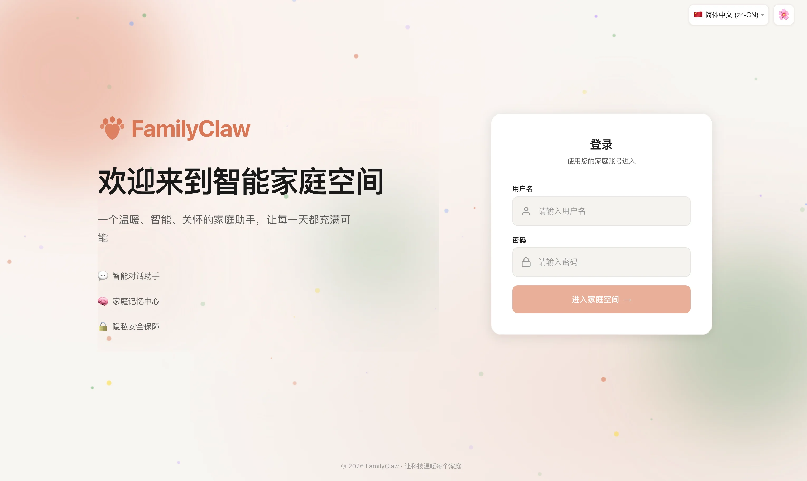

# Product Overview

## What the product is for

FamilyClaw = family context + conversation + long-term memory + plugin ecosystem + one unified entry point.

- Family is the center: families, members, rooms, and permissions form the base data model.
- Conversation is the main interaction: the web entry is already available, and the voice gateway is optional.
- Memory is the core asset: conversations, events, and preferences become searchable family memory.
- Plugins extend the system: AI providers, communication channels, theme packs, and more are all connected as plugins.
- The docs stay aligned: Chinese uses the root path and English uses `/en/`, but both follow the same information architecture.

## What this page does not do

- It does not explain installation steps. Go to Installation.
- It does not explain which buttons to click. Go to the User Guide.
- It does not explain backend implementation details. Go to the Developer Docs.

## Recommended next steps

- If you want the fastest way to run it, read [Quick Start](./quick-start.md).
- If you want to see the major capabilities, read [Core Features](./core-features.md).
