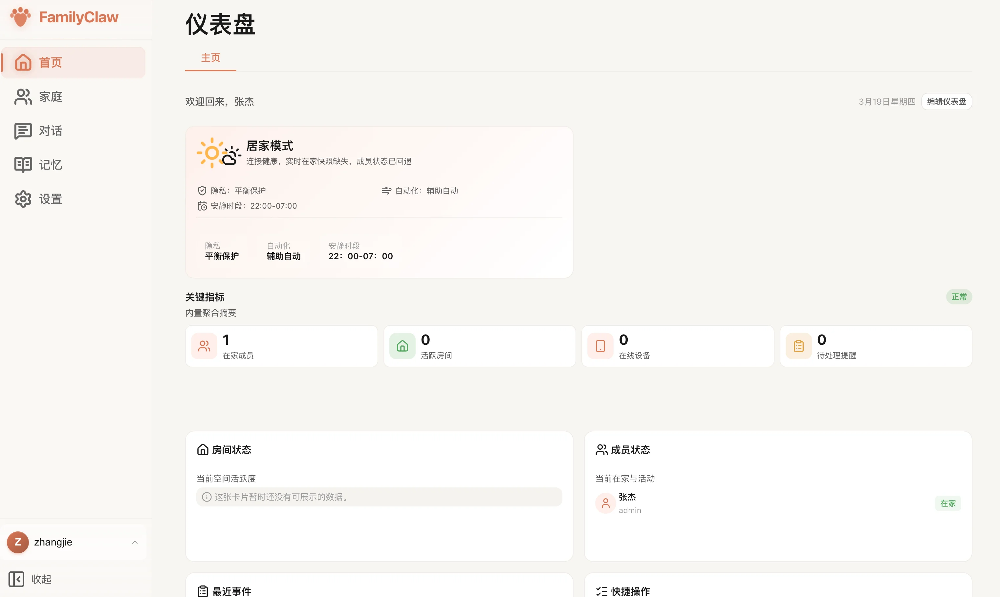

# 仪表盘

仪表盘是你登录后最先看到的主页面。

你可以把它理解成家庭首页: 一进来先看现在有什么需要处理、哪些信息最值得先看、接下来该去哪里。

## 这里会看到什么

- 家庭欢迎区：显示当前家庭与成员昵称。
- 卡片区：会展示天气、家庭统计、房间、成员、事件和快捷入口等内容。
- 快捷操作：可以直接进入对话、记忆、设置、家庭等常用页面。
- 卡片状态：如果某张卡片没有数据、数据过期或加载失败，页面会直接给出提示。

如果你是在手机上打开仪表盘，现在页面会自动切成单列卡片，页头和快捷入口也会改成更适合窄屏的排布，不需要你再横着拖页面去找内容。

## 第一次进来，建议先这样看

1. 先确认你当前看到的是正确的家庭和成员。
2. 快速扫一眼首页卡片，看看提醒、天气、家庭信息和最近事项是不是正常。
3. 如果你准备继续使用，优先点快捷入口进入对话、家庭或设置页。
4. 如果你想把首页调成更顺手的样子，可以直接拖动卡片位置和大小。

常见卡片大概可以这样理解:

- 天气卡：帮你快速看到当前天气情况。
- 统计卡：帮你确认家庭成员、房间、设备和提醒这些信息是不是已经补齐。
- 事件或提醒卡：适合先看有没有待处理的事情。
- 快捷操作卡：适合直接跳去常用页面，不用再慢慢找菜单。

> 配图占位：拖拽卡片调整宽度与高度的操作示意

## 首页布局可以自己调

- 拖住卡片左上角的拖拽点，可以调整顺序。
- 拖住卡片右下角，可以调整宽度和高度。
- 调整后的布局会自动保存，下一次进来会继续沿用。

手机上进入编辑模式时，优先支持隐藏和重新加回卡片；拖拽排序和鼠标式缩放还是桌面端更合适，别拿手机去硬拽，这种交互天生就不对。

## 常见问题

- **卡片一直显示加载中，或者报错**：先确认网络正常，再确认你当前所在的是正确的家庭。
- **天气卡没内容**：先去设置里确认地区信息是否已经填好，再看看天气相关能力是否已经接好。
- **布局没有保存**：先刷新页面再试一次；如果还是不行，看看浏览器是不是限制了本地存储。

## 接下来去哪

- 想继续整理家庭信息，去 [家庭](../使用指南/家庭.md)。
- 想直接和助手聊天，去 [对话](../使用指南/对话.md)。
- 想补语言、时区或 AI 服务设置，去 [设置](../使用指南/设置.md)。
