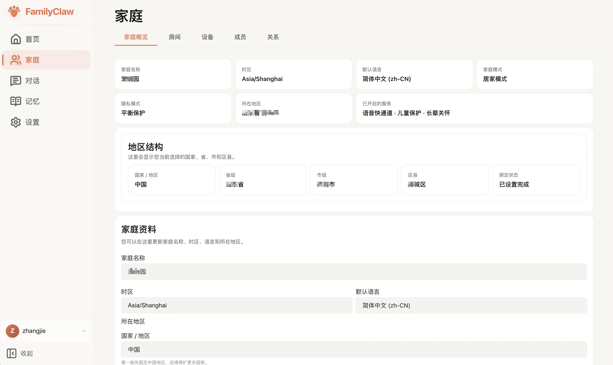
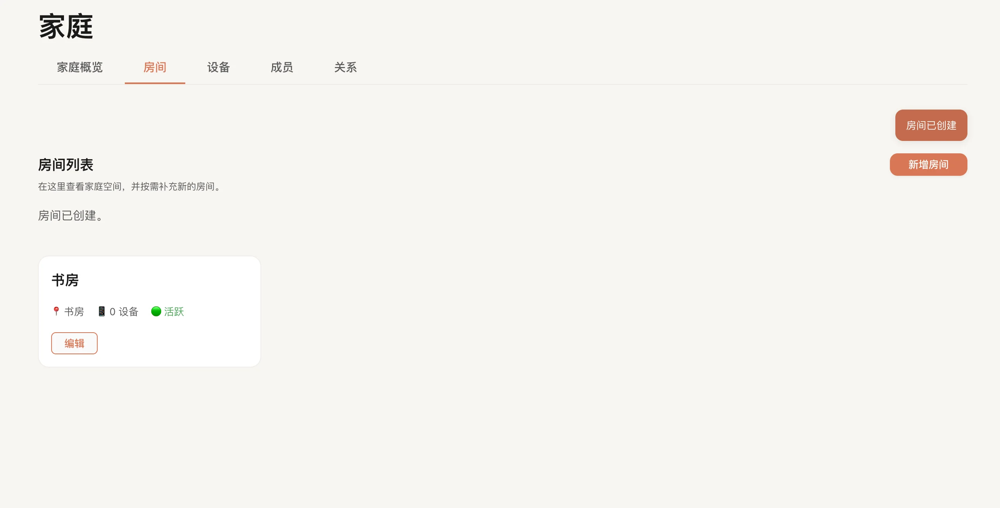
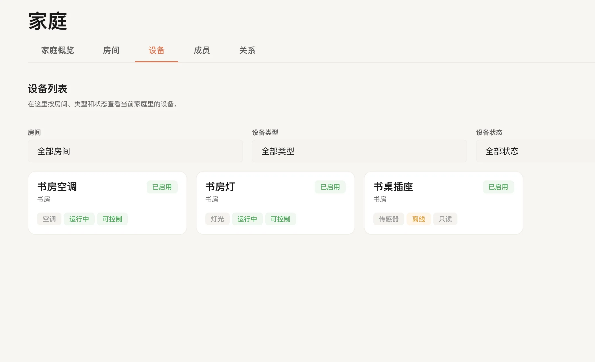
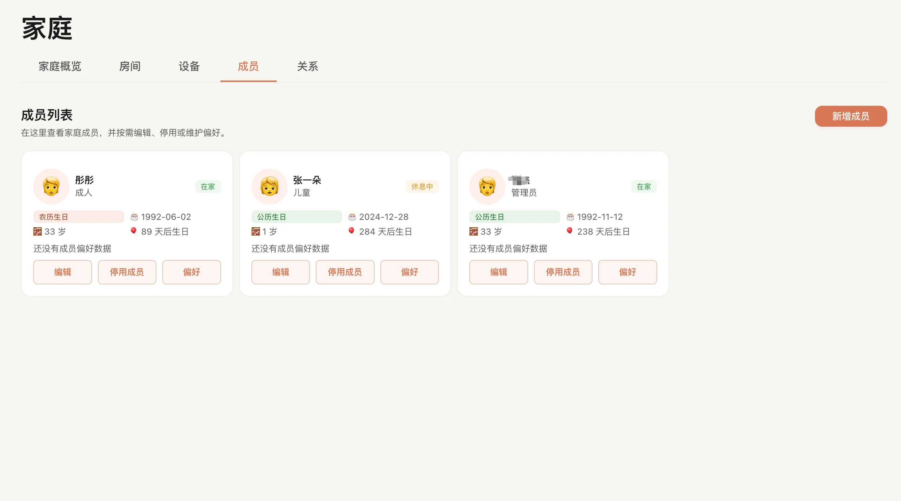
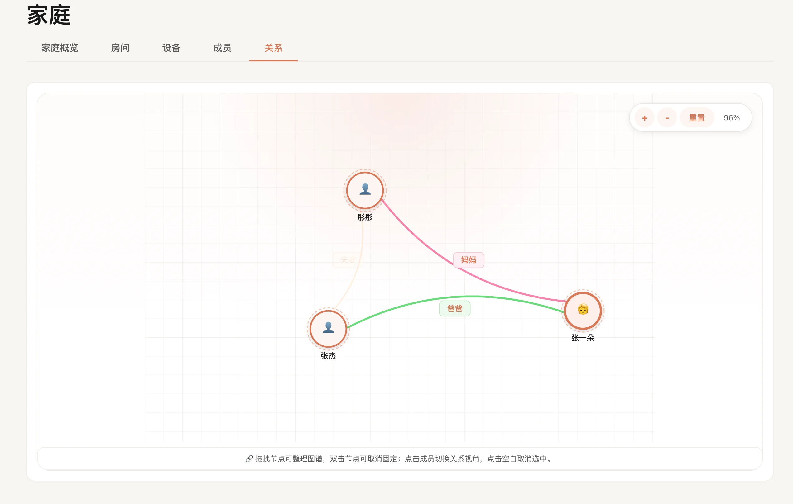

# 家庭

家庭页适合用来整理“这个家”的基础信息。

如果你想把家庭成员、房间、设备和彼此关系慢慢整理清楚，这一页就是最常用的地方。

## 这里可以做什么

### 1. 管理家庭基础资料

在“概览”里，你可以查看和修改：

- 家庭名称
- 时区
- 默认语言
- 地区信息（国家 / 省 / 市 / 区）

这里也会展示一些和家庭使用方式相关的状态，例如：

- 家庭当前模式
- 隐私模式
- 是否启用了访客模式、儿童保护、长者关怀、语音快速通道等

如果你刚完成初始化，后面补资料、改资料，基本都会先回到这里。

### 2. 新增房间并查看房间分布

在“房间”里，你可以：

- 查看现有房间列表
- 新建房间
- 为房间选择类型
- 设置房间隐私级别

当前创建房间时需要填写：

- 房间名称
- 房间类型
- 隐私级别

页面会把房间下的设备数量、活跃状态一起展示出来，方便你先判断家里结构是不是已经录完整。

现在已经可以新建房间和查看列表；如果你发现某些编辑动作还没开放，不影响先把房间结构补齐。

> 配图占位：房间列表与新建房间弹窗

### 3. 查看设备并按条件筛选

在“设备”里，你可以：

- 查看当前家庭下的设备列表
- 按房间筛选
- 按设备类型筛选
- 按设备状态筛选
- 打开设备详情弹窗

设备页会展示的信息包括：

- 设备名称
- 所属房间
- 设备类型
- 当前运行状态
- 是否可控制
- 是否启用

如果某个设备来自集成插件，这一页通常能最快帮你看出：

- 设备有没有同步进来
- 同步进来了但状态是不是异常
- 房间绑定是不是对的

### 4. 新增成员、编辑成员、停用成员

在“成员”里，你可以直接管理家里每个人的信息。

已支持的动作包括：

- 新增成员
- 修改成员资料
- 设置昵称、性别、角色、年龄段、生日、手机号
- 为儿童指定监护人
- 启用 / 停用成员
- 编辑成员偏好

当前成员角色包括：

- 管理员
- 成人
- 儿童
- 长者
- 访客

页面还会结合生日、农历生日标记、监护人信息和成员偏好，给出更完整的成员卡片信息。

如果你要做老人关怀、儿童照护、家庭协作，这里的成员资料最好尽量补完整。

### 5. 维护成员关系

在“关系”里，你可以：

- 查看现有成员关系
- 用图形方式查看关系网络
- 新增关系
- 删除关系

当前关系管理是按“源成员 -> 关系类型 -> 目标成员”来创建的。  
这对后续的称呼理解、照护关系、家庭协作都很重要。

如果家里有儿童、长者，或者你希望系统更好地理解谁在照顾谁、谁和谁是什么关系，这一页最好认真补完整。

## 第一次进入，建议这样整理

1. 先看“概览”，确认家庭名称、时区、语言、地区对不对。
2. 再去“房间”，把家里的主要空间补齐。
3. 接着看“成员”，把家人资料补完整。
4. 再去“关系”，把监护、父母、配偶、子女等关系补清楚。
5. 最后看“设备”，确认集成过来的设备是否已经落到正确房间。

## 常见问题

### 家庭页打开后有些卡片空白

这通常是因为有些信息还没补，或者某部分数据暂时没有加载出来。先看看页面顶部有没有相关提示。

### 为什么设备页里有设备，但房间里数量不对

先检查设备是不是已经绑定到了正确房间。设备同步进来，不等于房间关系一定已经整理好。

### 儿童成员为什么必须选监护人

因为儿童成员通常需要和监护关系一起使用。先把监护人补上，后面很多家庭场景会更完整。

### 我改完成员资料，为什么别的页面没立刻变化

有些页面会稍后刷新，或者需要你重新进入一次页面才能看到最新结果。

## 接下来去哪

- 想回首页看整体情况，去 [仪表盘](../使用指南/仪表盘.md)。
- 想直接和家庭助手聊天，去 [对话](../使用指南/对话.md)。
- 想整理长期记忆，去 [记忆](../使用指南/记忆.md)。
