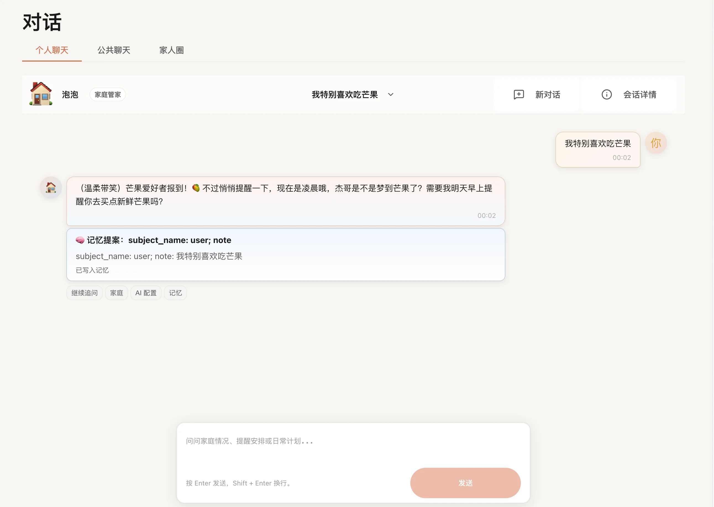
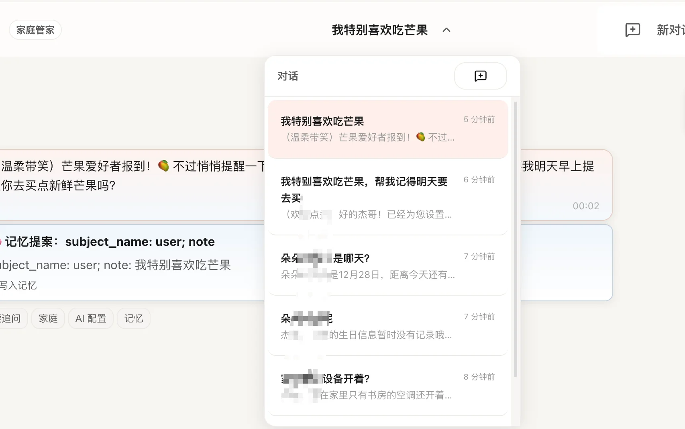
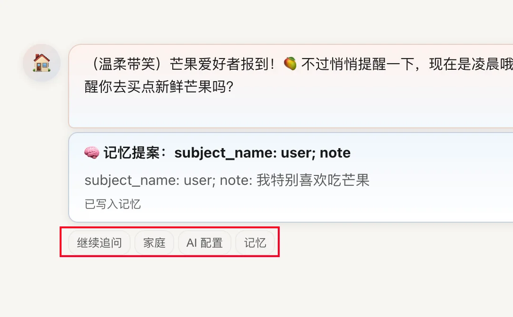
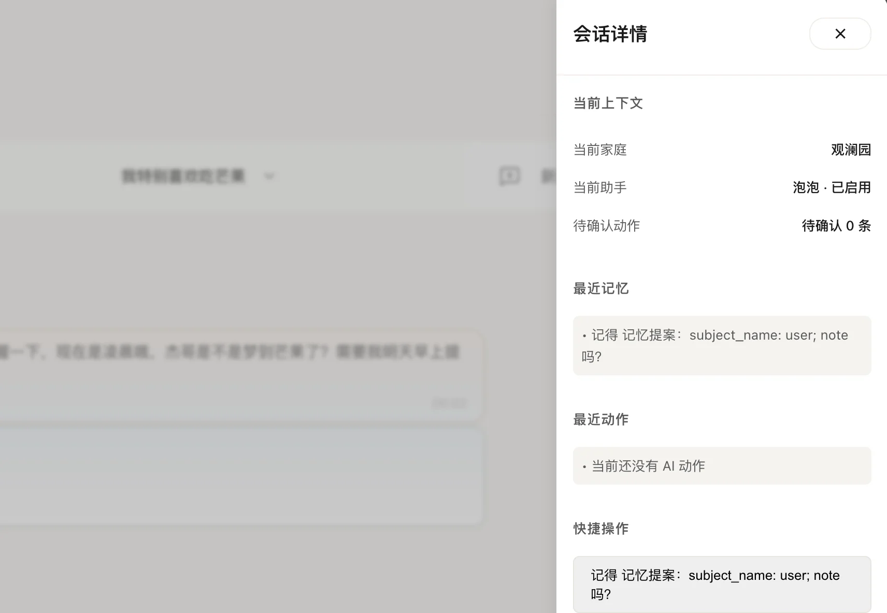
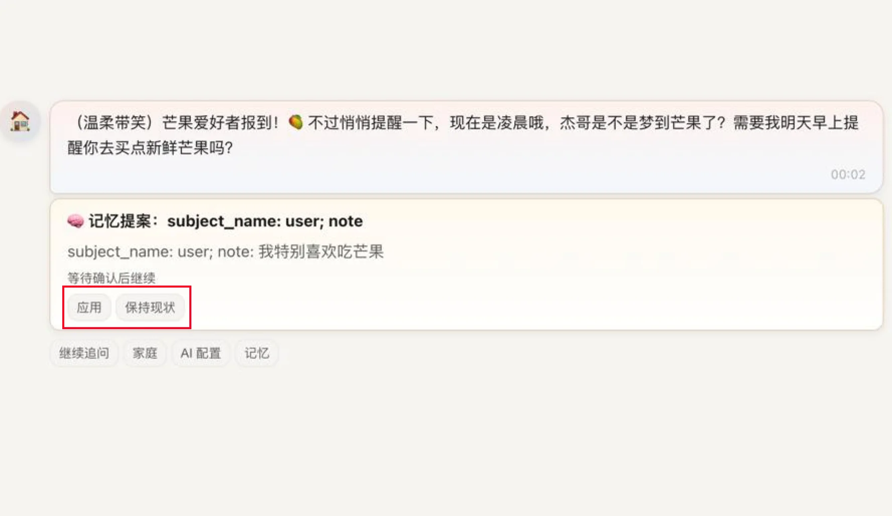
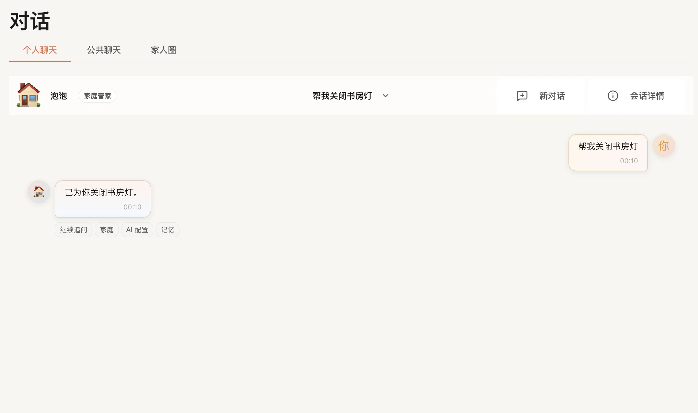

# 对话 / 助手

对话页是你和 FamilyClaw 最直接的沟通入口。

如果你已经完成登录和初始化，并且家里已经配置好至少一个可用的 AI 助手，就可以从这里开始聊天。

当前真正可以使用的是 `个人` 标签页；`公共` 和 `Moments` 先不用管。

## 你可以在这里做什么

### 1. 新建会话并管理历史会话

进入页面后，你可以直接开始新的对话，也可以切换到以前的会话继续聊。

当前页面支持：

- 点击右上角 `新对话` 按钮创建新会话
- 通过会话标题区域展开会话列表
- 查看每个会话的标题、最近一条消息摘要、最近活跃时间
- 点击某个历史会话，继续回到这段上下文里对话

如果你第一次进入页面、当前还没有任何会话，页面会直接给出“新建会话”的入口，不需要你先做别的复杂操作。

### 2. 选择不同的 AI 助手来对话

如果你的家庭里配置了多个可对话助手，这个页面允许你切换当前助手。

页面顶部会显示当前助手的信息，包括：

- 助手名称
- 助手类型
- 当前是否为可用状态

当存在多个可切换助手时，你可以点击头像区域进行切换。切换后，页面会基于新助手创建一段新的会话，避免把不同助手的上下文混在一起。

只有当前已启用、并且支持对话的助手，才会出现在这里。
如果你切换了助手，通常会从一段新的会话开始，这样不会把不同助手的上下文混在一起。

### 3. 发送消息并实时接收回复

你可以：

- 在输入框中输入问题
- 按 `Enter` 直接发送
- 按 `Shift + Enter` 换行
- 等待助手实时返回内容

消息会逐步返回，所以你通常会看到：

- 你的消息先出现在会话中
- 助手消息进入“正在生成”状态
- 内容逐步返回并最终完成

### 4. 直接使用建议问题，少打字

页面会自动拉取一组适合当前家庭和当前助手的建议问题。

这些建议问题会出现在两个地方：

- 页面上下文面板中的快捷提问区
- 某些助手回复下面的建议追问按钮

你可以直接点这些问题继续聊，适合：

- 不知道该怎么开口时
- 想快速试试助手能力时
- 想围绕当前话题继续追问时

这对第一次使用的人特别友好，因为你不需要先想好怎么组织提问。

### 5. 查看当前对话上下文

页面右上角有“详情”入口，打开后会看到右侧上下文面板。

这个面板目前会显示：

- 当前家庭
- 当前使用的助手
- 当前待处理动作数量
- 最近记忆
- 最近动作记录
- 快捷提问按钮

其中“最近记忆”会优先显示当前会话里最近提取到的事实；如果暂时没有可展示的事实，页面会回退显示建议问题。

这个面板主要是帮你快速理解：

- 助手此刻是在为哪个家庭服务
- 它最近参考了哪些上下文
- 有没有待确认的动作或建议

### 6. 在对话里确认或忽略助手提案

当助手判断某件事不应该直接替你执行，而是需要你确认时，页面会在消息下方显示提案卡片。你可以直接在卡片里操作，不需要跳出页面。

目前真实支持的提案类型包括但不限于：

- 计划任务创建
- 计划任务更新
- 计划任务暂停
- 计划任务恢复
- 计划任务删除
- 提醒创建
- 配置应用
- 记忆写入类建议

常见操作方式：

- 点主按钮确认执行
- 点次按钮先忽略或稍后再说

如果某个计划任务提案关键信息还没补齐，确认按钮会受限，不会装作已经能执行。

### 7. 确认动作、查看结果，必要时撤销

除了“先问你要不要做”的提案，你还会看到已经执行过或准备执行的动作记录。

当前页面里，动作可能以不同策略出现：

- 需要确认后再执行
- 只通知你，不拦截主流程
- 自动执行，但保留结果和撤销入口

你在页面上能看到的真实操作包括：

- 确认动作
- 忽略动作
- 撤销已完成动作（仅在该动作本身支持撤销时出现）

### 8. 从对话直接跳到相关页面

当助手回复完成后，消息下方可能会给出快捷按钮，帮助你继续处理相关事项。

当前真实可跳转的页面包括：

- 家庭页
- AI 设置页
- 记忆页

这很适合下面这类场景：

- 助手建议你先去补家庭资料
- 助手提示你当前没有可用 AI 助手，需要先去设置页
- 助手提到某条记忆，需要你去记忆页进一步查看

> 配图占位：消息下方快捷跳转按钮

## 第一次使用，建议这样试

1. 先确认你已经选中了正确的家庭，并且家庭里已经配置好至少一个 AI 助手。
2. 进入 `个人` 标签页，点击 `新对话`。
3. 先点一条建议问题，确认助手能正常回复。
4. 再自己输入一个真实问题，观察是否有提案卡片或动作卡片出现。
5. 如有需要，打开右侧详情面板，确认当前上下文、最近记忆和最近动作。
6. 如果助手提示你去补配置，再从消息下方快捷跳转到对应页面处理。

## 常见问题

### 为什么我看到“没有可用助手”？

通常是因为当前家庭还没有可用的 AI 助手。先去设置页确认是否已经配置并启用。

### 为什么发送按钮有时点不了？

通常是因为连接还没准备好、刚切换会话，或者网络暂时不稳定。等一会儿再试通常就能恢复。

### 为什么我切换助手后像是重新开始聊了？

这是正常的。切换助手后，会以新的助手重新开始一段会话，避免上下文混在一起。

### 为什么有时只有回复，没有“确认”“忽略”这些按钮？

因为这些按钮只会在需要你确认或处理时才出现，不是每条回复都会有。

### 为什么我点进了 `公共` 或 `Moments`，但不能正常聊天？

因为当前真正可以使用的是 `个人` 标签页，另外两个先不用管。

## 接下来去哪

- 想整理家庭资料，去 [家庭](../使用指南/家庭.md)。
- 想查看或修正对话里提到的重要信息，去 [记忆](../使用指南/记忆.md)。
- 想补模型和助手设置，去 [设置](../使用指南/设置.md)。
