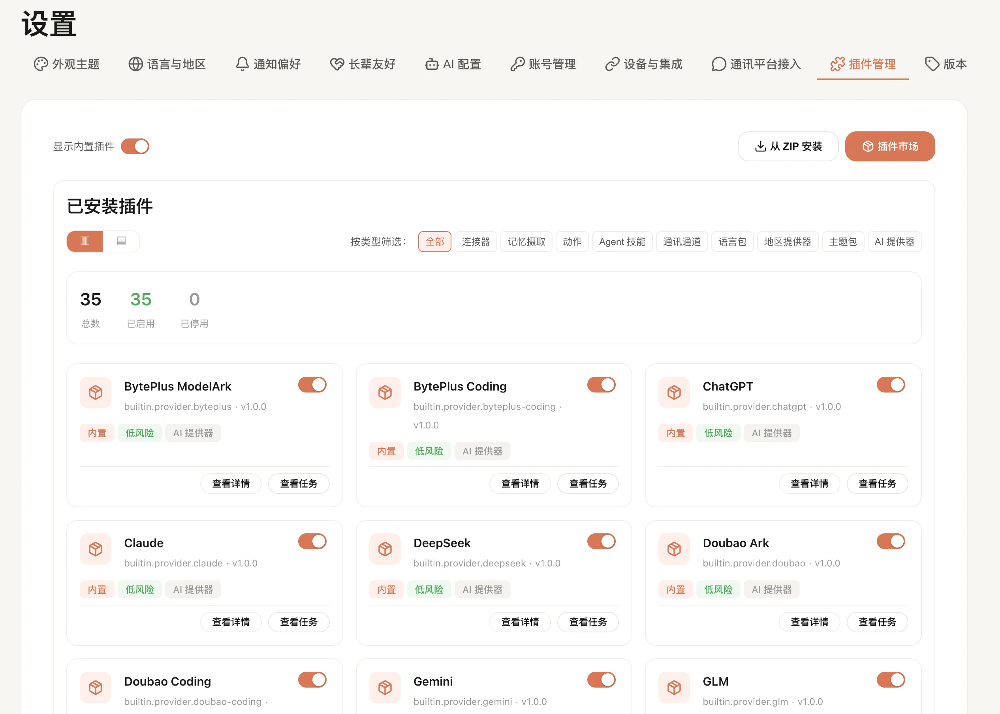

# 插件

插件页适合用来给 FamilyClaw 加新能力，或者管理已经接进来的能力。

如果你想接入新的 AI 服务、通讯渠道、主题，或者其他扩展功能，通常都会从这里开始。

## 这里可以做什么

- 浏览可用插件，看看它们来自哪里、现在是什么状态、适不适合你用。
- 在卡片视图和列表视图之间切换，按你更顺眼的方式查看。
- 在插件市场里先看简洁卡片，再点开详情模态框查看介绍、版本状态、提供方和适用分类。
- 添加新的插件来源，然后按需同步插件列表。
- 安装、启用、禁用插件。
- 查看插件的版本情况和风险提示。

## 一般怎么用

1. 打开插件页，确认右上角家庭选择正确。
2. 打开“插件市场”后，系统会先自动从已启用的插件源刷新一次目录。
3. 如果你要接入新的插件来源，就先在“插件源设置”里添加仓库地址并同步。
4. 在市场列表里先挑目标插件，再点开详情查看说明、风险提示、版本状态和提供方信息。
   详情弹窗会把“插件介绍”和“版本信息”分开显示，只保留普通用户需要看的内容；其中“版本更新状态”表示当前已安装版本和市场版本的关系，未安装时会直接显示“未安装”。
5. 确认没问题后，再在详情里选择安装、升级或启用。
6. 有些插件自带可直接工作的默认配置，安装后就能直接启用；只有明确要求你补配置的插件，才需要继续去设置页完成。

## 页面上的提示怎么理解

- **风险等级**：风险越高，越建议你先看清楚再启用。
- **版本状态**：会告诉你这个插件是不是已经安装、能不能升级、有没有被阻断。
- **来源标识**：可以帮助你区分这是内置、官方还是第三方插件。
- **禁用后的影响**：禁用后，相关功能通常不会继续运行，但你仍然可以回来看配置。

## 常见问题

- **启用失败**：先看看这个插件要求的配置是不是还没填完整。带默认配置的插件如果刚安装就启用失败，通常就是后端状态没刷新对，不是你漏填了什么。
- **市场源同步失败**：先确认仓库地址、分支和网络是否正确。
- **市场目录没变化**：现在市场同步只会更新真的有变化的条目。没变化不是坏了，而是后端没必要重复全量拉取。
- **主题或语言突然失效**：很可能是对应插件被禁用了，换一个可用主题或重新启用即可。

## 接下来去哪

- 安装完插件后需要配置，去 [设置](../使用指南/设置.md)。
- 想回到日常使用页面，去 [仪表盘](../使用指南/仪表盘.md)。
