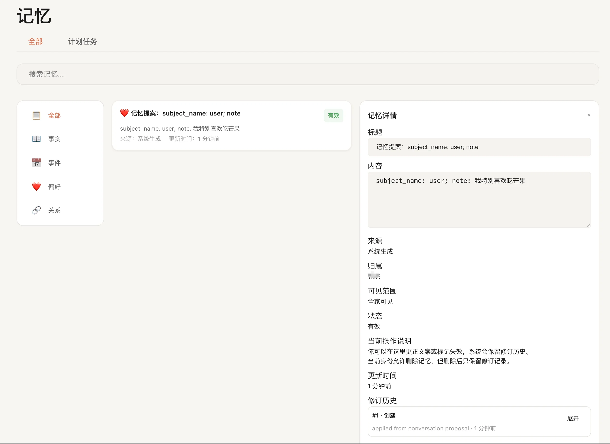

# 记忆

记忆页适合用来查看 FamilyClaw 已经记住了什么，也适合在发现错误时手动修正。

如果你希望系统长期记住家庭偏好、重要事件和人物关系，这一页会很有用。

## 这里可以做什么

- 按类型筛选：全部 / 事实 / 事件 / 偏好 / 关系。
- 搜索：支持关键字搜索标题与内容。
- 查看详情：点击左侧列表项查看右侧详情，包含所有修订记录。
- 状态与可见性：
  - 可见性：公开 / 家庭 / 私密 / 敏感。
  - 状态：有效 / 待确认 / 已失效 / 已删除。
- 修订与操作：
  - 纠错（Correct）：提交修订，生成新的版本。
  - 标记失效（Invalidate）：保留历史，当前版本失效。
- 删除（Delete）：从当前使用列表里移除，但历史仍会保留。

## 一般怎么用

1. 打开记忆页，等待列表加载完成（右上角家庭上下文要正确）。
2. 通过顶部筛选切换类型，或输入关键词搜索。
3. 点击左侧某条记忆，右侧展示详情与修订历史：
   - “当前版本”展示标题、摘要、可见性、状态。
   - “修订历史”按时间倒序，展示变更字段与原因。
4. 若需修订：
   - 选择“纠错”填写新的标题/内容/可见性后提交。
   - 选择“标记失效”或“删除”时，需填写原因后提交。
5. 提交后列表会刷新；失败时请根据提示检查权限或网络。

## 这些状态怎么理解

- **公开 / 家庭 / 私密 / 敏感**：表示这条记忆可以被谁看到。
- **有效 / 待确认 / 已失效 / 已删除**：表示这条记忆现在还能不能继续作为有效信息使用。
- **纠错**：适合内容不准确，但这条记忆本身还应该保留的时候。
- **标记失效**：适合这条信息以前是对的，现在已经不再成立。
- **删除**：适合你确认这条内容不应该继续保留在当前使用列表里。

如果你的账号权限不够，某些操作会直接失败。这时候换管理员账号，或者请管理员来处理。

## 常见问题

- **列表为空**：新环境首次使用可能尚无记忆；正常对话与事件会逐步产生记忆。
- **修订失败或提示权限不足**：先确认你现在是不是用对了账号，也确认当前家庭没有切错。
- **时间显示不对**：先去设置页确认时区是不是已经改成你常用的那一个。

## 接下来去哪

- 想继续聊下去，去 [对话](../使用指南/对话.md)。
- 想调整时区或其他基础配置，去 [设置](../使用指南/设置.md)。
