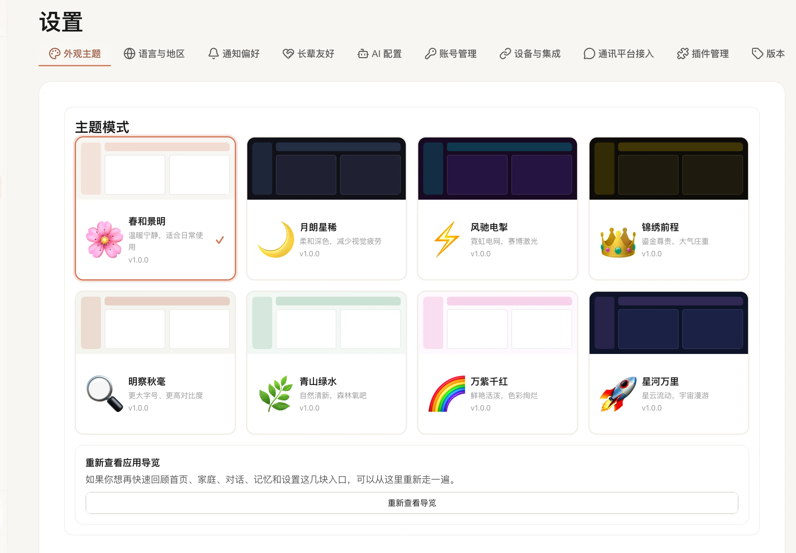
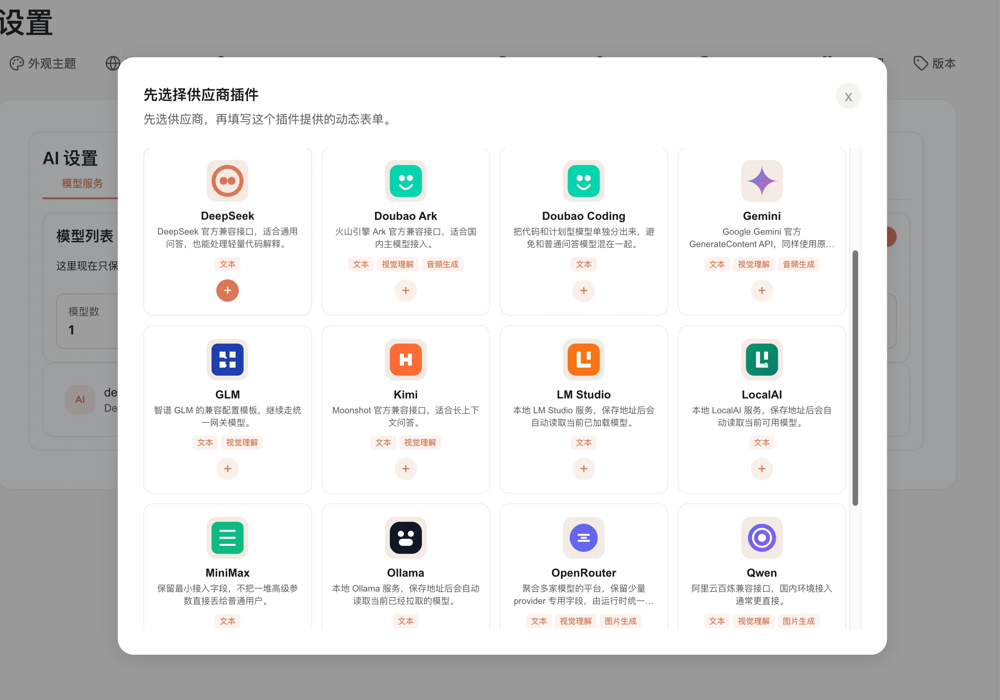

# 设置

设置页适合用来把 FamilyClaw 调整成更符合你家使用习惯的样子。

像主题、语言、时区、AI 服务这些内容，基本都会从这里调整。

## 这里主要能改什么

- **外观与主题**：可以切换界面风格，选一个你看着更舒服的主题。
- **语言与时区**：会影响页面语言和时间显示，建议在第一次使用时就先设好。
- **AI 设置入口**：如果你要配置模型、助手或其他 AI 相关能力，也从这里进入。

## AI 设置里可以做什么

- 创建或调整家庭管家和其他助手角色。
- 配置你要连接的 AI 服务，填写地址、密钥和模型名称等信息。
- 为不同用途选择合适的模型，比如聊天用哪个、其他任务优先用哪个。
- 如果初始化还没做完，这里也会告诉你还差哪些步骤。

### 如果你想接本地模型

现在内置支持这些本地模型供应商插件：

- `Ollama`
- `LM Studio`
- `LocalAI`

另外也支持很多常见的云端 AI 服务。

最省事的配置顺序通常是：

1. 先选供应商插件
2. 填本地服务地址
3. 如果你的本地服务启用了 API Key，再把 API Key 填上
4. 页面会自动刷新模型列表
5. 直接从列表里选模型；如果你要填自定义模型名，也可以继续手动输入

这样配完以后，你就可以直接在系统里使用本地模型了。

## 使用时注意

- 页面顶部会显示当前家庭；切换家庭后，语言/主题/时区等设置随之切换。
- 如果当前家庭还没初始化完成，页面会提示你先回去完成初始化。

## 常见问题

- **主题缺失或突然失效**：先看看对应主题插件是不是被禁用了。
- **语言或时区没变化**：刷新页面或者重新登录一次，通常就会生效。
- **AI 服务保存失败**：先检查必填项是不是没填完整，再确认相关插件是不是已经启用。

## 接下来去哪

- 想开始聊天，去 [对话](../使用指南/对话.md)。
- 想安装更多扩展能力，去 [插件](../使用指南/插件.md)。
