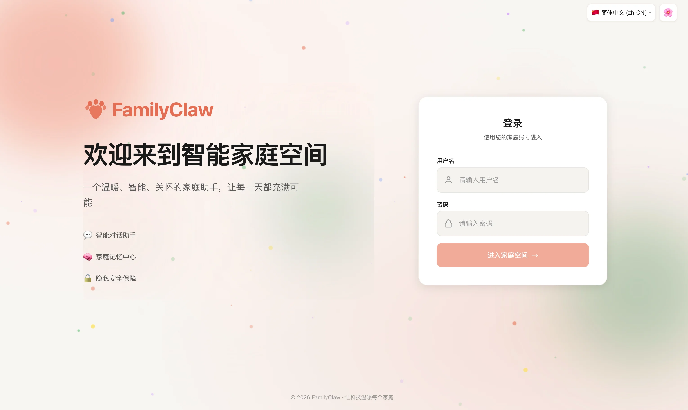
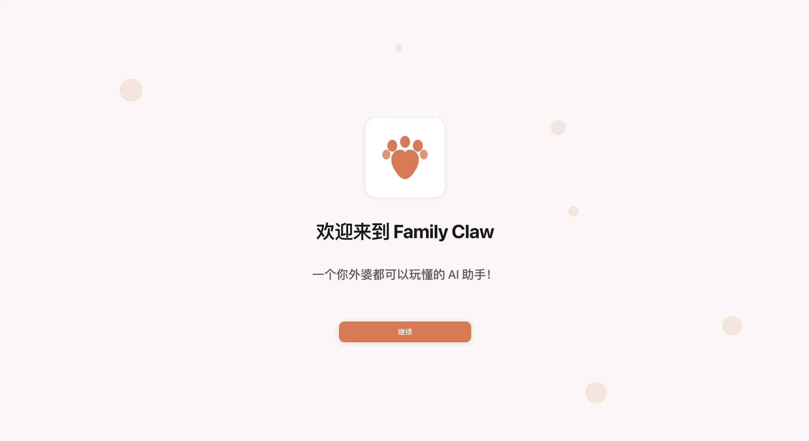
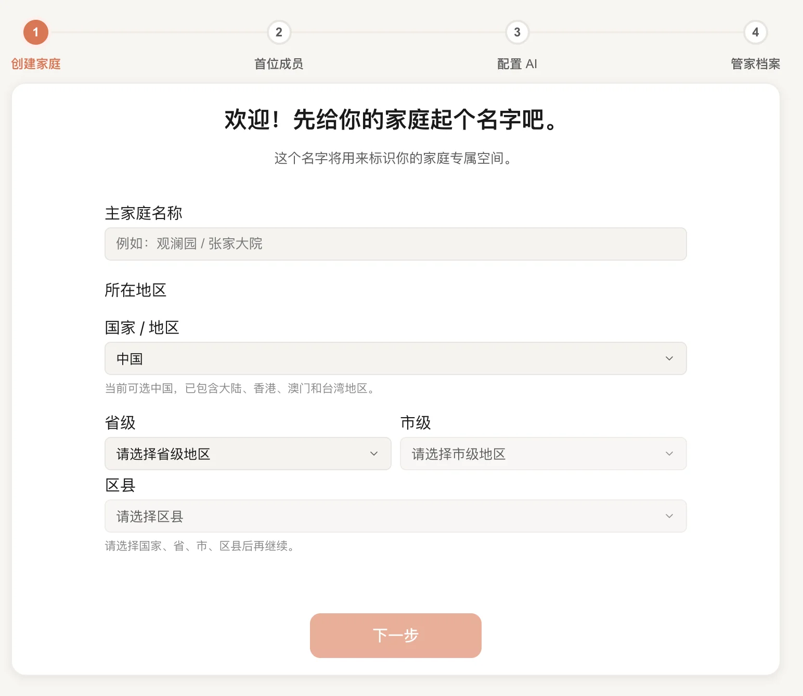
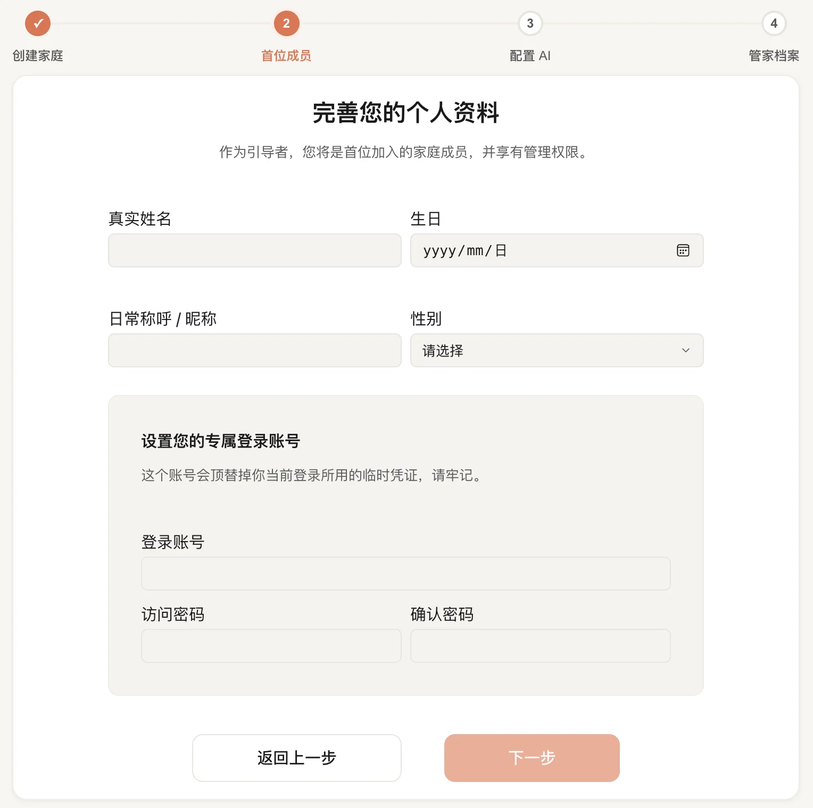
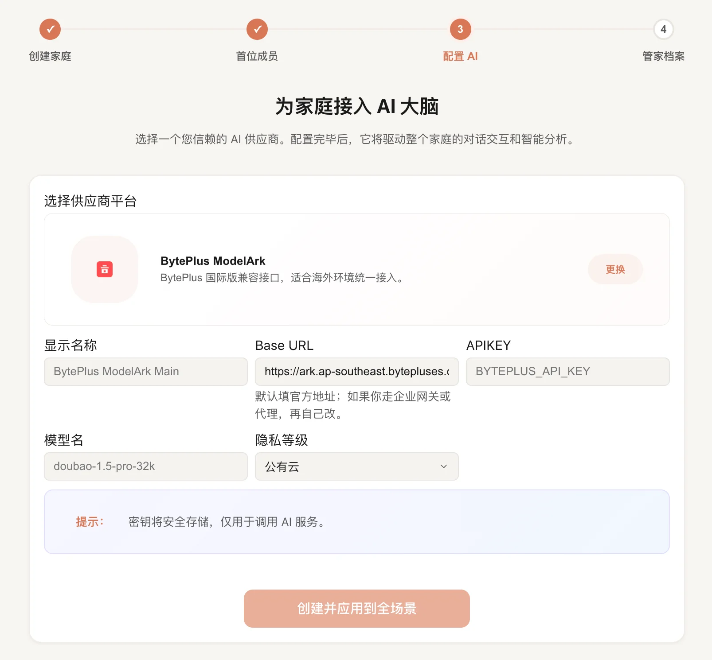
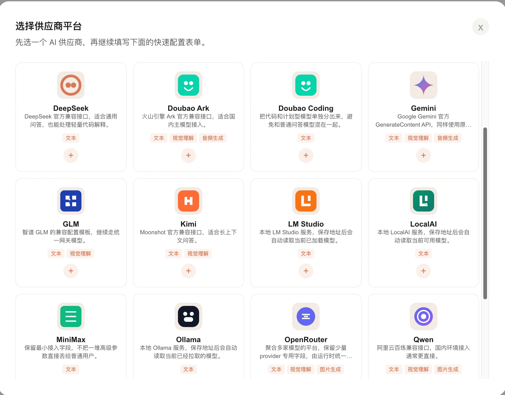
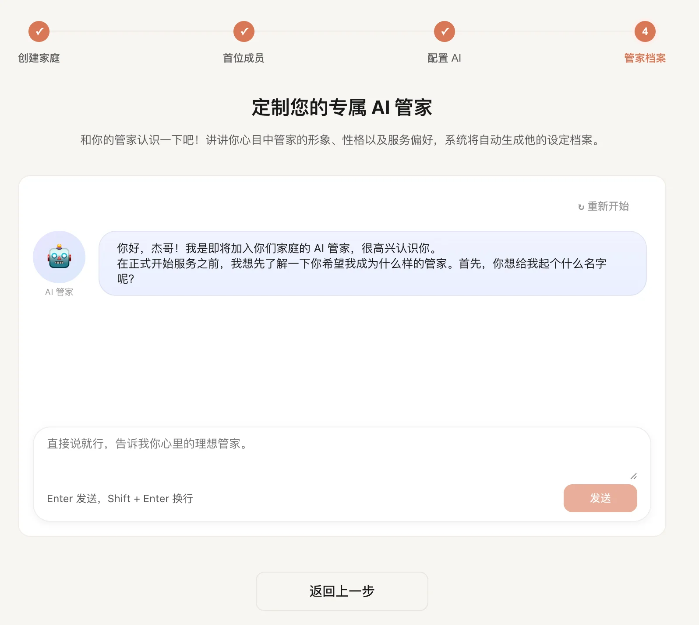
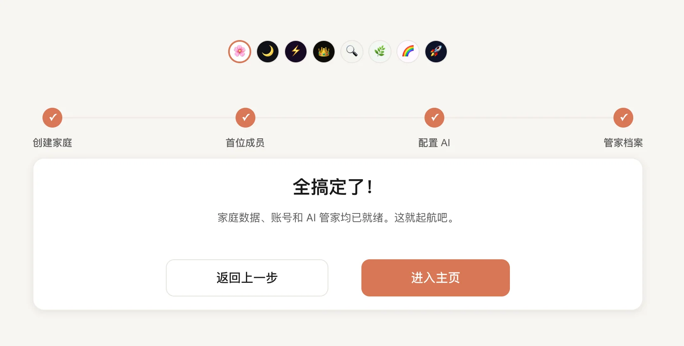

# 首次登录与初始化

如果你刚把 FamilyClaw 装好，第一次进入系统时会先来到这里。

这一段不用研究太多概念，跟着页面一步步填完，系统就能开始正常使用。

## 先登录进入系统

1. 在浏览器打开你的部署地址，默认是 `http://<主机>:8080`。
2. 如果你还没有登录，系统会自动带你进入登录页。
3. 第一次登录时，默认账号是 `user`，默认密码也是 `user`。
4. 完成初始化后，你会创建自己的账号密码，默认的 `user` 账号会停用。
5. 如果你是用手机浏览器竖屏打开，登录页会自动切成以表单为主的移动端卡片布局，品牌说明和功能卖点不会再渲染，LOGO、产品名称和欢迎语会按移动端比例缩放并整体下移到更自然的位置，品牌区和登录卡片都会按同一中心线居中显示，页面还会收掉多余的横向滚动槽和右侧空白，输入框和按钮也会放大到适合触屏操作的尺寸。

## 跟着向导完成初始化

如果当前家庭还没有初始化，登录后会自动进入向导。

1. **家庭资料**
   - 先把家庭名称、时区、语言和地区填好。
   - 这些信息会影响后面的时间显示、默认语言和家庭场景。

2. **首位成员**
   - 创建第一个家庭成员。
   - 这里通常就是你自己，默认会作为管理员使用。

3. **模型服务**
   - 选择你准备使用的 AI 服务。
   - 按页面提示填写地址、密钥和模型名称等信息。
   - 如果你用的是 ChatGPT 供应商，现在既可以选 `Responses`，也可以选 `Chat Completions`，默认会先走 `Responses`，不通再自动回退。
   - 如果你只填了站点根地址，例如 `https://example.com`，系统会自动按 `https://example.com/v1` 去请求 API，不需要你手动补这一段。
   - 如果你已经有 OpenAI 兼容服务，或者本地模型服务，也可以在这里接入。

支持众多 AI 提供商，包括本地的 Ollama、LM Studio、LocalAI 等。

4. **首个管家**

   - 给你的第一个家庭管家做基本设定。
   - 你可以通过对话方式确定它的身份、语气和服务重点，后面还可以继续调整。
5. **完成**

   - 全部完成后，系统会自动进入仪表盘。

## 中途退出了怎么办

- 若中途退出，可在重新登录后自动继续；向导会显示当前进度。
- 如果系统判断当前家庭已经完成初始化，就会直接回到仪表盘。

## 常见问题

- **进不去向导，或者一直来回跳转**：先刷新页面，再重新登录；如果还不行，再检查服务是不是已经正常启动。
- **AI 服务这一步填不下去**：先确认地址和密钥是否正确；如果你接的是 ChatGPT 供应商，先看一下协议模式是不是选对了；如果你接的是本地模型，也确认本地服务已经在运行。
- **明明做完了，还是提示没初始化**：先重新登录一次，确认你现在进入的是刚刚完成初始化的那个家庭。

## 做完以后你会看到什么

- 你可以正常进入仪表盘。
- 系统不再把你重新带回初始化向导。
- 这时候你就可以继续去看 [仪表盘](../使用指南/仪表盘.md) 和其他页面了。
