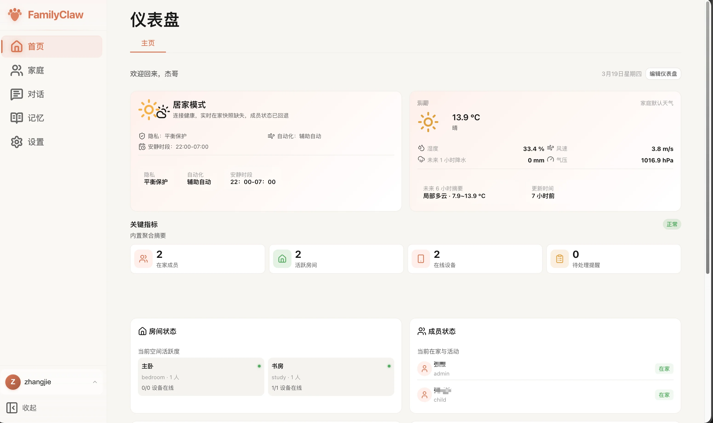
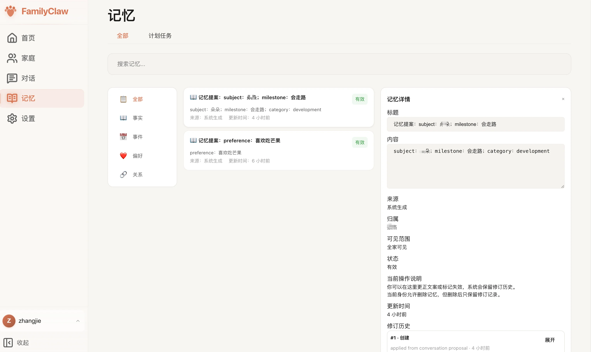

# 核心功能

## 当前核心模块

- 仪表盘：家庭概况、提醒、天气/健康等卡片，提供快速入口。
- 家庭：家庭、成员、房间、权限管理，是所有数据的根。
- 对话：文字对话入口已就绪，语音网关可选（端口 4399）。
- 记忆：事件/偏好/关系等长期记忆，可查询、可修订。
- 设置：AI 供应商、主题、插件、账户与时区语言等统一配置。
- 插件：AI 供应商、渠道、主题包等均以插件管理，支持启停和配置。

【配图占位：产品主界面示意】

## 能力边界

- 宿主：规则、权限、调度、标准数据模型、日志与审计。
- 插件：对接第三方 API/设备/模型，产出标准化实体、卡片和动作结果。

## 推荐继续阅读

- 具体怎么点：看 [使用指南](../使用指南/仪表盘.md)
- 要跑起来：看 [安装部署](../安装部署/概览.md)
- 要二开：看 [开发文档](../开发文档/环境准备.md) 和插件章节
