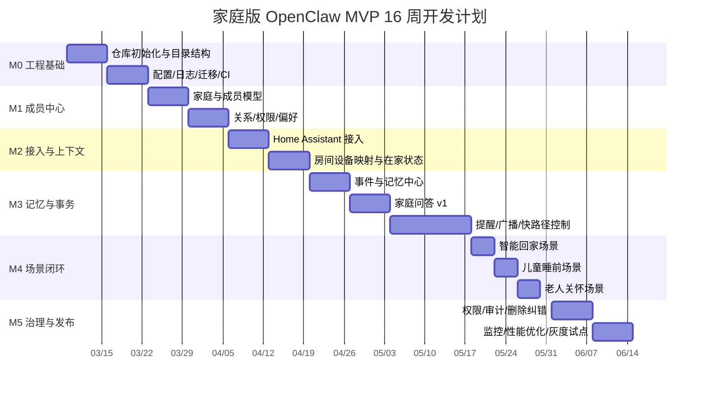

# 家庭版 OpenClaw 产品 Backlog 与里程碑甘特 v0.1

## 0. 文档目的

本文档用于把 `docs/家庭版OpenClaw-MVP与完整版本开发计划-v0.1.md` 继续细化为：

- 面向研发执行的产品 Backlog
- 面向项目推进的里程碑与阶段目标
- 面向排期的 16 周甘特视图
- 面向首期落地的开发启动顺序

本文档默认采用：

- `2 周一个 Sprint`
- `16 周 = 8 个 Sprint`
- `MVP 目标 = 跑通 3 个高价值场景闭环`

---

## 1. 开发起点建议

如果现在要正式开始开发，**第一步不要先做问答，也不要先做复杂语音，而是先做“家庭底座”**。

推荐启动顺序：

1. **工程骨架**
2. **家庭/成员/权限基础模型**
3. **房间/设备/HA 接入基础模型**
4. **事件总线与上下文缓存**
5. **提醒与场景编排基础骨架**

原因很简单：

- 没有成员模型，就无法判断“服务谁”
- 没有房间和设备模型，就无法稳定联动
- 没有上下文缓存，就无法做低延迟问答与广播
- 没有事件总线，后续记忆、提醒、审计都会返工

因此，**第一阶段的开发主线应是：家庭成员中心 + 家居接入底座 + 上下文中心骨架**。

---

## 2. 里程碑规划

## 2.1 里程碑总览

| 里程碑 | 周期 | 目标 | 发布物 |
|---|---|---|---|
| M0 | 第 1~2 周 | 完成工程初始化与架构冻结 | 仓库骨架、环境、ER 草案、API 草案 |
| M1 | 第 3~4 周 | 建立家庭成员中心与权限基础 | 家庭/成员/关系/权限 API 与管理页 |
| M2 | 第 5~6 周 | 建立设备接入与家庭上下文骨架 | HA 接入、房间模型、设备同步、在家状态 |
| M3 | 第 7~10 周 | 建立记忆、问答、提醒与快路径控制 | 问答 v1、提醒 v1、广播 v1、快路径控制 |
| M4 | 第 11~12 周 | 跑通 3 个代表性场景闭环 | 演示环境、场景编排、事件回写 |
| M5 | 第 13~16 周 | 补齐治理、性能、试点与发布准备 | 审计、权限校验、监控、灰度反馈 |

## 2.2 里程碑退出标准

### M0 退出标准

- 仓库可启动
- 数据库迁移可执行
- 基础 CI 可运行
- 核心目录结构冻结
- 家庭主数据模型冻结 v0.1

### M1 退出标准

- 可创建家庭
- 可创建成员
- 可定义关系
- 可配置角色与可见范围
- API 与管理页联通

### M2 退出标准

- 可同步 HA 设备
- 可映射房间与设备
- 可查询当前谁在家
- 可查询房间占用
- 可执行基础设备控制

### M3 退出标准

- 支持 10 个高频家庭问答
- 支持 4 类提醒
- 支持按房间广播
- 快路径能处理高频设备控制
- 记忆与事件写回可运行

### M4 退出标准

- 智能回家可重复演示
- 儿童睡前陪伴可重复演示
- 老人关怀提醒可重复演示
- 场景结果可被审计、可回看

### M5 退出标准

- 敏感数据受权限控制
- 高风险动作有确认机制
- 性能指标可观测
- 有一轮真实家庭试点记录

---

## 3. MVP 产品 Backlog

## 3.1 Epic 划分

| Epic ID | Epic 名称 | 说明 |
|---|---|---|
| E1 | 工程基础与平台底座 | 仓库、环境、日志、配置、监控、任务系统 |
| E2 | 家庭成员中心 | 家庭、成员、关系、权限、偏好 |
| E3 | 家居接入与上下文中心 | HA、小米、房间、设备、在家状态、活跃成员 |
| E4 | 家庭记忆中心 | 记忆卡、事件记录、热索引、写回机制 |
| E5 | 家庭问答与提醒 | 家庭问答、提醒、广播、每日公告 |
| E6 | 语音快路径与场景编排 | 高频命令、场景触发、冲突处理 |
| E7 | 管理台与治理 | 成员配置、场景配置、审计、删除与纠错 |
| E8 | 照片与相册基础能力 | 首期轻量照片归档与人物标签 |

## 3.2 P0 Backlog

| ID | Epic | 用户故事 | 优先级 | 依赖 | 预计 Sprint |
|---|---|---|---|---|---|
| B001 | E1 | 作为开发者，我需要统一仓库结构与基础服务启动方式 | P0 | 无 | S1 |
| B002 | E1 | 作为开发者，我需要配置管理、日志、错误处理与健康检查 | P0 | B001 | S1 |
| B003 | E1 | 作为开发者，我需要数据库迁移与种子数据机制 | P0 | B001 | S1 |
| B004 | E2 | 作为管理员，我可以创建家庭与家庭基础信息 | P0 | B003 | S1 |
| B005 | E2 | 作为管理员，我可以新增、编辑、停用家庭成员 | P0 | B004 | S2 |
| B006 | E2 | 作为管理员，我可以配置成员角色与可见范围 | P0 | B005 | S2 |
| B007 | E2 | 作为管理员，我可以配置成员偏好和提醒方式 | P0 | B005 | S2 |
| B008 | E2 | 作为系统，我需要存储成员关系图谱 | P0 | B005 | S2 |
| B009 | E3 | 作为系统，我可以接入 Home Assistant 并同步设备 | P0 | B002 | S3 |
| B010 | E3 | 作为管理员，我可以配置房间与设备归属 | P0 | B009 | S3 |
| B011 | E3 | 作为系统，我可以根据门锁/传感器/设备状态推断在家状态 | P0 | B009 | S3 |
| B012 | E3 | 作为系统，我可以维护当前活跃成员与房间占用缓存 | P0 | B011 | S3 |
| B013 | E3 | 作为系统，我可以调用 HA 执行基础设备动作 | P0 | B009 | S3 |
| B014 | E4 | 作为系统，我可以写入家庭事件记录 | P0 | B005,B013 | S4 |
| B015 | E4 | 作为系统，我可以写入事实记忆与偏好记忆 | P0 | B014 | S4 |
| B016 | E4 | 作为管理员，我可以查看、删除、纠错记忆 | P0 | B015 | S4 |
| B017 | E5 | 作为成员，我可以查询谁在家与基础设备状态 | P0 | B012,B015 | S4 |
| B018 | E5 | 作为成员，我可以查询今日家庭安排与个人提醒 | P0 | B015 | S5 |
| B019 | E5 | 作为系统，我可以创建个人/家庭/课程/服药提醒 | P0 | B005 | S5 |
| B020 | E5 | 作为系统，我可以按房间和成员进行广播 | P0 | B012,B019 | S5 |
| B021 | E6 | 作为成员，我说出高频控制指令时系统可直接执行 | P0 | B013 | S5 |
| B022 | E6 | 作为系统，我可以配置并执行智能回家场景 | P0 | B012,B020,B021 | S6 |
| B023 | E6 | 作为系统，我可以配置并执行儿童睡前场景 | P0 | B019,B020,B021 | S6 |
| B024 | E6 | 作为系统，我可以配置并执行老人关怀提醒场景 | P0 | B019,B020 | S6 |
| B025 | E7 | 作为管理员，我可以查看敏感操作审计日志 | P0 | B002,B014 | S7 |
| B026 | E7 | 作为系统，我对敏感问答与高风险动作执行权限校验 | P0 | B006,B025 | S7 |
| B027 | E7 | 作为管理员，我可以删除生物信息或关闭成员识别 | P0 | B006 | S7 |
| B028 | E1 | 作为团队，我需要监控关键接口、任务与场景成功率 | P0 | B002 | S7 |
| B029 | E6 | 作为团队，我需要对 3 个场景做端到端回归验证 | P0 | B022,B023,B024 | S8 |
| B030 | E7 | 作为团队，我需要试点反馈表与灰度发布流程 | P0 | B025,B028 | S8 |

## 3.3 P1 Backlog

| ID | Epic | 用户故事 | 优先级 | 依赖 | 建议阶段 |
|---|---|---|---|---|---|
| B031 | E8 | 作为系统，我可以接入 Immich 并同步照片元数据 | P1 | B005 | v0.5 |
| B032 | E8 | 作为系统，我可以为照片打人物标签并关联成员 | P1 | B031 | v0.5 |
| B033 | E4 | 作为系统，我可以生成成长记忆卡 | P1 | B031,B032 | v0.5 |
| B034 | E5 | 作为系统，我可以生成家庭日报/周报 | P1 | B015,B019 | v0.5 |
| B035 | E6 | 作为系统，我可以处理公共空间偏好冲突 | P1 | B012,B021 | v0.5 |
| B036 | E7 | 作为管理员，我可以配置隐私房间与隐私时段 | P1 | B026 | v0.5 |
| B037 | E5 | 作为家长，我可以获得儿童作息和学习摘要 | P1 | B015,B019 | v1.0 |
| B038 | E5 | 作为家属，我可以查看老人提醒完成率与异常摘要 | P1 | B019,B025 | v1.0 |

## 3.4 P2 Backlog

| ID | Epic | 用户故事 | 优先级 | 建议阶段 |
|---|---|---|---|---|
| B039 | E5 | 情绪化陪伴与情绪理解 | P2 | v2.0 |
| B040 | E6 | 多智能体自主编排 | P2 | v2.0 |
| B041 | E8 | 自动生成家庭月记/成长相册 | P2 | v1.0+ |
| B042 | E5 | 健康趋势分析与风险预警 | P2 | v1.0+ |
| B043 | E3 | 更多生态设备品牌统一接入 | P2 | v2.0 |

---

## 4. 按 Sprint 的执行视图

## 4.1 Sprint 目标总览

| Sprint | 周期 | 目标 |
|---|---|---|
| S1 | 第 1~2 周 | 完成工程骨架、数据库迁移、家庭与成员最小模型 |
| S2 | 第 3~4 周 | 完成成员、关系、权限、偏好管理 |
| S3 | 第 5~6 周 | 完成 HA 接入、房间设备模型、在家状态与上下文缓存 |
| S4 | 第 7~8 周 | 完成记忆、事件、基础问答 |
| S5 | 第 9~10 周 | 完成提醒、广播、快路径控制 |
| S6 | 第 11~12 周 | 完成 3 个标志性场景编排与联调 |
| S7 | 第 13~14 周 | 完成权限治理、审计、监控、性能优化 |
| S8 | 第 15~16 周 | 完成试点、回归、发布准备 |

## 4.2 甘特表（16 周）

## 4.3 单人开发甘特建议

如果由单人推进，建议按 `24~36 周` 重排，并优先顺序保持不变：

1. S1~S2：工程骨架 + 成员中心
2. S3：HA 接入 + 房间设备模型
3. S4：在家状态 + 上下文缓存
4. S5：提醒 + 广播 + 简单问答
5. S6：3 个场景闭环
6. S7：权限 + 审计
7. S8：试点与优化

---

## 5. 每个 Epic 的完成定义

## 5.1 E1 工程基础与平台底座

完成定义：

- 本地一键启动
- API 服务可运行
- 数据库迁移可执行
- 统一日志与错误格式
- 基础监控可接入

## 5.2 E2 家庭成员中心

完成定义：

- 支持家庭创建
- 支持成员增删改查
- 支持关系管理
- 支持角色与可见范围
- 支持偏好配置

## 5.3 E3 家居接入与上下文中心

完成定义：

- HA 实体同步可运行
- 房间设备映射清晰
- 当前谁在家可查询
- 当前房间占用可查询
- 基础设备控制可执行

## 5.4 E4 家庭记忆中心

完成定义：

- 可记录事件
- 可查询记忆
- 可删除与纠错
- 可作为问答输入

## 5.5 E5 家庭问答与提醒

完成定义：

- 至少 10 个高频问答
- 至少 4 类提醒
- 广播按成员和房间分发
- 结果遵守权限规则

## 5.6 E6 语音快路径与场景编排

完成定义：

- 高频设备控制可直接执行
- 三个场景可编排
- 低置信度时有回退策略
- 冲突和失败时有回执

## 5.7 E7 管理台与治理

完成定义：

- 成员和场景可配置
- 审计日志可查看
- 敏感操作受控
- 数据可删除与纠错

---

## 6. 现在就可以开始的任务清单

## 6.1 第 1 周必须开干的任务

### 后端

- 初始化 `api-server`
- 初始化 `worker`
- 建立 `SQLite` 数据库与迁移
- 建立基础配置与环境变量
- 建立健康检查、日志、统一错误格式

### 数据

- 设计首批表：
  - `households`
  - `members`
  - `member_relationships`
  - `member_preferences`
  - `rooms`
  - `devices`
  - `device_bindings`

### 集成

- 调通 Home Assistant 开发环境
- 明确实体同步方式
- 明确设备状态订阅方式

### 前端

- 初始化 `admin-web`
- 做基础登录壳和家庭管理页面框架
- 先做成员列表/编辑表单壳子

## 6.2 第 2 周必须收口的任务

- 跑通家庭创建 API
- 跑通成员 CRUD API
- 跑通关系配置 API
- 跑通角色与权限模型初版
- 输出首版 ER 图与 API 清单

---

## 7. 推荐的第一开发切片

如果只选一个切片开始编码，推荐这个：

### 切片名称

**家庭与成员底座 + 房间设备基础模型**

### 切片目标

完成后，你将具备：

- 一个真实可扩展的家庭主数据模型
- 一个后续所有能力都可依赖的数据底座
- 一个能开始接 HA 与记忆系统的最小框架

### 切片交付物

- 家庭与成员表结构
- 成员/关系/偏好 API
- 房间与设备表结构
- 房间与设备管理 API
- 基础管理台页面

### 为什么从这里开始

因为这是所有后续功能最稳的依赖底座，返工概率最低，且能快速把“概念项目”变成“工程项目”。
