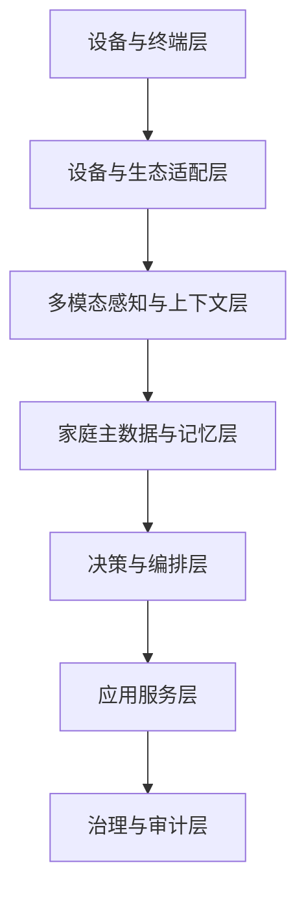
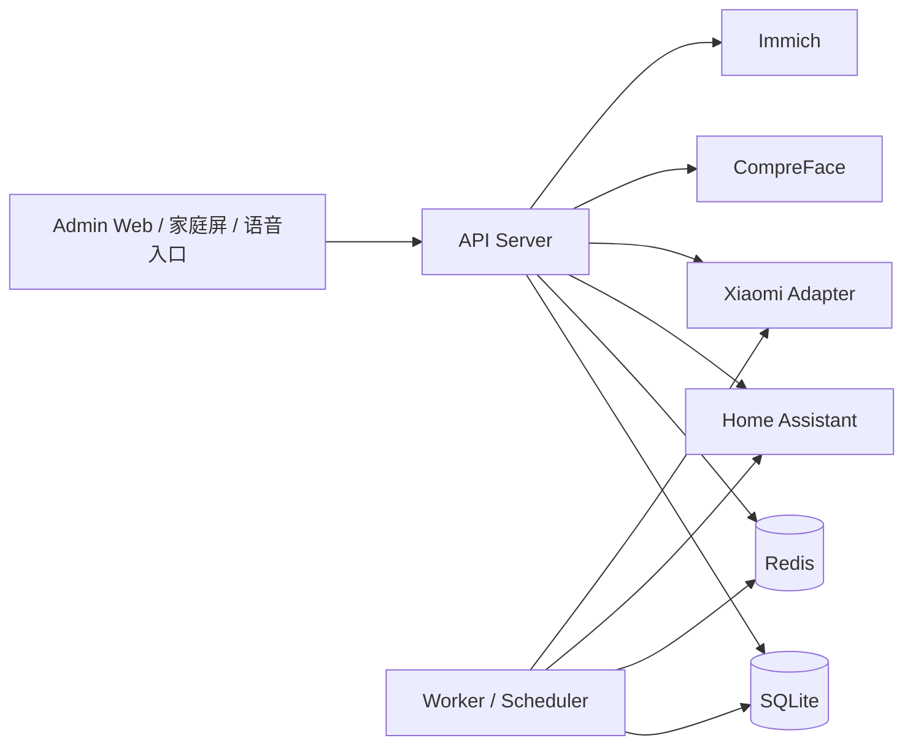
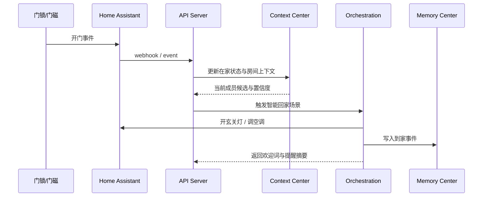

# 家庭版 OpenClaw 系统架构图说明与数据库设计草案 v0.1

## 0. 文档目标

本文档用于把项目从“规划层”推进到“系统设计层”，回答 4 个关键问题：

1. 系统应该拆成哪些模块
2. 模块之间如何交互
3. 首期应该部署哪些基础组件
4. 首期数据库应该如何建表

本文档聚焦 `MVP ~ v0.5`，不追求一次性覆盖所有长期演进能力。

---

## 1. 架构目标

首期架构应满足以下要求：

- 支持家庭成员中心作为主数据源
- 支持 Home Assistant 与小米设备接入
- 支持事件驱动的场景编排
- 支持记忆写回、问答、提醒与广播
- 支持低延迟快路径控制
- 支持权限、审计、删除纠错
- 能从模块化单体平滑演进到服务化

---

## 2. 系统分层

## 2.1 逻辑分层

### A. 设备与终端层

- 小爱音箱/语音终端
- 门锁、门磁、人体传感器
- 摄像头
- 灯、空调、窗帘等设备
- 手机、手表、家庭屏

### B. 设备与生态适配层

- Home Assistant Gateway
- Xiaomi Gateway
- Photo/Immich Adapter
- Notification Adapter

### C. 多模态感知与上下文层

- 在家状态推断
- 房间占用推断
- 活跃成员推断
- 快路径意图识别

### D. 家庭主数据与记忆层

- Household / Member / Relationship
- Preferences / Permissions
- Memory / Event / Reminder / Policy

### E. 决策与编排层

- 场景规则引擎
- 快慢路径分流
- 冲突处理
- 权限校验

### F. 应用服务层

- 家庭问答
- 提醒与广播
- 家居联动
- 睡前陪伴
- 老人关怀

### G. 治理与审计层

- 审计日志
- 数据删除
- 敏感操作确认
- 访问控制

---

## 3. 运行时组件图

## 3.1 MVP 组件图

## 3.2 组件职责

### `API Server`

负责：

- REST API
- 权限校验
- 主数据管理
- 问答编排入口
- 场景触发入口
- 对外集成适配

### `Worker / Scheduler`

负责：

- 提醒调度
- 定时任务
- 场景异步执行
- 事件写回
- 同步任务
- 周报/日报生成

### `Redis`

负责：

- 当前在家成员缓存
- 房间占用缓存
- 设备状态热缓存
- 高频问答热索引
- 幂等键与限流

### `SQLite`

负责：

- 主数据持久化
- 关系数据
- 事件与记忆
- 提醒与审计

说明：

- MVP 阶段优先使用 `SQLite`，减少部署复杂度，便于本地优先和单机试点
- 当并发写入、远程多用户访问、报表分析需求明显上升时，再迁移到 `PostgreSQL`

### `Home Assistant Gateway`

负责：

- 实体同步
- 设备控制执行
- 设备状态回读
- 脚本/场景调用

### `Xiaomi Adapter`

负责：

- 小米设备桥接
- 小爱音箱/场景入口
- 小米设备事件输入

---

## 4. 建议的服务边界

## 4.1 MVP 阶段

建议采用**模块化单体**，代码层拆模块，运行时先只部署：

- `api-server`
- `worker`
- `admin-web`

模块边界如下：

1. `member_center`
2. `context_center`
3. `memory_center`
4. `reminder_service`
5. `orchestration_engine`
6. `automation_gateway`
7. `governance`

## 4.2 v1.0 之后可独立拆分

以下模块在流量或复杂度增长后可拆成独立服务：

- `automation_gateway`
- `memory_center`
- `orchestration_engine`
- `voice_pipeline`

---

## 5. 核心交互流

## 5.1 智能回家场景

## 5.2 儿童睡前场景

关键步骤：

1. 时间窗口命中
2. 房间占用判断孩子在儿童房
3. 若语音确认“我要睡觉啦”，进入高置信触发
4. 编排灯光、故事、空调、白噪音
5. 写回睡前互动与入睡事件

## 5.3 老人关怀提醒场景

关键步骤：

1. 任务调度器命中吃药任务
2. 上下文中心确认老人位置
3. 广播服务选择最近设备
4. 未响应触发升级策略
5. 事件中心写回完成结果

---

## 6. API 设计草案

## 6.1 家庭与成员

- `POST /api/v1/households`
- `GET /api/v1/households/{household_id}`
- `POST /api/v1/members`
- `GET /api/v1/members`
- `PATCH /api/v1/members/{member_id}`
- `POST /api/v1/member-relationships`
- `PUT /api/v1/member-preferences/{member_id}`

## 6.2 房间与设备

- `POST /api/v1/rooms`
- `GET /api/v1/rooms`
- `POST /api/v1/devices/sync/ha`
- `GET /api/v1/devices`
- `PATCH /api/v1/devices/{device_id}`
- `POST /api/v1/device-actions`

## 6.3 问答与提醒

- `POST /api/v1/qa/query`
- `POST /api/v1/reminders`
- `GET /api/v1/reminders`
- `POST /api/v1/broadcasts`

## 6.4 记忆与事件

- `POST /api/v1/events`
- `GET /api/v1/memories`
- `DELETE /api/v1/memories/{memory_id}`
- `POST /api/v1/memories/{memory_id}/corrections`

## 6.5 场景编排

- `POST /api/v1/scenarios/arrive-home/execute`
- `POST /api/v1/scenarios/sleep-mode/execute`
- `POST /api/v1/scenarios/elder-care/execute`

---

## 7. 数据库设计原则

## 7.1 设计原则

1. **先以家庭为顶层租户**
2. **所有核心业务表带 `household_id`**
3. **优先结构化存储，减少首期过度 JSON 化**
4. **高频查询字段必须单独建索引**
5. **事件与审计采用 append-only 思路**
6. **敏感数据与业务数据逻辑分层**

## 7.2 命名原则

- MVP 主键统一使用 `TEXT` 存储 UUID
- 时间统一使用 `TEXT`，格式为 `ISO8601 UTC`
- JSON 结构首期统一使用 `TEXT` 存储 JSON 字符串
- 枚举首期可先用 `varchar + check`
- 删除采用 `soft delete` 或 `status`，避免直接物理删除造成审计缺失

---

## 8. MVP 首批数据库表设计

## 8.1 `households`

用途：

- 家庭顶层实体

字段草案：

| 字段 | 类型 | 说明 |
|---|---|---|
| id | text pk | 家庭 ID |
| name | varchar(100) | 家庭名称 |
| timezone | varchar(64) | 时区 |
| locale | varchar(32) | 语言区域 |
| status | varchar(20) | active/inactive |
| created_at | text | 创建时间 |
| updated_at | text | 更新时间 |

索引：

- `idx_households_status`

## 8.2 `members`

用途：

- 家庭成员主表

字段草案：

| 字段 | 类型 | 说明 |
|---|---|---|
| id | text pk | 成员 ID |
| household_id | text fk | 所属家庭 |
| name | varchar(100) | 姓名 |
| nickname | varchar(100) | 昵称 |
| role | varchar(30) | admin/adult/child/elder/guest |
| age_group | varchar(30) | toddler/child/teen/adult/elder |
| birthday | date | 生日 |
| phone | varchar(30) | 联系方式 |
| status | varchar(20) | active/inactive |
| guardian_member_id | text nullable | 儿童监护人 |
| created_at | text | 创建时间 |
| updated_at | text | 更新时间 |

索引：

- `idx_members_household_id`
- `idx_members_role`
- `idx_members_guardian_member_id`

## 8.3 `member_relationships`

用途：

- 成员关系图谱

字段草案：

| 字段 | 类型 | 说明 |
|---|---|---|
| id | text pk | 关系 ID |
| household_id | text fk | 所属家庭 |
| source_member_id | text fk | 源成员 |
| target_member_id | text fk | 目标成员 |
| relation_type | varchar(30) | spouse/parent/child/guardian/caregiver |
| visibility_scope | varchar(30) | public/family/private |
| delegation_scope | varchar(30) | none/reminder/health/device |
| created_at | text | 创建时间 |

约束：

- `unique(source_member_id, target_member_id, relation_type)`

## 8.4 `member_preferences`

用途：

- 成员偏好与习惯

字段草案：

| 字段 | 类型 | 说明 |
|---|---|---|
| member_id | text pk fk | 成员 ID |
| preferred_name | varchar(100) | 常用称呼 |
| light_preference | text(JSON) | 灯光偏好 |
| climate_preference | text(JSON) | 空调偏好 |
| content_preference | text(JSON) | 内容偏好 |
| reminder_channel_preference | text(JSON) | 提醒方式偏好 |
| sleep_schedule | text(JSON) | 作息偏好 |
| updated_at | text | 更新时间 |

## 8.5 `member_permissions`

用途：

- 成员权限与可见范围

字段草案：

| 字段 | 类型 | 说明 |
|---|---|---|
| id | text pk | 权限 ID |
| household_id | text fk | 所属家庭 |
| member_id | text fk | 成员 ID |
| resource_type | varchar(30) | memory/health/device/photo/scenario |
| resource_scope | varchar(50) | self/children/family/public |
| action | varchar(30) | read/write/execute/manage |
| effect | varchar(10) | allow/deny |
| created_at | text | 创建时间 |

索引：

- `idx_member_permissions_member_id`

## 8.6 `biometric_profiles`

用途：

- 生物识别信息索引

字段草案：

| 字段 | 类型 | 说明 |
|---|---|---|
| id | text pk | 档案 ID |
| household_id | text fk | 所属家庭 |
| member_id | text fk | 成员 ID |
| face_provider | varchar(50) | 识别服务来源 |
| face_ref | varchar(255) | 外部模板引用 |
| voice_provider | varchar(50) | 声纹服务来源 |
| voice_ref | varchar(255) | 外部模板引用 |
| device_presence_keys | text(JSON) | 手机/手表标识 |
| last_verified_at | text | 最近验证时间 |
| status | varchar(20) | active/inactive |
| created_at | text | 创建时间 |

注意：

- 生物模板建议只存外部引用或加密摘要，不直接明文入库

## 8.7 `rooms`

用途：

- 房间主数据

字段草案：

| 字段 | 类型 | 说明 |
|---|---|---|
| id | text pk | 房间 ID |
| household_id | text fk | 所属家庭 |
| name | varchar(100) | 房间名称 |
| room_type | varchar(30) | living_room/bedroom/study/entrance |
| privacy_level | varchar(20) | public/private/sensitive |
| created_at | text | 创建时间 |

## 8.8 `devices`

用途：

- 统一设备主表

字段草案：

| 字段 | 类型 | 说明 |
|---|---|---|
| id | text pk | 设备 ID |
| household_id | text fk | 所属家庭 |
| room_id | text fk | 所属房间 |
| name | varchar(100) | 设备名称 |
| device_type | varchar(30) | light/ac/speaker/camera/sensor/lock |
| vendor | varchar(30) | xiaomi/ha/other |
| status | varchar(20) | active/offline/inactive |
| controllable | integer | 是否可控，0/1 |
| created_at | text | 创建时间 |
| updated_at | text | 更新时间 |

索引：

- `idx_devices_household_id`
- `idx_devices_room_id`
- `idx_devices_device_type`

## 8.9 `device_bindings`

用途：

- 设备与外部平台实体绑定

字段草案：

| 字段 | 类型 | 说明 |
|---|---|---|
| id | text pk | 绑定 ID |
| device_id | text fk | 本地设备 ID |
| platform | varchar(30) | home_assistant/xiaomi |
| external_entity_id | varchar(255) | 平台实体 ID |
| external_device_id | varchar(255) | 平台设备 ID |
| capabilities | text(JSON) | 能力清单 |
| last_sync_at | text | 最近同步时间 |

约束：

- `unique(platform, external_entity_id)`

## 8.10 `presence_events`

用途：

- 原始在家状态与感知事件

字段草案：

| 字段 | 类型 | 说明 |
|---|---|---|
| id | text pk | 事件 ID |
| household_id | text fk | 所属家庭 |
| member_id | text nullable fk | 命中的成员 |
| room_id | text nullable fk | 房间 |
| source_type | varchar(30) | lock/camera/bluetooth/sensor/voice |
| source_ref | varchar(255) | 来源引用 |
| confidence | real | 置信度 |
| payload | text(JSON) | 原始内容摘要 |
| occurred_at | text | 发生时间 |

索引：

- `idx_presence_events_household_occurred_at`
- `idx_presence_events_member_id`

## 8.11 `member_presence_state`

用途：

- 当前成员在家状态快照表

字段草案：

| 字段 | 类型 | 说明 |
|---|---|---|
| member_id | text pk fk | 成员 ID |
| household_id | text fk | 所属家庭 |
| status | varchar(20) | home/away/unknown |
| current_room_id | text nullable fk | 当前房间 |
| confidence | real | 置信度 |
| source_summary | text(JSON) | 来源摘要 |
| updated_at | text | 更新时间 |

## 8.12 `memory_cards`

用途：

- 家庭长期记忆主表

字段草案：

| 字段 | 类型 | 说明 |
|---|---|---|
| id | text pk | 记忆 ID |
| household_id | text fk | 所属家庭 |
| title | varchar(200) | 标题 |
| memory_type | varchar(30) | fact/event/preference/growth |
| summary | text | 摘要 |
| importance | int | 重要度 1~5 |
| visibility | varchar(30) | public/family/private/sensitive |
| source_event_id | text nullable fk | 来源事件 |
| created_by | varchar(30) | system/admin |
| created_at | text | 创建时间 |
| updated_at | text | 更新时间 |

索引：

- `idx_memory_cards_household_id`
- `idx_memory_cards_memory_type`
- `idx_memory_cards_visibility`

## 8.13 `memory_card_members`

用途：

- 记忆与成员关联

字段草案：

| 字段 | 类型 | 说明 |
|---|---|---|
| memory_id | text fk | 记忆 ID |
| member_id | text fk | 成员 ID |
| relation_role | varchar(30) | subject/participant/mentioned |

约束：

- `primary key(memory_id, member_id, relation_role)`

## 8.14 `event_records`

用途：

- 家庭事件流水

字段草案：

| 字段 | 类型 | 说明 |
|---|---|---|
| id | text pk | 事件 ID |
| household_id | text fk | 所属家庭 |
| event_type | varchar(50) | arrived_home/reminder_done/sleep_mode_started |
| event_source | varchar(30) | device/manual/system |
| description | text | 描述 |
| room_id | text nullable fk | 房间 |
| payload | text(JSON) | 事件详情 |
| generate_memory_card | integer | 是否生成记忆，0/1 |
| occurred_at | text | 发生时间 |
| created_at | text | 创建时间 |

索引：

- `idx_event_records_household_occurred_at`
- `idx_event_records_event_type`

## 8.15 `reminder_tasks`

用途：

- 提醒任务定义

字段草案：

| 字段 | 类型 | 说明 |
|---|---|---|
| id | text pk | 任务 ID |
| household_id | text fk | 所属家庭 |
| owner_member_id | text fk | 归属成员 |
| reminder_type | varchar(30) | medicine/course/family/personal |
| title | varchar(200) | 标题 |
| schedule_rule | text(JSON) | 定时规则 |
| priority | varchar(20) | low/normal/high/critical |
| delivery_channels | text(JSON) | 触达方式 |
| escalation_policy | text(JSON) | 升级策略 |
| status | varchar(20) | active/paused/done |
| created_at | text | 创建时间 |
| updated_at | text | 更新时间 |

## 8.16 `reminder_deliveries`

用途：

- 提醒执行流水

字段草案：

| 字段 | 类型 | 说明 |
|---|---|---|
| id | text pk | 执行 ID |
| task_id | text fk | 任务 ID |
| channel | varchar(30) | speaker/mobile/screen |
| room_id | text nullable fk | 触达房间 |
| delivered_at | text | 发送时间 |
| response_status | varchar(30) | ack/ignored/timeout/escalated |
| response_at | text nullable | 响应时间 |

## 8.17 `home_policies`

用途：

- 家庭场景与联动策略

字段草案：

| 字段 | 类型 | 说明 |
|---|---|---|
| id | text pk | 策略 ID |
| household_id | text fk | 所属家庭 |
| name | varchar(100) | 策略名称 |
| trigger_context | text(JSON) | 触发上下文 |
| target_members | text(JSON) | 目标成员 |
| conditions | text(JSON) | 条件 |
| actions | text(JSON) | 动作 |
| conflict_priority | int | 冲突优先级 |
| safety_constraints | text(JSON) | 安全约束 |
| status | varchar(20) | active/inactive |
| created_at | text | 创建时间 |

## 8.18 `audit_logs`

用途：

- 审计与追责

字段草案：

| 字段 | 类型 | 说明 |
|---|---|---|
| id | text pk | 日志 ID |
| household_id | text fk | 所属家庭 |
| actor_type | varchar(30) | member/system/admin/service |
| actor_id | text nullable | 执行者 |
| action | varchar(100) | 动作 |
| target_type | varchar(30) | member/device/memory/policy |
| target_id | text nullable | 目标 ID |
| result | varchar(20) | success/deny/fail |
| details | text(JSON) | 详情 |
| created_at | text | 时间 |

---

## 9. 首期必须先建的最小表集

如果你下一步准备开始编码，建议第一批只先落以下表：

1. `households`
2. `members`
3. `member_relationships`
4. `member_preferences`
5. `member_permissions`
6. `rooms`
7. `devices`
8. `device_bindings`
9. `event_records`
10. `reminder_tasks`
11. `audit_logs`

原因：

- 这批表足够支撑成员中心、HA 接入、提醒、场景编排骨架
- `memory_cards`、`presence_events`、`member_presence_state` 可以在第二批补上

---

## 10. 推荐开发顺序

## 10.1 第一批开发

- `households/members/relationships/permissions`
- `rooms/devices/device_bindings`
- `home assistant sync`
- `event_records/audit_logs`

## 10.2 第二批开发

- `presence_events/member_presence_state`
- `reminder_tasks/reminder_deliveries`
- `memory_cards/memory_card_members`

## 10.3 第三批开发

- `home_policies`
- `photo_assets`
- `weekly_reports`

---

## 11. 下一步最落地的启动建议

如果你准备马上进入编码阶段，最推荐的第一条主线是：

### 主线 A：家庭主数据与设备主数据

交付顺序：

1. 建表
2. 写迁移
3. 写 CRUD API
4. 写管理台页面
5. 写 HA 同步任务

### 主线 B：事件与审计骨架

交付顺序：

1. 写 `event_records`
2. 写 `audit_logs`
3. 给成员编辑、设备同步、设备控制都加审计

### 主线 C：上下文缓存骨架

交付顺序：

1. 从设备事件更新 `presence_events`
2. 聚合为 `member_presence_state`
3. 将当前状态写入 `Redis`

这三条主线完成之后，后续提醒、问答、广播、场景编排才会真正好做。
