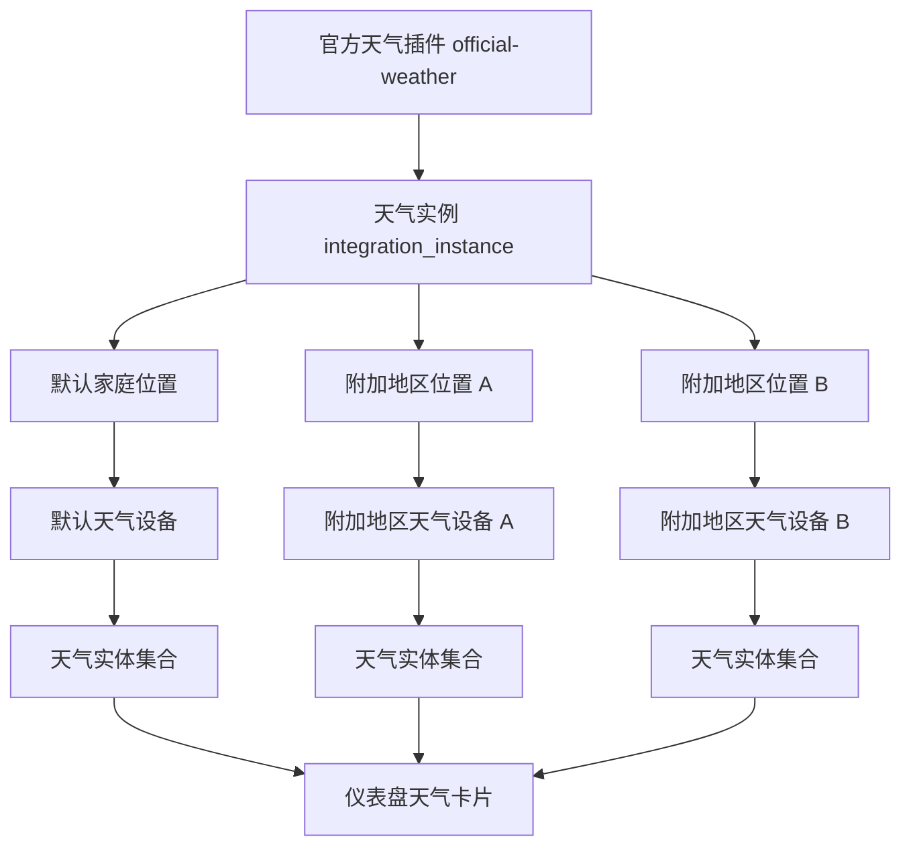

# 设计文档 - 官方天气插件

状态：Draft

## 1. 概览

官方天气插件现在被定义为新插件体系下的第一个标准 `integration` 样板。

它不再假设宿主里有一条天气专用主链路，而是完全建立在下面这些平台能力上：

- `integration` 插件类型
- `integration_instance` 配置作用域
- 标准设备模型
- 标准实体状态模型
- 仪表盘按设备选卡

## 2. 设计目标

### 2.1 目标

- 默认启用后就能看当前家庭天气
- 默认源固定为 `MET Norway`
- 可切换到 `OpenWeather`、`WeatherAPI`
- 默认天气和附加地区天气使用同一套设备模型
- 所有天气数据通过统一实体暴露
- 卡片按设备选择

### 2.2 不做的事

- 不做 AQI
- 不做预警
- 不做日出日落
- 不做中心化代理
- 不把主查询链路建在 city 文本上

## 3. 架构

### 3.1 核心对象

官方天气插件涉及五个核心对象：

1. **插件本体 `official-weather`**
   - 类型：`integration`
   - 负责声明天气域能力和适配器入口

2. **天气实例 `integration_instance`**
   - 一个家庭启用插件后创建一个实例
   - 存放该家庭的天气源配置和刷新策略

3. **天气位置子项**
   - 实例内部的位置配置单元
   - 包括默认家庭位置和手动添加位置

4. **天气设备**
   - 每个位置子项对外暴露为一个标准设备
   - 默认家庭天气和附加地区天气都使用这一模型

5. **天气实体**
   - 设备刷新后的标准实体集合

### 3.2 关系



## 4. 插件能力声明

### 4.1 Manifest 关键声明

```json
{
  "id": "official-weather",
  "types": ["integration"],
  "capabilities": {
    "integration": {
      "domains": ["weather"],
      "instance_model": "single_instance_with_subitems",
      "refresh_mode": "polling",
      "supports_discovery": false,
      "supports_actions": false,
      "supports_cards": true
    }
  }
}
```

### 4.2 配置作用域

天气插件使用两个配置层次：

- `integration_instance`
  - `provider_type`
  - `refresh_interval_minutes`
  - `request_timeout_seconds`
  - `user_agent`
  - `openweather_api_key`
  - `weatherapi_api_key`
- `device`
  - 设备展示名
  - 地区标签
  - 卡片偏好等设备级显示设置

第一版不需要单独的插件全局配置。

## 5. 数据模型

### 5.1 天气实例模型

| 字段 | 说明 |
| --- | --- |
| `id` | 集成实例 ID |
| `plugin_id` | 固定为 `official-weather` |
| `household_id` | 所属家庭 |
| `status` | `draft` / `active` / `degraded` / `disabled` |
| `provider_type` | 当前使用的天气源 |
| `refresh_interval_minutes` | 刷新间隔 |
| `request_timeout_seconds` | 请求超时 |
| `user_agent` | 对外请求标识 |

### 5.2 天气位置子项模型

第一版天气位置子项不作为新的公共平台表暴露，而是由天气插件自己维护绑定信息，然后产出标准设备。

每个位置子项至少包含：

| 字段 | 说明 |
| --- | --- |
| `location_key` | 插件内唯一键 |
| `location_type` | `default_household` / `region_node` |
| `provider_code` | 地区 provider |
| `region_code` | 地区节点编码 |
| `latitude` | 纬度 |
| `longitude` | 经度 |
| `display_name` | 展示名 |

### 5.3 天气设备模型

| 字段 | 说明 |
| --- | --- |
| `device_kind` | `virtual_household` |
| `domain` | `weather` |
| `unique_key` | 例如 `weather:default`、`weather:region:cn-310000` |
| `integration_instance_id` | 所属天气实例 |
| `name` | 设备显示名 |
| `metadata.location_type` | 默认家庭或附加地区 |

说明：

- 默认家庭天气设备和附加地区天气设备用同一设备模型
- 第一版不单独发明“天气位置设备类型”

### 5.4 天气实体模型

第一版至少落这些实体：

| 实体键 | 含义 |
| --- | --- |
| `weather.condition` | 天气状态 |
| `weather.temperature` | 温度 |
| `weather.humidity` | 湿度 |
| `weather.wind_speed` | 风速 |
| `weather.wind_direction` | 风向 |
| `weather.pressure` | 气压 |
| `weather.cloud_cover` | 云量 |
| `weather.precipitation_next_1h` | 未来 1 小时降水 |
| `weather.forecast_6h_summary` | 未来 6 小时摘要 |
| `weather.updated_at` | 更新时间 |

### 5.5 实体值要求

| 实体键 | 值类型 | 单位 |
| --- | --- | --- |
| `weather.condition` | `string` | 无 |
| `weather.temperature` | `number` | `C` |
| `weather.humidity` | `number` | `%` |
| `weather.wind_speed` | `number` | `m/s` |
| `weather.wind_direction` | `number` | `deg` |
| `weather.pressure` | `number` | `hPa` |
| `weather.cloud_cover` | `number` | `%` |
| `weather.precipitation_next_1h` | `number` | `mm` |
| `weather.forecast_6h_summary` | `string` | 无 |
| `weather.updated_at` | `datetime` | UTC |

## 6. 天气源架构

### 6.1 统一适配接口

所有天气源必须实现统一接口：

- 输入：经纬度、实例配置
- 输出：标准天气结果

接口要求：

```json
{
  "condition": {
    "code": "partly_cloudy",
    "text": "多云"
  },
  "temperature": 22.4,
  "humidity": 0.61,
  "wind_speed": 4.2,
  "wind_direction": 135,
  "pressure": 1012.4,
  "cloud_cover": 0.7,
  "precipitation_next_1h": 0.2,
  "forecast_6h_summary": "未来 6 小时多云，短时有小雨",
  "observed_at": "2026-03-18T12:00:00Z"
}
```

### 6.2 第一版源清单

- `met_norway`
  - 默认
  - 无 key
- `openweather`
  - 可选
  - 用户自填 key
- `weatherapi`
  - 可选
  - 用户自填 key

### 6.3 不允许的做法

- 不允许主链路用 city 文本查天气
- 不允许因为某个源支持更多字段，就强推宿主新增专用字段
- 不允许把 key 保存在插件私有文件里绕开宿主 secret 存储

## 7. 主链路

### 7.1 启用插件后的默认链路

1. 家庭启用 `official-weather`
2. 宿主自动创建该家庭的天气实例
3. 宿主检查家庭坐标是否可用
4. 坐标可用时，自动建立默认天气位置子项
5. 插件产出默认天气设备
6. 调度 `refresh`
7. 写入标准天气实体
8. 卡片按设备读取实体并渲染

### 7.2 手动添加附加地区链路

1. 用户在天气实例中选择一个地区节点
2. 平台读取该地区坐标
3. 插件创建新的位置子项
4. 宿主产出新的天气设备
5. 新设备独立刷新并独立显示

## 8. 刷新、缓存与降级

### 8.1 刷新策略

- 默认轮询
- 按实例配置控制刷新间隔
- 每个设备独立计算数据有效期

### 8.2 缓存策略

- 优先使用最近一次成功结果
- 在 TTL 内优先读缓存
- 超过 TTL 但未超过 `max_stale_seconds` 时，允许读陈旧快照并标记 `stale`

### 8.3 失败降级

| 场景 | 处理 |
| --- | --- |
| 家庭坐标缺失 | 默认设备进入待补全状态 |
| 上游临时失败 | 保留最后一次成功数据并标 `stale` |
| key 缺失 | 实例进入配置错误状态 |
| 上游返回结构异常 | 标记 `invalid_response`，保留旧数据 |
| 长时间持续失败 | 设备和实例进入 `degraded` |

## 9. 仪表盘卡片

### 9.1 卡片绑定规则

天气卡片必须绑定 `device_id`，不允许绑定 city 文本。

### 9.2 卡片展示字段

第一版天气卡片展示：

- 设备名
- 地区副标题
- 当前天气摘要
- 当前温度
- 更新时间
- 当前状态标记

### 9.3 卡片异常状态

卡片至少支持：

- `ready`
- `empty`
- `stale`
- `error`

## 10. 与宿主平台的边界

### 10.1 宿主负责

- 集成实例创建和状态治理
- 设备与实体标准模型
- 配置和 secret 存储
- 卡片规范
- 调度与审计

### 10.2 插件负责

- 天气源适配
- 字段映射
- 位置子项管理
- 刷新逻辑
- 快照和降级策略

### 10.3 不再接受的边界

- 宿主首页对 `official-weather` 做专门分支
- 宿主里存在新的天气专用聚合主链路
- 天气字段只存在于插件私有 JSON，不进统一实体

## 11. 延期项

这些明确延期，不在第一版承诺：

- AQI
- 预警
- 日出日落
- 复杂趋势图
- 自由输入城市名检索

## 12. 验证方式

### 12.1 平台层验证

- `integration` 类型是否可用
- `integration_instance` 配置是否可用
- 设备和实体标准链路是否可用

### 12.2 天气插件验证

- 默认实例创建
- 默认设备创建
- 多地区设备创建
- 三种天气源配置校验
- 标准实体输出
- 卡片按设备展示
- 缓存和降级生效
