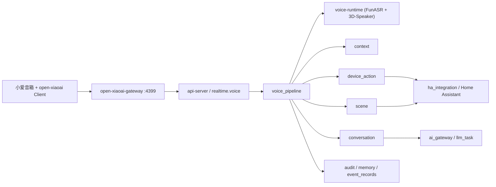

# 设计文档 - 语音快路径与设备控制

状态：Draft

## 1. 概述

### 1.1 目标

- 给项目补一条正式的语音主链，而不是继续靠 demo server 和临时脚本硬凑
- 把 `open-xiaoai` 收编成正式终端接入层，而不是把业务逻辑搬到音箱上
- 把私有设备协议和业务编排隔开，避免 `api-server` 直接吃厂商协议
- 让简单语音控制复用现有 `device_action / scene`
- 让复杂语音问题回到现有 `conversation`
- 让声纹成为身份增强，而不是新的单点授权漏洞

### 1.2 覆盖需求

- `requirements.md` 需求 1
- `requirements.md` 需求 2
- `requirements.md` 需求 3
- `requirements.md` 需求 4
- `requirements.md` 需求 5
- `requirements.md` 需求 6
- `requirements.md` 需求 7

### 1.3 技术约束

- 后端：FastAPI + SQLAlchemy + Alembic
- 实时通道：沿用现有 WebSocket 事件模型
- 数据存储：当前基线仍是 SQLite / Alembic，不假装 Redis、MQ 已经存在
- 设备控制：继续以现有 `ha_integration`、`device_action`、`scene` 为唯一正式执行入口
- 对话主链：继续以现有 `conversation` 为唯一正式复杂问答入口
- 初版终端适配器：只支持 `open-xiaoai`
- 初版终端协议隔离：必须通过独立 `open-xiaoai-gateway`
- 部署原则：当前阶段仍然以模块化单体为主，但 `gateway` 和 `voice-runtime` 必须独立出来

### 1.4 技术选型结论

这里先把结论写死，别后面又摇摆。

#### 1.4.1 初版终端侧

- **结论**：初版唯一正式终端适配器是 `open-xiaoai`
- **落法**：小爱音箱跑 `open-xiaoai` Client，外接独立 `open-xiaoai-gateway`
- **原因**：
  - 用户已经完成刷机、连接、录音、播放和打断验证
  - `open-xiaoai` 已经解决了小爱终端侧音频输入和播放输出问题
  - 现在最省事的方案不是重做终端，而是把它纳入正式系统边界

#### 1.4.2 为什么不用官方 demo server 当正式服务

- **结论**：官方 demo server 只用于 P0 验证，不进入生产架构
- **原因**：
  - 它的职责是演示，不是项目正式业务网关
  - 把它直接变成生产入口，后面协议、安全和业务边界都会烂掉
  - 生产系统需要的是“协议翻译器”，不是“演示程序加补丁”

#### 1.4.3 `open-xiaoai-gateway` 为什么必须独立进程

- **结论**：初版基线是独立进程，不直接塞进 `api-server`
- **原因**：
  - `open-xiaoai` 私有协议变化不该污染业务代码
  - 危险能力裁剪应该在靠近设备的一层完成
  - 后续如果接更多终端，独立网关更容易扩成统一适配器层

#### 1.4.4 流式 ASR

- **结论**：第一版优先用 **FunASR**
- **原因**：
  - 适合中文家庭场景
  - 可本地部署
  - 更适合快路径和家庭短句控制

#### 1.4.5 声纹识别

- **结论**：第一版优先用 **3D-Speaker**
- **原因**：
  - 可本地部署
  - 适合做成员候选增强
  - 能和快慢路径身份融合解耦

#### 1.4.6 `mi-gpt` 的位置

- **结论**：`mi-gpt` 不进初版
- **原因**：
  - 当前仓库已声明停止维护
  - 官方 README 也明确更推荐 `open-xiaoai`
  - 它可以保留为后续“普通用户路径”插件候选，但不该影响当前主链设计

## 2. 架构

### 2.1 系统结构



核心原则只有一句：

> 终端协议隔离在网关层，业务编排继续收口到现有模块。

### 2.2 为什么不把 `open-xiaoai` 协议直接塞进 `api-server`

因为那会把三类东西搅成一锅：

1. 终端私有协议适配
2. 音频推理和播放控制
3. 家庭业务编排和权限判断

这三类不是一个边界。直接混写，只会让后面每接一个终端就改一遍核心业务。

所以这次必须把终端接入拆成两层：

- **设备层**：`open-xiaoai` Client
- **适配层**：`open-xiaoai-gateway`

`api-server` 只看统一内部语音事件，不直接看 `open-xiaoai` 私有字段。

### 2.3 模块职责

| 模块 | 职责 | 输入 | 输出 |
| --- | --- | --- | --- |
| `open-xiaoai client` | 音频采集、播放输出、终端状态、中断事件 | 麦克风音频、播放命令 | 私有 WS 音频流和终端事件 |
| `open-xiaoai-gateway` | 协议翻译、终端注册、播放控制中转、危险能力裁剪 | `open-xiaoai` 私有 WS | 统一内部语音事件、终端回执 |
| `voice-runtime` | 流式 ASR、声纹注册、声纹验证 | 音频流、注册样本 | 部分转写、最终转写、声纹结果 |
| `voice/realtime_service` | 管语音会话、收发内部事件、流控 | 统一语音事件 | 会话事件、回执 |
| `voice/session_service` | 建会话、写结果、查历史 | 终端、文本、声纹结果 | `voice_session` 记录 |
| `voice/identity_service` | 声纹 + 房间 + 在家状态融合 | 声纹候选、上下文快照 | 成员候选、置信度、回退策略 |
| `voice/router` | 判断快路径还是慢路径 | 最终转写、身份结果、上下文 | 路由结果 |
| `voice/fast_action_service` | 快路径控制和场景触发 | 路由结果 | 动作回执、错误 |
| `voice/conversation_bridge` | 把慢路径接回现有对话主链 | 最终转写、身份结果 | 文本回答、提案、副作用 |
| `voice/playback_service` | 生成播放请求、停止请求和中断处理 | 文本回复、固定确认语、控制事件 | `play / stop / abort` |

### 2.4 关键流程

#### 2.4.1 快路径设备控制

1. 小爱终端本地触发录音并把音频流发给 `open-xiaoai-gateway`
2. `open-xiaoai-gateway` 建立内部会话，并通过 `/api/v1/realtime/voice` 推送统一语音事件
3. `voice_pipeline` 把音频转给 `voice-runtime`，拿到部分转写和最终转写
4. `identity_service` 结合声纹候选、终端房间、成员在家状态做身份融合
5. `router` 判断命中快路径
6. `fast_action_service` 解析目标设备或场景
7. 复用 `device_action` 或 `scene`
8. `playback_service` 生成确认语或提示音，通过网关回推到终端播放
9. 会话结束并写入审计、事件和执行记录

#### 2.4.2 复杂语音问答

1. 前三步同上，先拿到最终转写和身份候选
2. `router` 判断这不是快路径
3. `voice/conversation_bridge` 把文本请求喂回现有 `conversation`
4. `conversation` 继续走三车道、提案、记忆、任务草稿等现有机制
5. `playback_service` 生成文本回复播放请求
6. 网关把播放命令翻译成 `open-xiaoai` 命令并下发给终端
7. 会话结束并写入语音会话记录

#### 2.4.3 播放停止与打断

1. `voice_pipeline` 下发 `play`
2. `open-xiaoai-gateway` 翻译为终端播放命令
3. 终端回报 `playing / done / failed / interrupted`
4. 如果用户再次说话或主动打断，网关先上报 `playback.interrupted`
5. `voice_pipeline` 再决定是切新会话，还是只停止当前播放

#### 2.4.4 声纹注册

1. 管理员从管理端发起声纹注册
2. 终端或其他采集入口录入多段样本
3. `voice-runtime` 生成模板或模板引用
4. 系统只保存受控引用、样本计数和最后更新时间
5. 后续验证链路只读取模板引用，不直接读原始音频

## 3. 组件和接口

### 3.1 核心组件

覆盖需求：1、2、3、4、5、6、7

- `OpenXiaoAIGateway`
  - 监听 `4399`
  - 维护终端连接
  - 翻译外部协议和内部事件
  - 裁剪危险能力

- `VoiceTerminalService`
  - 管理终端注册、房间绑定、终端状态

- `VoiceRealtimeService`
  - 接收网关转发的内部语音事件
  - 管理语音会话生命周期

- `VoiceRuntimeClient`
  - 与 `voice-runtime` 通信

- `VoiceIdentityService`
  - 做声纹验证、上下文融合和低置信回退

- `VoiceFastActionService`
  - 做快路径动作解析与执行

- `VoiceConversationBridge`
  - 慢路径复用现有 `conversation`

- `VoicePlaybackService`
  - 统一生成和跟踪 `play / stop / abort`

### 3.2 数据结构

覆盖需求：1、2、5、7

#### 3.2.1 `voice_terminals`

| 字段 | 类型 | 必填 | 说明 | 约束 |
| --- | --- | --- | --- | --- |
| `id` | text | 是 | 终端 ID | 主键 |
| `household_id` | text | 是 | 所属家庭 | 外键 |
| `room_id` | text | 否 | 所属房间 | 外键，可空 |
| `terminal_code` | varchar(64) | 是 | 终端唯一编码 | 家庭内唯一 |
| `name` | varchar(100) | 是 | 终端名称 | 非空 |
| `adapter_type` | varchar(30) | 是 | 初版固定 `open_xiaoai` | 有限集合 |
| `transport_type` | varchar(30) | 是 | 初版固定 `gateway_ws` | 有限集合 |
| `capabilities_json` | text | 是 | 终端能力声明 | UTF-8 JSON |
| `adapter_meta_json` | text | 是 | 网关侧附加信息 | UTF-8 JSON |
| `status` | varchar(20) | 是 | `active/offline/disabled` | 有限集合 |
| `last_seen_at` | text | 否 | 最近心跳时间 | ISO-8601 |
| `created_at` | text | 是 | 创建时间 | ISO-8601 |
| `updated_at` | text | 是 | 更新时间 | ISO-8601 |

说明：

- `capabilities_json` 初版只允许声明：
  - `audio_input`
  - `audio_output`
  - `playback_stop`
  - `playback_abort`
  - `heartbeat`
- 明确不允许声明：
  - `shell_exec`
  - `script_exec`
  - `system_upgrade`
  - `reboot_control`
  - `business_logic`

#### 3.2.2 `biometric_profiles`

说明：沿用系统愿景里已规划的 `biometric_profiles`，不再新造 `voice_profiles`。

| 字段 | 类型 | 必填 | 说明 | 约束 |
| --- | --- | --- | --- | --- |
| `id` | text | 是 | 资料 ID | 主键 |
| `household_id` | text | 是 | 所属家庭 | 外键 |
| `member_id` | text | 是 | 所属成员 | 外键 |
| `voice_provider` | varchar(50) | 否 | 声纹服务来源 | 可空 |
| `voice_ref` | varchar(255) | 否 | 受控模板引用 | 可空 |
| `voice_sample_count` | int | 是 | 已注册样本数 | 默认 0 |
| `last_verified_at` | text | 否 | 最近验证时间 | ISO-8601 |
| `status` | varchar(20) | 是 | `active/inactive` | 有限集合 |
| `created_at` | text | 是 | 创建时间 | ISO-8601 |

#### 3.2.3 `voice_sessions`

| 字段 | 类型 | 必填 | 说明 | 约束 |
| --- | --- | --- | --- | --- |
| `id` | text | 是 | 语音会话 ID | 主键 |
| `household_id` | text | 是 | 所属家庭 | 外键 |
| `terminal_id` | text | 是 | 来源终端 | 外键 |
| `requester_member_id` | text | 否 | 最终服务成员 | 外键，可空 |
| `speaker_candidate_member_id` | text | 否 | 声纹候选成员 | 外键，可空 |
| `speaker_confidence` | real | 否 | 声纹置信度 | 0~1 |
| `lane` | varchar(30) | 是 | `fast_action/realtime_query/free_chat` | 有限集合 |
| `session_status` | varchar(30) | 是 | 见状态机 | 有限集合 |
| `transcript_text` | text | 否 | 最终转写 | UTF-8 文本 |
| `route_payload_json` | text | 是 | 路由摘要 | UTF-8 JSON |
| `playback_payload_json` | text | 是 | 播放摘要 | UTF-8 JSON |
| `execution_payload_json` | text | 是 | 执行摘要 | UTF-8 JSON |
| `error_code` | varchar(50) | 否 | 失败码 | 可空 |
| `wake_started_at` | text | 否 | 唤醒开始 | ISO-8601 |
| `speech_started_at` | text | 否 | 录音开始 | ISO-8601 |
| `speech_ended_at` | text | 否 | 录音结束 | ISO-8601 |
| `completed_at` | text | 否 | 完成时间 | ISO-8601 |
| `created_at` | text | 是 | 创建时间 | ISO-8601 |
| `updated_at` | text | 是 | 更新时间 | ISO-8601 |

### 3.3 接口契约

覆盖需求：1、2、3、4、7

#### 3.3.1 外部协议：`open-xiaoai` 到网关

- 类型：WebSocket
- 监听：`0.0.0.0:4399`
- 说明：
  - 网关对外保持 `open-xiaoai` 所需私有协议兼容
  - `api-server` 不感知这里的私有事件名和字段
  - 所有私有协议变化都只允许在网关内消化

#### 3.3.2 内部协议：网关到 `api-server`

- 类型：WebSocket
- 路径：`/api/v1/realtime/voice`
- 鉴权：终端签名或网关签发的受控凭证
- 事件包格式：

```json
{
  "type": "audio.append",
  "session_id": "voice-session-id",
  "terminal_id": "terminal-id",
  "seq": 3,
  "payload": {},
  "ts": "2026-03-14T00:00:00Z"
}
```

网关发往 `api-server` 的统一事件：

- `terminal.online`
- `terminal.offline`
- `terminal.heartbeat`
- `session.start`
- `audio.append`
- `audio.commit`
- `session.cancel`
- `playback.interrupted`
- `playback.receipt`
- `ping`

`api-server` 发往网关的统一事件：

- `session.ready`
- `asr.partial`
- `asr.final`
- `route.selected`
- `play.start`
- `play.stop`
- `play.abort`
- `agent.done`
- `agent.error`
- `pong`

要求：

1. 内部事件要稳定，不能跟着 `open-xiaoai` 私有字段一起漂
2. 网关负责双向映射，`api-server` 不直接理解 `open-xiaoai` 协议
3. 播放回执必须带 `session_id` 和 `terminal_id`

#### 3.3.3 HTTP：终端管理

- `GET /api/v1/voice/terminals`
- `POST /api/v1/voice/terminals`
- `PATCH /api/v1/voice/terminals/{terminal_id}`
- `POST /api/v1/voice/terminals/{terminal_id}/heartbeat`

#### 3.3.4 HTTP：声纹注册与资料管理

- `POST /api/v1/voice/biometrics/enrollments`
- `GET /api/v1/voice/biometrics`
- `PATCH /api/v1/voice/biometrics/{profile_id}`

#### 3.3.5 HTTP：语音会话查询

- `GET /api/v1/voice/sessions`
- `GET /api/v1/voice/sessions/{session_id}`

#### 3.3.6 `voice-runtime` 内部契约

- 流式 ASR：`WS /runtime/asr-stream`
- 声纹注册：`POST /runtime/speaker/enroll`
- 声纹验证：`POST /runtime/speaker/verify`

要求：

1. `api-server` 不直接加载模型文件
2. `voice-runtime` 必须能单独替换模型实现
3. 运行时异常必须返回明确错误码，不能只回空结果

## 4. 数据与状态模型

### 4.1 数据关系

- 一个 `voice_terminal` 属于一个 `household`，可绑定一个 `room`
- 一个 `voice_terminal` 初版只能通过一个 `open-xiaoai-gateway` 在线
- 一个 `voice_session` 只属于一个 `voice_terminal`
- 一个 `voice_session` 最终可关联到一个服务成员，也可只保留匿名候选
- 一个成员可对应一条 `biometric_profile`
- `voice_session` 成功进入慢路径后，应能关联已有 `conversation session / request_id`
- `voice_session` 成功执行快路径或播放回复后，应能关联设备动作、场景执行和播放回执

### 4.2 状态流转

| 状态 | 含义 | 进入条件 | 退出条件 |
| --- | --- | --- | --- |
| `streaming` | 正在接收音频与部分转写 | `session.start` 成功 | 音频提交或取消 |
| `resolving_identity` | 正在做声纹和上下文融合 | 收到最终转写 | 路由完成或失败 |
| `routing` | 正在判定快慢路径 | 身份融合完成 | 进入快路径或慢路径 |
| `fast_action_running` | 正在执行设备动作或场景 | 命中快路径 | 成功、失败或阻断 |
| `conversation_running` | 正在复用 `conversation` | 命中慢路径 | 成功或失败 |
| `playback_running` | 正在向终端播报 | 下发 `play.start` | 完成、失败或打断 |
| `completed` | 本次交互完成 | 执行或回答结束 | 无 |
| `failed` | 本次交互失败 | 任一关键环节失败 | 无 |
| `cancelled` | 终端主动取消 | `session.cancel` | 无 |

## 5. 错误处理

### 5.1 错误类型

- `terminal_not_found`：终端不存在或未绑定
- `terminal_disabled`：终端被停用
- `gateway_unavailable`：`open-xiaoai-gateway` 不可用
- `terminal_protocol_unsupported`：终端协议版本不兼容
- `voice_runtime_unavailable`：语音运行时不可用
- `asr_timeout`：流式转写超时
- `speaker_low_confidence`：声纹结果不可靠
- `fast_action_ambiguous`：快路径目标不明确
- `fast_action_blocked`：高风险或守卫阻断
- `playback_failed`：终端播放失败
- `playback_abort_timeout`：终端停止或打断超时
- `conversation_failed`：慢路径对话失败
- `invalid_audio_payload`：音频事件格式不合法

### 5.2 错误响应格式

```json
{
  "type": "agent.error",
  "session_id": "voice-session-id",
  "seq": 12,
  "payload": {
    "detail": "当前语音请求处理失败，请重试",
    "error_code": "gateway_unavailable"
  },
  "ts": "2026-03-14T00:00:00Z"
}
```

### 5.3 处理策略

1. 网关或鉴权错误：直接拒绝会话，不进入正式执行链
2. `voice-runtime` 异常：结束本次语音会话，但不影响文本主链
3. 声纹低置信：回退匿名或追问，不自动执行敏感动作
4. 快路径目标不明确：追问，不猜
5. 播放失败：记录回执并降级成静默文本结果，不假装播过
6. 慢路径失败：回一个降级文本，并保留完整会话记录

## 6. 正确性属性

### 6.1 属性 1：高风险动作不能只靠一次声纹放行

*对于任何* 语音触发的高风险动作，系统都应该满足：声纹只能作为身份增强，最终仍要经过现有确认和守卫链路。

### 6.2 属性 2：复杂语音问题不能绕开现有对话主链

*对于任何* 非快路径语音请求，系统都应该满足：必须复用现有 `conversation`，而不是落成第二套语音专用问答链路。

### 6.3 属性 3：系统默认不长期留原始音频

*对于任何* 语音会话，系统都应该满足：默认只保存必要的会话元数据、最终转写和受控模板引用，不把原始音频无限期落库。

### 6.4 属性 4：语音运行时或网关故障不能拖死业务 API

*对于任何* `open-xiaoai-gateway` 或 `voice-runtime` 故障场景，系统都应该满足：语音链路受限降级，但文本聊天、设备管理和其他后端能力继续可用。

### 6.5 属性 5：终端适配层不能承载业务逻辑

*对于任何* 终端适配器实现，系统都应该满足：适配层只做协议翻译、状态同步和播放中转，不做设备控制决策、权限判断和对话编排。

### 6.6 属性 6：危险终端能力默认禁用

*对于任何* `open-xiaoai` 终端接入，系统都应该满足：不开放任意脚本执行、系统升级、重启控制和业务逻辑扩展点。

## 7. 测试策略

### 7.1 单元测试

- 网关事件映射
- 终端注册、房间绑定和状态更新
- 语音会话状态流转
- 快路径动作解析与歧义回退
- 声纹低置信回退逻辑
- 播放控制和打断回执处理

### 7.2 集成测试

- `open-xiaoai-gateway -> /api/v1/realtime/voice` 双向事件联调
- WebSocket 语音会话 `start -> partial -> final -> play -> done`
- 快路径设备动作与场景执行
- 慢路径回接 `conversation`
- 高风险动作阻断
- 终端断线重连与重复事件幂等

### 7.3 端到端测试

- “打开客厅灯” 直达快路径并播出确认语
- “朵朵明天几点上课” 进入慢路径并从终端播放回答
- 播放过程中再次说话，当前播报被成功打断
- 声纹低置信时尝试解锁门锁，系统必须阻断
- `gateway` 或 `voice-runtime` 不可用时，语音失败但文本聊天仍然正常

### 7.4 验证映射

| 需求 | 设计章节 | 验证方式 |
| --- | --- | --- |
| `requirements.md` 需求 1 | `design.md` §2.3、§3.2、§3.3 | 网关接入与终端管理测试 |
| `requirements.md` 需求 2 | `design.md` §2.4.3、§3.3.2、§5.3 | 播放控制与打断测试 |
| `requirements.md` 需求 3 | `design.md` §2.4.1、§6.1 | 快路径集成测试 |
| `requirements.md` 需求 4 | `design.md` §2.4.2、§6.2 | 慢路径复用对话测试 |
| `requirements.md` 需求 5 | `design.md` §2.4.4、§6.1、§6.3 | 声纹注册与低置信回退测试 |
| `requirements.md` 需求 6 | `design.md` §2.3、§5.3、§6.1 | 上下文与守卫联动测试 |
| `requirements.md` 需求 7 | `design.md` §1.3、§1.4、§6.4、§6.5、§6.6 | 故障降级和演进边界测试 |

## 8. 风险与待确认项

### 8.1 风险

- `open-xiaoai` 私有协议如果后续变动，网关映射层需要跟着维护
- 家庭环境噪声、儿童音色变化、老人发声波动都会直接影响声纹稳定性
- 第一版没有 Redis 和 MQ，意味着时延和幂等只能靠本地状态和数据库控制
- 如果后续有人图省事，把播放控制、快路径执行或权限判断塞回网关，这份设计就会被破坏

### 8.2 待确认项

- 初版播放内容以固定确认语和文本回复为主，是否在第二阶段补轻量 TTS 模板管理
- 后续如果要兼容“普通用户路径”，是直接评估 `mi-gpt`，还是优先评估其后继方案
