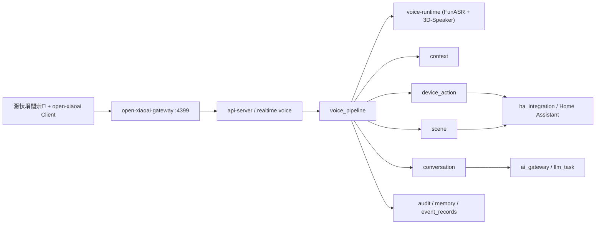

> 说明：本文件里出现的 SQLite 描述属于历史方案或阶段性验收记录。项目已于 2026-03-16 统一切换到 PostgreSQL，当前实现与测试基线都以 PostgreSQL 为准。

# 璁捐鏂囨。 - 璇煶蹇矾寰勪笌璁惧鎺у埗

鐘舵€侊細Draft

## 1. 姒傝堪

### 1.1 鐩爣

- 缁欓」鐩ˉ涓€鏉℃寮忕殑璇煶涓婚摼锛岃€屼笉鏄户缁潬 demo server 鍜屼复鏃惰剼鏈‖鍑?
- 鎶?`open-xiaoai` 鏀剁紪鎴愭寮忕粓绔帴鍏ュ眰锛岃€屼笉鏄妸涓氬姟閫昏緫鎼埌闊崇涓?
- 鎶婄鏈夎澶囧崗璁拰涓氬姟缂栨帓闅斿紑锛岄伩鍏?`api-server` 鐩存帴鍚冨巶鍟嗗崗璁?
- 璁╃畝鍗曡闊虫帶鍒跺鐢ㄧ幇鏈?`device_action / scene`
- 璁╁鏉傝闊抽棶棰樺洖鍒扮幇鏈?`conversation`
- 璁╁０绾规垚涓鸿韩浠藉寮猴紝鑰屼笉鏄柊鐨勫崟鐐规巿鏉冩紡娲?

### 1.2 瑕嗙洊闇€姹?

- `requirements.md` 闇€姹?1
- `requirements.md` 闇€姹?2
- `requirements.md` 闇€姹?3
- `requirements.md` 闇€姹?4
- `requirements.md` 闇€姹?5
- `requirements.md` 闇€姹?6
- `requirements.md` 闇€姹?7

### 1.3 鎶€鏈害鏉?

- 鍚庣锛欶astAPI + SQLAlchemy + Alembic
- 瀹炴椂閫氶亾锛氭部鐢ㄧ幇鏈?WebSocket 浜嬩欢妯″瀷
- 鏁版嵁瀛樺偍锛氬綋鍓嶅熀绾夸粛鏄?SQLite / Alembic锛屼笉鍋囪 Redis銆丮Q 宸茬粡瀛樺湪
- 璁惧鎺у埗锛氱户缁互鐜版湁 `ha_integration`銆乣device_action`銆乣scene` 涓哄敮涓€姝ｅ紡鎵ц鍏ュ彛
- 瀵硅瘽涓婚摼锛氱户缁互鐜版湁 `conversation` 涓哄敮涓€姝ｅ紡澶嶆潅闂瓟鍏ュ彛
- 鍒濈増缁堢閫傞厤鍣細鍙敮鎸?`open-xiaoai`
- 鍒濈増缁堢鍗忚闅旂锛氬繀椤婚€氳繃鐙珛 `open-xiaoai-gateway`
- 閮ㄧ讲鍘熷垯锛氬綋鍓嶉樁娈典粛鐒朵互妯″潡鍖栧崟浣撲负涓伙紝浣?`gateway` 鍜?`voice-runtime` 蹇呴』鐙珛鍑烘潵

### 1.4 鎶€鏈€夊瀷缁撹

杩欓噷鍏堟妸缁撹鍐欐锛屽埆鍚庨潰鍙堟憞鎽嗐€?

#### 1.4.1 鍒濈増缁堢渚?

- **缁撹**锛氬垵鐗堝敮涓€姝ｅ紡缁堢閫傞厤鍣ㄦ槸 `open-xiaoai`
- **钀芥硶**锛氬皬鐖遍煶绠辫窇 `open-xiaoai` Client锛屽鎺ョ嫭绔?`open-xiaoai-gateway`
- **鍘熷洜**锛?
  - 鐢ㄦ埛宸茬粡瀹屾垚鍒锋満銆佽繛鎺ャ€佸綍闊炽€佹挱鏀惧拰鎵撴柇楠岃瘉
  - `open-xiaoai` 宸茬粡瑙ｅ喅浜嗗皬鐖辩粓绔晶闊抽杈撳叆鍜屾挱鏀捐緭鍑洪棶棰?
  - 鐜板湪鏈€鐪佷簨鐨勬柟妗堜笉鏄噸鍋氱粓绔紝鑰屾槸鎶婂畠绾冲叆姝ｅ紡绯荤粺杈圭晫

#### 1.4.2 涓轰粈涔堜笉鐢ㄥ畼鏂?demo server 褰撴寮忔湇鍔?

- **缁撹**锛氬畼鏂?demo server 鍙敤浜?P0 楠岃瘉锛屼笉杩涘叆鐢熶骇鏋舵瀯
- **鍘熷洜**锛?
  - 瀹冪殑鑱岃矗鏄紨绀猴紝涓嶆槸椤圭洰姝ｅ紡涓氬姟缃戝叧
  - 鎶婂畠鐩存帴鍙樻垚鐢熶骇鍏ュ彛锛屽悗闈㈠崗璁€佸畨鍏ㄥ拰涓氬姟杈圭晫閮戒細鐑傛帀
  - 鐢熶骇绯荤粺闇€瑕佺殑鏄€滃崗璁炕璇戝櫒鈥濓紝涓嶆槸鈥滄紨绀虹▼搴忓姞琛ヤ竵鈥?

#### 1.4.3 `open-xiaoai-gateway` 涓轰粈涔堝繀椤荤嫭绔嬭繘绋?

- **缁撹**锛氬垵鐗堝熀绾挎槸鐙珛杩涚▼锛屼笉鐩存帴濉炶繘 `api-server`
- **鍘熷洜**锛?
  - `open-xiaoai` 绉佹湁鍗忚鍙樺寲涓嶈姹℃煋涓氬姟浠ｇ爜
  - 鍗遍櫓鑳藉姏瑁佸壀搴旇鍦ㄩ潬杩戣澶囩殑涓€灞傚畬鎴?
  - 鍚庣画濡傛灉鎺ユ洿澶氱粓绔紝鐙珛缃戝叧鏇村鏄撴墿鎴愮粺涓€閫傞厤鍣ㄥ眰

#### 1.4.4 娴佸紡 ASR

- **缁撹**锛氱涓€鐗堜紭鍏堢敤 **FunASR**
- **鍘熷洜**锛?
  - 閫傚悎涓枃瀹跺涵鍦烘櫙
  - 鍙湰鍦伴儴缃?
  - 鏇撮€傚悎蹇矾寰勫拰瀹跺涵鐭彞鎺у埗

#### 1.4.5 澹扮汗璇嗗埆

- **缁撹**锛氱涓€鐗堜紭鍏堢敤 **3D-Speaker**
- **鍘熷洜**锛?
  - 鍙湰鍦伴儴缃?
  - 閫傚悎鍋氭垚鍛樺€欓€夊寮?
  - 鑳藉拰蹇參璺緞韬唤铻嶅悎瑙ｈ€?

#### 1.4.6 `mi-gpt` 鐨勪綅缃?

- **缁撹**锛歚mi-gpt` 涓嶈繘鍒濈増
- **鍘熷洜**锛?
  - 褰撳墠浠撳簱宸插０鏄庡仠姝㈢淮鎶?
  - 瀹樻柟 README 涔熸槑纭洿鎺ㄨ崘 `open-xiaoai`
  - 瀹冨彲浠ヤ繚鐣欎负鍚庣画鈥滄櫘閫氱敤鎴疯矾寰勨€濇彃浠跺€欓€夛紝浣嗕笉璇ュ奖鍝嶅綋鍓嶄富閾捐璁?

## 2. 鏋舵瀯

### 2.1 绯荤粺缁撴瀯



鏍稿績鍘熷垯鍙湁涓€鍙ワ細

> 缁堢鍗忚闅旂鍦ㄧ綉鍏冲眰锛屼笟鍔＄紪鎺掔户缁敹鍙ｅ埌鐜版湁妯″潡銆?

### 2.2 涓轰粈涔堜笉鎶?`open-xiaoai` 鍗忚鐩存帴濉炶繘 `api-server`

鍥犱负閭ｄ細鎶婁笁绫讳笢瑗挎悈鎴愪竴閿咃細

1. 缁堢绉佹湁鍗忚閫傞厤
2. 闊抽鎺ㄧ悊鍜屾挱鏀炬帶鍒?
3. 瀹跺涵涓氬姟缂栨帓鍜屾潈闄愬垽鏂?

杩欎笁绫讳笉鏄竴涓竟鐣屻€傜洿鎺ユ贩鍐欙紝鍙細璁╁悗闈㈡瘡鎺ヤ竴涓粓绔氨鏀逛竴閬嶆牳蹇冧笟鍔°€?

鎵€浠ヨ繖娆″繀椤绘妸缁堢鎺ュ叆鎷嗘垚涓ゅ眰锛?

- **璁惧灞?*锛歚open-xiaoai` Client
- **閫傞厤灞?*锛歚open-xiaoai-gateway`

`api-server` 鍙湅缁熶竴鍐呴儴璇煶浜嬩欢锛屼笉鐩存帴鐪?`open-xiaoai` 绉佹湁瀛楁銆?

### 2.3 妯″潡鑱岃矗

| 妯″潡 | 鑱岃矗 | 杈撳叆 | 杈撳嚭 |
| --- | --- | --- | --- |
| `open-xiaoai client` | 闊抽閲囬泦銆佹挱鏀捐緭鍑恒€佺粓绔姸鎬併€佷腑鏂簨浠?| 楹﹀厠椋庨煶棰戙€佹挱鏀惧懡浠?| 绉佹湁 WS 闊抽娴佸拰缁堢浜嬩欢 |
| `open-xiaoai-gateway` | 鍗忚缈昏瘧銆佺粓绔敞鍐屻€佹挱鏀炬帶鍒朵腑杞€佸嵄闄╄兘鍔涜鍓?| `open-xiaoai` 绉佹湁 WS | 缁熶竴鍐呴儴璇煶浜嬩欢銆佺粓绔洖鎵?|
| `voice-runtime` | 娴佸紡 ASR銆佸０绾规敞鍐屻€佸０绾归獙璇?| 闊抽娴併€佹敞鍐屾牱鏈?| 閮ㄥ垎杞啓銆佹渶缁堣浆鍐欍€佸０绾圭粨鏋?|
| `voice/realtime_service` | 绠¤闊充細璇濄€佹敹鍙戝唴閮ㄤ簨浠躲€佹祦鎺?| 缁熶竴璇煶浜嬩欢 | 浼氳瘽浜嬩欢銆佸洖鎵?|
| `voice/session_service` | 寤轰細璇濄€佸啓缁撴灉銆佹煡鍘嗗彶 | 缁堢銆佹枃鏈€佸０绾圭粨鏋?| `voice_session` 璁板綍 |
| `voice/identity_service` | 澹扮汗 + 鎴块棿 + 鍦ㄥ鐘舵€佽瀺鍚?| 澹扮汗鍊欓€夈€佷笂涓嬫枃蹇収 | 鎴愬憳鍊欓€夈€佺疆淇″害銆佸洖閫€绛栫暐 |
| `voice/router` | 鍒ゆ柇蹇矾寰勮繕鏄參璺緞 | 鏈€缁堣浆鍐欍€佽韩浠界粨鏋溿€佷笂涓嬫枃 | 璺敱缁撴灉 |
| `voice/fast_action_service` | 蹇矾寰勬帶鍒跺拰鍦烘櫙瑙﹀彂 | 璺敱缁撴灉 | 鍔ㄤ綔鍥炴墽銆侀敊璇?|
| `voice/conversation_bridge` | 鎶婃參璺緞鎺ュ洖鐜版湁瀵硅瘽涓婚摼 | 鏈€缁堣浆鍐欍€佽韩浠界粨鏋?| 鏂囨湰鍥炵瓟銆佹彁妗堛€佸壇浣滅敤 |
| `voice/playback_service` | 鐢熸垚鎾斁璇锋眰銆佸仠姝㈣姹傚拰涓柇澶勭悊 | 鏂囨湰鍥炲銆佸浐瀹氱‘璁よ銆佹帶鍒朵簨浠?| `play / stop / abort` |

### 2.4 鍏抽敭娴佺▼

#### 2.4.1 蹇矾寰勮澶囨帶鍒?

1. 灏忕埍缁堢鏈湴瑙﹀彂褰曢煶骞舵妸闊抽娴佸彂缁?`open-xiaoai-gateway`
2. `open-xiaoai-gateway` 寤虹珛鍐呴儴浼氳瘽锛屽苟閫氳繃 `/api/v1/realtime/voice` 鎺ㄩ€佺粺涓€璇煶浜嬩欢
3. `voice_pipeline` 鎶婇煶棰戣浆缁?`voice-runtime`锛屾嬁鍒伴儴鍒嗚浆鍐欏拰鏈€缁堣浆鍐?
4. `identity_service` 缁撳悎澹扮汗鍊欓€夈€佺粓绔埧闂淬€佹垚鍛樺湪瀹剁姸鎬佸仛韬唤铻嶅悎
5. `router` 鍒ゆ柇鍛戒腑蹇矾寰?
6. `fast_action_service` 瑙ｆ瀽鐩爣璁惧鎴栧満鏅?
7. 澶嶇敤 `device_action` 鎴?`scene`
8. `playback_service` 鐢熸垚纭璇垨鎻愮ず闊筹紝閫氳繃缃戝叧鍥炴帹鍒扮粓绔挱鏀?
9. 浼氳瘽缁撴潫骞跺啓鍏ュ璁°€佷簨浠跺拰鎵ц璁板綍

#### 2.4.2 澶嶆潅璇煶闂瓟

1. 鍓嶄笁姝ュ悓涓婏紝鍏堟嬁鍒版渶缁堣浆鍐欏拰韬唤鍊欓€?
2. `router` 鍒ゆ柇杩欎笉鏄揩璺緞
3. `voice/conversation_bridge` 鎶婃枃鏈姹傚杺鍥炵幇鏈?`conversation`
4. `conversation` 缁х画璧颁笁杞﹂亾銆佹彁妗堛€佽蹇嗐€佷换鍔¤崏绋跨瓑鐜版湁鏈哄埗
5. `playback_service` 鐢熸垚鏂囨湰鍥炲鎾斁璇锋眰
6. 缃戝叧鎶婃挱鏀惧懡浠ょ炕璇戞垚 `open-xiaoai` 鍛戒护骞朵笅鍙戠粰缁堢
7. 浼氳瘽缁撴潫骞跺啓鍏ヨ闊充細璇濊褰?

#### 2.4.3 鎾斁鍋滄涓庢墦鏂?

1. `voice_pipeline` 涓嬪彂 `play`
2. `open-xiaoai-gateway` 缈昏瘧涓虹粓绔挱鏀惧懡浠?
3. 缁堢鍥炴姤 `playing / done / failed / interrupted`
4. 濡傛灉鐢ㄦ埛鍐嶆璇磋瘽鎴栦富鍔ㄦ墦鏂紝缃戝叧鍏堜笂鎶?`playback.interrupted`
5. `voice_pipeline` 鍐嶅喅瀹氭槸鍒囨柊浼氳瘽锛岃繕鏄彧鍋滄褰撳墠鎾斁

#### 2.4.4 澹扮汗娉ㄥ唽

1. 绠＄悊鍛樹粠绠＄悊绔彂璧峰０绾规敞鍐?
2. 缁堢鎴栧叾浠栭噰闆嗗叆鍙ｅ綍鍏ュ娈垫牱鏈?
3. `voice-runtime` 鐢熸垚妯℃澘鎴栨ā鏉垮紩鐢?
4. 绯荤粺鍙繚瀛樺彈鎺у紩鐢ㄣ€佹牱鏈鏁板拰鏈€鍚庢洿鏂版椂闂?
5. 鍚庣画楠岃瘉閾捐矾鍙鍙栨ā鏉垮紩鐢紝涓嶇洿鎺ヨ鍘熷闊抽

## 3. 缁勪欢鍜屾帴鍙?

### 3.1 鏍稿績缁勪欢

瑕嗙洊闇€姹傦細1銆?銆?銆?銆?銆?銆?

- `OpenXiaoAIGateway`
  - 鐩戝惉 `4399`
  - 缁存姢缁堢杩炴帴
  - 缈昏瘧澶栭儴鍗忚鍜屽唴閮ㄤ簨浠?
  - 瑁佸壀鍗遍櫓鑳藉姏

- `VoiceTerminalService`
  - 绠＄悊缁堢娉ㄥ唽銆佹埧闂寸粦瀹氥€佺粓绔姸鎬?

- `VoiceRealtimeService`
  - 鎺ユ敹缃戝叧杞彂鐨勫唴閮ㄨ闊充簨浠?
  - 绠＄悊璇煶浼氳瘽鐢熷懡鍛ㄦ湡

- `VoiceRuntimeClient`
  - 涓?`voice-runtime` 閫氫俊

- `VoiceIdentityService`
  - 鍋氬０绾归獙璇併€佷笂涓嬫枃铻嶅悎鍜屼綆缃俊鍥為€€

- `VoiceFastActionService`
  - 鍋氬揩璺緞鍔ㄤ綔瑙ｆ瀽涓庢墽琛?

- `VoiceConversationBridge`
  - 鎱㈣矾寰勫鐢ㄧ幇鏈?`conversation`

- `VoicePlaybackService`
  - 缁熶竴鐢熸垚鍜岃窡韪?`play / stop / abort`

### 3.2 鏁版嵁缁撴瀯

瑕嗙洊闇€姹傦細1銆?銆?銆?

#### 3.2.1 `voice_terminals`

| 瀛楁 | 绫诲瀷 | 蹇呭～ | 璇存槑 | 绾︽潫 |
| --- | --- | --- | --- | --- |
| `id` | text | 鏄?| 缁堢 ID | 涓婚敭 |
| `household_id` | text | 鏄?| 鎵€灞炲搴?| 澶栭敭 |
| `room_id` | text | 鍚?| 鎵€灞炴埧闂?| 澶栭敭锛屽彲绌?|
| `terminal_code` | varchar(64) | 鏄?| 缁堢鍞竴缂栫爜 | 瀹跺涵鍐呭敮涓€ |
| `name` | varchar(100) | 鏄?| 缁堢鍚嶇О | 闈炵┖ |
| `adapter_type` | varchar(30) | 鏄?| 鍒濈増鍥哄畾 `open_xiaoai` | 鏈夐檺闆嗗悎 |
| `transport_type` | varchar(30) | 鏄?| 鍒濈増鍥哄畾 `gateway_ws` | 鏈夐檺闆嗗悎 |
| `capabilities_json` | text | 鏄?| 缁堢鑳藉姏澹版槑 | UTF-8 JSON |
| `adapter_meta_json` | text | 鏄?| 缃戝叧渚ч檮鍔犱俊鎭?| UTF-8 JSON |
| `status` | varchar(20) | 鏄?| `active/offline/disabled` | 鏈夐檺闆嗗悎 |
| `last_seen_at` | text | 鍚?| 鏈€杩戝績璺虫椂闂?| ISO-8601 |
| `created_at` | text | 鏄?| 鍒涘缓鏃堕棿 | ISO-8601 |
| `updated_at` | text | 鏄?| 鏇存柊鏃堕棿 | ISO-8601 |

璇存槑锛?

- `capabilities_json` 鍒濈増鍙厑璁稿０鏄庯細
  - `audio_input`
  - `audio_output`
  - `playback_stop`
  - `playback_abort`
  - `heartbeat`
- 鏄庣‘涓嶅厑璁稿０鏄庯細
  - `shell_exec`
  - `script_exec`
  - `system_upgrade`
  - `reboot_control`
  - `business_logic`

#### 3.2.2 `biometric_profiles`

璇存槑锛氭部鐢ㄧ郴缁熸効鏅噷宸茶鍒掔殑 `biometric_profiles`锛屼笉鍐嶆柊閫?`voice_profiles`銆?

| 瀛楁 | 绫诲瀷 | 蹇呭～ | 璇存槑 | 绾︽潫 |
| --- | --- | --- | --- | --- |
| `id` | text | 鏄?| 璧勬枡 ID | 涓婚敭 |
| `household_id` | text | 鏄?| 鎵€灞炲搴?| 澶栭敭 |
| `member_id` | text | 鏄?| 鎵€灞炴垚鍛?| 澶栭敭 |
| `voice_provider` | varchar(50) | 鍚?| 澹扮汗鏈嶅姟鏉ユ簮 | 鍙┖ |
| `voice_ref` | varchar(255) | 鍚?| 鍙楁帶妯℃澘寮曠敤 | 鍙┖ |
| `voice_sample_count` | int | 鏄?| 宸叉敞鍐屾牱鏈暟 | 榛樿 0 |
| `last_verified_at` | text | 鍚?| 鏈€杩戦獙璇佹椂闂?| ISO-8601 |
| `status` | varchar(20) | 鏄?| `active/inactive` | 鏈夐檺闆嗗悎 |
| `created_at` | text | 鏄?| 鍒涘缓鏃堕棿 | ISO-8601 |

#### 3.2.3 `voice_sessions`

| 瀛楁 | 绫诲瀷 | 蹇呭～ | 璇存槑 | 绾︽潫 |
| --- | --- | --- | --- | --- |
| `id` | text | 鏄?| 璇煶浼氳瘽 ID | 涓婚敭 |
| `household_id` | text | 鏄?| 鎵€灞炲搴?| 澶栭敭 |
| `terminal_id` | text | 鏄?| 鏉ユ簮缁堢 | 澶栭敭 |
| `requester_member_id` | text | 鍚?| 鏈€缁堟湇鍔℃垚鍛?| 澶栭敭锛屽彲绌?|
| `speaker_candidate_member_id` | text | 鍚?| 澹扮汗鍊欓€夋垚鍛?| 澶栭敭锛屽彲绌?|
| `speaker_confidence` | real | 鍚?| 澹扮汗缃俊搴?| 0~1 |
| `lane` | varchar(30) | 鏄?| `fast_action/realtime_query/free_chat` | 鏈夐檺闆嗗悎 |
| `session_status` | varchar(30) | 鏄?| 瑙佺姸鎬佹満 | 鏈夐檺闆嗗悎 |
| `transcript_text` | text | 鍚?| 鏈€缁堣浆鍐?| UTF-8 鏂囨湰 |
| `route_payload_json` | text | 鏄?| 璺敱鎽樿 | UTF-8 JSON |
| `playback_payload_json` | text | 鏄?| 鎾斁鎽樿 | UTF-8 JSON |
| `execution_payload_json` | text | 鏄?| 鎵ц鎽樿 | UTF-8 JSON |
| `error_code` | varchar(50) | 鍚?| 澶辫触鐮?| 鍙┖ |
| `wake_started_at` | text | 鍚?| 鍞ら啋寮€濮?| ISO-8601 |
| `speech_started_at` | text | 鍚?| 褰曢煶寮€濮?| ISO-8601 |
| `speech_ended_at` | text | 鍚?| 褰曢煶缁撴潫 | ISO-8601 |
| `completed_at` | text | 鍚?| 瀹屾垚鏃堕棿 | ISO-8601 |
| `created_at` | text | 鏄?| 鍒涘缓鏃堕棿 | ISO-8601 |
| `updated_at` | text | 鏄?| 鏇存柊鏃堕棿 | ISO-8601 |

### 3.3 鎺ュ彛濂戠害

瑕嗙洊闇€姹傦細1銆?銆?銆?銆?

#### 3.3.1 澶栭儴鍗忚锛歚open-xiaoai` 鍒扮綉鍏?

- 绫诲瀷锛歐ebSocket
- 鐩戝惉锛歚0.0.0.0:4399`
- 璇存槑锛?
  - 缃戝叧瀵瑰淇濇寔 `open-xiaoai` 鎵€闇€绉佹湁鍗忚鍏煎
  - `api-server` 涓嶆劅鐭ヨ繖閲岀殑绉佹湁浜嬩欢鍚嶅拰瀛楁
  - 鎵€鏈夌鏈夊崗璁彉鍖栭兘鍙厑璁稿湪缃戝叧鍐呮秷鍖?

#### 3.3.2 鍐呴儴鍗忚锛氱綉鍏冲埌 `api-server`

- 绫诲瀷锛歐ebSocket
- 璺緞锛歚/api/v1/realtime/voice`
- 閴存潈锛氱粓绔鍚嶆垨缃戝叧绛惧彂鐨勫彈鎺у嚟璇?
- 浜嬩欢鍖呮牸寮忥細

```json
{
  "type": "audio.append",
  "session_id": "voice-session-id",
  "terminal_id": "terminal-id",
  "seq": 3,
  "payload": {},
  "ts": "2026-03-14T00:00:00Z"
}
```

缃戝叧鍙戝線 `api-server` 鐨勭粺涓€浜嬩欢锛?

- `terminal.online`
- `terminal.offline`
- `terminal.heartbeat`
- `session.start`
- `audio.append`
- `audio.commit`
- `session.cancel`
- `playback.interrupted`
- `playback.receipt`
- `ping`

`api-server` 鍙戝線缃戝叧鐨勭粺涓€浜嬩欢锛?

- `session.ready`
- `asr.partial`
- `asr.final`
- `route.selected`
- `play.start`
- `play.stop`
- `play.abort`
- `agent.done`
- `agent.error`
- `pong`

瑕佹眰锛?

1. 鍐呴儴浜嬩欢瑕佺ǔ瀹氾紝涓嶈兘璺熺潃 `open-xiaoai` 绉佹湁瀛楁涓€璧锋紓
2. 缃戝叧璐熻矗鍙屽悜鏄犲皠锛宍api-server` 涓嶇洿鎺ョ悊瑙?`open-xiaoai` 鍗忚
3. 鎾斁鍥炴墽蹇呴』甯?`session_id` 鍜?`terminal_id`

#### 3.3.3 HTTP锛氱粓绔鐞?

- `GET /api/v1/voice/terminals`
- `POST /api/v1/voice/terminals`
- `PATCH /api/v1/voice/terminals/{terminal_id}`
- `POST /api/v1/voice/terminals/{terminal_id}/heartbeat`

#### 3.3.4 HTTP锛氬０绾规敞鍐屼笌璧勬枡绠＄悊

- `POST /api/v1/voice/biometrics/enrollments`
- `GET /api/v1/voice/biometrics`
- `PATCH /api/v1/voice/biometrics/{profile_id}`

#### 3.3.5 HTTP锛氳闊充細璇濇煡璇?

- `GET /api/v1/voice/sessions`
- `GET /api/v1/voice/sessions/{session_id}`

#### 3.3.6 `voice-runtime` 鍐呴儴濂戠害

- 娴佸紡 ASR锛歚WS /runtime/asr-stream`
- 澹扮汗娉ㄥ唽锛歚POST /runtime/speaker/enroll`
- 澹扮汗楠岃瘉锛歚POST /runtime/speaker/verify`

瑕佹眰锛?

1. `api-server` 涓嶇洿鎺ュ姞杞芥ā鍨嬫枃浠?
2. `voice-runtime` 蹇呴』鑳藉崟鐙浛鎹㈡ā鍨嬪疄鐜?
3. 杩愯鏃跺紓甯稿繀椤昏繑鍥炴槑纭敊璇爜锛屼笉鑳藉彧鍥炵┖缁撴灉

## 4. 鏁版嵁涓庣姸鎬佹ā鍨?

### 4.1 鏁版嵁鍏崇郴

- 涓€涓?`voice_terminal` 灞炰簬涓€涓?`household`锛屽彲缁戝畾涓€涓?`room`
- 涓€涓?`voice_terminal` 鍒濈増鍙兘閫氳繃涓€涓?`open-xiaoai-gateway` 鍦ㄧ嚎
- 涓€涓?`voice_session` 鍙睘浜庝竴涓?`voice_terminal`
- 涓€涓?`voice_session` 鏈€缁堝彲鍏宠仈鍒颁竴涓湇鍔℃垚鍛橈紝涔熷彲鍙繚鐣欏尶鍚嶅€欓€?
- 涓€涓垚鍛樺彲瀵瑰簲涓€鏉?`biometric_profile`
- `voice_session` 鎴愬姛杩涘叆鎱㈣矾寰勫悗锛屽簲鑳藉叧鑱斿凡鏈?`conversation session / request_id`
- `voice_session` 鎴愬姛鎵ц蹇矾寰勬垨鎾斁鍥炲鍚庯紝搴旇兘鍏宠仈璁惧鍔ㄤ綔銆佸満鏅墽琛屽拰鎾斁鍥炴墽

### 4.2 鐘舵€佹祦杞?

| 鐘舵€?| 鍚箟 | 杩涘叆鏉′欢 | 閫€鍑烘潯浠?|
| --- | --- | --- | --- |
| `streaming` | 姝ｅ湪鎺ユ敹闊抽涓庨儴鍒嗚浆鍐?| `session.start` 鎴愬姛 | 闊抽鎻愪氦鎴栧彇娑?|
| `resolving_identity` | 姝ｅ湪鍋氬０绾瑰拰涓婁笅鏂囪瀺鍚?| 鏀跺埌鏈€缁堣浆鍐?| 璺敱瀹屾垚鎴栧け璐?|
| `routing` | 姝ｅ湪鍒ゅ畾蹇參璺緞 | 韬唤铻嶅悎瀹屾垚 | 杩涘叆蹇矾寰勬垨鎱㈣矾寰?|
| `fast_action_running` | 姝ｅ湪鎵ц璁惧鍔ㄤ綔鎴栧満鏅?| 鍛戒腑蹇矾寰?| 鎴愬姛銆佸け璐ユ垨闃绘柇 |
| `conversation_running` | 姝ｅ湪澶嶇敤 `conversation` | 鍛戒腑鎱㈣矾寰?| 鎴愬姛鎴栧け璐?|
| `playback_running` | 姝ｅ湪鍚戠粓绔挱鎶?| 涓嬪彂 `play.start` | 瀹屾垚銆佸け璐ユ垨鎵撴柇 |
| `completed` | 鏈浜や簰瀹屾垚 | 鎵ц鎴栧洖绛旂粨鏉?| 鏃?|
| `failed` | 鏈浜や簰澶辫触 | 浠讳竴鍏抽敭鐜妭澶辫触 | 鏃?|
| `cancelled` | 缁堢涓诲姩鍙栨秷 | `session.cancel` | 鏃?|

## 5. 閿欒澶勭悊

### 5.1 閿欒绫诲瀷

- `terminal_not_found`锛氱粓绔笉瀛樺湪鎴栨湭缁戝畾
- `terminal_disabled`锛氱粓绔鍋滅敤
- `gateway_unavailable`锛歚open-xiaoai-gateway` 涓嶅彲鐢?
- `terminal_protocol_unsupported`锛氱粓绔崗璁増鏈笉鍏煎
- `voice_runtime_unavailable`锛氳闊宠繍琛屾椂涓嶅彲鐢?
- `asr_timeout`锛氭祦寮忚浆鍐欒秴鏃?
- `speaker_low_confidence`锛氬０绾圭粨鏋滀笉鍙潬
- `fast_action_ambiguous`锛氬揩璺緞鐩爣涓嶆槑纭?
- `fast_action_blocked`锛氶珮椋庨櫓鎴栧畧鍗樆鏂?
- `playback_failed`锛氱粓绔挱鏀惧け璐?
- `playback_abort_timeout`锛氱粓绔仠姝㈡垨鎵撴柇瓒呮椂
- `conversation_failed`锛氭參璺緞瀵硅瘽澶辫触
- `invalid_audio_payload`锛氶煶棰戜簨浠舵牸寮忎笉鍚堟硶

### 5.2 閿欒鍝嶅簲鏍煎紡

```json
{
  "type": "agent.error",
  "session_id": "voice-session-id",
  "seq": 12,
  "payload": {
    "detail": "褰撳墠璇煶璇锋眰澶勭悊澶辫触锛岃閲嶈瘯",
    "error_code": "gateway_unavailable"
  },
  "ts": "2026-03-14T00:00:00Z"
}
```

### 5.3 澶勭悊绛栫暐

1. 缃戝叧鎴栭壌鏉冮敊璇細鐩存帴鎷掔粷浼氳瘽锛屼笉杩涘叆姝ｅ紡鎵ц閾?
2. `voice-runtime` 寮傚父锛氱粨鏉熸湰娆¤闊充細璇濓紝浣嗕笉褰卞搷鏂囨湰涓婚摼
3. 澹扮汗浣庣疆淇★細鍥為€€鍖垮悕鎴栬拷闂紝涓嶈嚜鍔ㄦ墽琛屾晱鎰熷姩浣?
4. 蹇矾寰勭洰鏍囦笉鏄庣‘锛氳拷闂紝涓嶇寽
5. 鎾斁澶辫触锛氳褰曞洖鎵у苟闄嶇骇鎴愰潤榛樻枃鏈粨鏋滐紝涓嶅亣瑁呮挱杩?
6. 鎱㈣矾寰勫け璐ワ細鍥炰竴涓檷绾ф枃鏈紝骞朵繚鐣欏畬鏁翠細璇濊褰?

## 6. 姝ｇ‘鎬у睘鎬?

### 6.1 灞炴€?1锛氶珮椋庨櫓鍔ㄤ綔涓嶈兘鍙潬涓€娆″０绾规斁琛?

*瀵逛簬浠讳綍* 璇煶瑙﹀彂鐨勯珮椋庨櫓鍔ㄤ綔锛岀郴缁熼兘搴旇婊¤冻锛氬０绾瑰彧鑳戒綔涓鸿韩浠藉寮猴紝鏈€缁堜粛瑕佺粡杩囩幇鏈夌‘璁ゅ拰瀹堝崼閾捐矾銆?

### 6.2 灞炴€?2锛氬鏉傝闊抽棶棰樹笉鑳界粫寮€鐜版湁瀵硅瘽涓婚摼

*瀵逛簬浠讳綍* 闈炲揩璺緞璇煶璇锋眰锛岀郴缁熼兘搴旇婊¤冻锛氬繀椤诲鐢ㄧ幇鏈?`conversation`锛岃€屼笉鏄惤鎴愮浜屽璇煶涓撶敤闂瓟閾捐矾銆?

### 6.3 灞炴€?3锛氱郴缁熼粯璁や笉闀挎湡鐣欏師濮嬮煶棰?

*瀵逛簬浠讳綍* 璇煶浼氳瘽锛岀郴缁熼兘搴旇婊¤冻锛氶粯璁ゅ彧淇濆瓨蹇呰鐨勪細璇濆厓鏁版嵁銆佹渶缁堣浆鍐欏拰鍙楁帶妯℃澘寮曠敤锛屼笉鎶婂師濮嬮煶棰戞棤闄愭湡钀藉簱銆?

### 6.4 灞炴€?4锛氳闊宠繍琛屾椂鎴栫綉鍏虫晠闅滀笉鑳芥嫋姝讳笟鍔?API

*瀵逛簬浠讳綍* `open-xiaoai-gateway` 鎴?`voice-runtime` 鏁呴殰鍦烘櫙锛岀郴缁熼兘搴旇婊¤冻锛氳闊抽摼璺彈闄愰檷绾э紝浣嗘枃鏈亰澶┿€佽澶囩鐞嗗拰鍏朵粬鍚庣鑳藉姏缁х画鍙敤銆?

### 6.5 灞炴€?5锛氱粓绔€傞厤灞備笉鑳芥壙杞戒笟鍔￠€昏緫

*瀵逛簬浠讳綍* 缁堢閫傞厤鍣ㄥ疄鐜帮紝绯荤粺閮藉簲璇ユ弧瓒筹細閫傞厤灞傚彧鍋氬崗璁炕璇戙€佺姸鎬佸悓姝ュ拰鎾斁涓浆锛屼笉鍋氳澶囨帶鍒跺喅绛栥€佹潈闄愬垽鏂拰瀵硅瘽缂栨帓銆?

### 6.6 灞炴€?6锛氬嵄闄╃粓绔兘鍔涢粯璁ょ鐢?

*瀵逛簬浠讳綍* `open-xiaoai` 缁堢鎺ュ叆锛岀郴缁熼兘搴旇婊¤冻锛氫笉寮€鏀句换鎰忚剼鏈墽琛屻€佺郴缁熷崌绾с€侀噸鍚帶鍒跺拰涓氬姟閫昏緫鎵╁睍鐐广€?

## 7. 娴嬭瘯绛栫暐

### 7.1 鍗曞厓娴嬭瘯

- 缃戝叧浜嬩欢鏄犲皠
- 缁堢娉ㄥ唽銆佹埧闂寸粦瀹氬拰鐘舵€佹洿鏂?
- 璇煶浼氳瘽鐘舵€佹祦杞?
- 蹇矾寰勫姩浣滆В鏋愪笌姝т箟鍥為€€
- 澹扮汗浣庣疆淇″洖閫€閫昏緫
- 鎾斁鎺у埗鍜屾墦鏂洖鎵у鐞?

### 7.2 闆嗘垚娴嬭瘯

- `open-xiaoai-gateway -> /api/v1/realtime/voice` 鍙屽悜浜嬩欢鑱旇皟
- WebSocket 璇煶浼氳瘽 `start -> partial -> final -> play -> done`
- 蹇矾寰勮澶囧姩浣滀笌鍦烘櫙鎵ц
- 鎱㈣矾寰勫洖鎺?`conversation`
- 楂橀闄╁姩浣滈樆鏂?
- 缁堢鏂嚎閲嶈繛涓庨噸澶嶄簨浠跺箓绛?

### 7.3 绔埌绔祴璇?

- 鈥滄墦寮€瀹㈠巺鐏€?鐩磋揪蹇矾寰勫苟鎾嚭纭璇?
- 鈥滄湹鏈垫槑澶╁嚑鐐逛笂璇锯€?杩涘叆鎱㈣矾寰勫苟浠庣粓绔挱鏀惧洖绛?
- 鎾斁杩囩▼涓啀娆¤璇濓紝褰撳墠鎾姤琚垚鍔熸墦鏂?
- 澹扮汗浣庣疆淇℃椂灏濊瘯瑙ｉ攣闂ㄩ攣锛岀郴缁熷繀椤婚樆鏂?
- `gateway` 鎴?`voice-runtime` 涓嶅彲鐢ㄦ椂锛岃闊冲け璐ヤ絾鏂囨湰鑱婂ぉ浠嶇劧姝ｅ父

### 7.4 楠岃瘉鏄犲皠

| 闇€姹?| 璁捐绔犺妭 | 楠岃瘉鏂瑰紡 |
| --- | --- | --- |
| `requirements.md` 闇€姹?1 | `design.md` 搂2.3銆伮?.2銆伮?.3 | 缃戝叧鎺ュ叆涓庣粓绔鐞嗘祴璇?|
| `requirements.md` 闇€姹?2 | `design.md` 搂2.4.3銆伮?.3.2銆伮?.3 | 鎾斁鎺у埗涓庢墦鏂祴璇?|
| `requirements.md` 闇€姹?3 | `design.md` 搂2.4.1銆伮?.1 | 蹇矾寰勯泦鎴愭祴璇?|
| `requirements.md` 闇€姹?4 | `design.md` 搂2.4.2銆伮?.2 | 鎱㈣矾寰勫鐢ㄥ璇濇祴璇?|
| `requirements.md` 闇€姹?5 | `design.md` 搂2.4.4銆伮?.1銆伮?.3 | 澹扮汗娉ㄥ唽涓庝綆缃俊鍥為€€娴嬭瘯 |
| `requirements.md` 闇€姹?6 | `design.md` 搂2.3銆伮?.3銆伮?.1 | 涓婁笅鏂囦笌瀹堝崼鑱斿姩娴嬭瘯 |
| `requirements.md` 闇€姹?7 | `design.md` 搂1.3銆伮?.4銆伮?.4銆伮?.5銆伮?.6 | 鏁呴殰闄嶇骇鍜屾紨杩涜竟鐣屾祴璇?|

## 8. 椋庨櫓涓庡緟纭椤?

### 8.1 椋庨櫓

- `open-xiaoai` 绉佹湁鍗忚濡傛灉鍚庣画鍙樺姩锛岀綉鍏虫槧灏勫眰闇€瑕佽窡鐫€缁存姢
- 瀹跺涵鐜鍣０銆佸効绔ラ煶鑹插彉鍖栥€佽€佷汉鍙戝０娉㈠姩閮戒細鐩存帴褰卞搷澹扮汗绋冲畾鎬?
- 绗竴鐗堟病鏈?Redis 鍜?MQ锛屾剰鍛崇潃鏃跺欢鍜屽箓绛夊彧鑳介潬鏈湴鐘舵€佸拰鏁版嵁搴撴帶鍒?
- 濡傛灉鍚庣画鏈変汉鍥剧渷浜嬶紝鎶婃挱鏀炬帶鍒躲€佸揩璺緞鎵ц鎴栨潈闄愬垽鏂鍥炵綉鍏筹紝杩欎唤璁捐灏变細琚牬鍧?

### 8.2 寰呯‘璁ら」

- 鍒濈増鎾斁鍐呭浠ュ浐瀹氱‘璁よ鍜屾枃鏈洖澶嶄负涓伙紝鏄惁鍦ㄧ浜岄樁娈佃ˉ杞婚噺 TTS 妯℃澘绠＄悊
- 鍚庣画濡傛灉瑕佸吋瀹光€滄櫘閫氱敤鎴疯矾寰勨€濓紝鏄洿鎺ヨ瘎浼?`mi-gpt`锛岃繕鏄紭鍏堣瘎浼板叾鍚庣户鏂规

