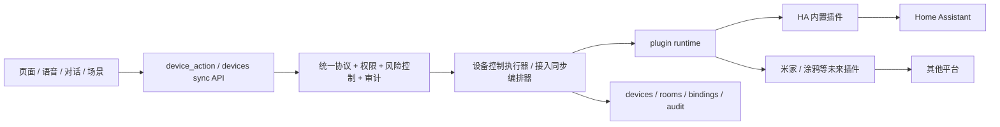

# 设计文档 - 设备控制与家居接入插件化改造

状态：Draft

## 1. 概述

### 1.1 目标

- 把设备控制主链从“核心直接调用 HA”改成“核心统一协议 + 插件真实执行”
- 把设备接入主链从“核心直接同步 HA”改成“插件提供平台数据 + 核心统一落库”
- 让 Home Assistant 内置插件真正接管主链，而不是继续当占位壳
- 保住现有权限、高风险确认、审计、场景和语音入口，不让这些通用规矩散落到插件里
- 为后续多平台并存做准备，但不在这次方案里过度设计市场、安装器和新平台实现

### 1.2 覆盖需求

- `requirements.md` 需求 1
- `requirements.md` 需求 2
- `requirements.md` 需求 3
- `requirements.md` 需求 4
- `requirements.md` 需求 5
- `requirements.md` 需求 6
- `requirements.md` 需求 7

### 1.3 技术约束

- 后端：FastAPI + SQLAlchemy + Alembic
- 插件系统：优先复用现有 `plugin` 模块、manifest、entrypoint、执行器和任务体系
- 数据存储：当前基线仍是 SQLite + Alembic，不假装已经有专门消息总线
- 接口兼容：现有 `device-actions`、`devices/sync/ha`、`devices/rooms/sync/ha` 等入口要尽量保持外部语义稳定
- 迁移原则：先让 HA 走真插件，再删核心里的 HA 设备实现层
- 设计原则：核心保留统一协议和通用规则；平台实现必须放插件，不在核心继续写 `if vendor == xxx`

### 1.4 方案结论

#### 1.4.1 本地到底保留什么

本地核心保留这些内容：

- 统一动作定义和参数 schema
- 设备控制请求模型、执行结果模型和错误码
- 权限控制、高风险确认、场景编排、审计日志、幂等、超时、错误归一
- 设备绑定模型和插件选择规则
- 统一执行器接口和统一同步编排器

#### 1.4.2 本地明确不保留什么

本地核心不再保留这些内容：

- `turn_on -> light.turn_on` 这种平台动作映射
- `set_temperature -> climate.set_temperature` 这种平台 service 组装
- HA registry 拉取细节、平台 SDK 细节、厂商错误细节
- 针对平台设备类型的散装实现分支

#### 1.4.3 插件必须承担什么

插件必须承担两类真实工作：

1. **控制执行**：把统一动作翻译成平台 API 或 service call
2. **平台接入**：把平台设备、实体、房间、能力整理成统一候选和同步结果

## 2. 架构

### 2.1 系统结构



一句话概括：

> 调用方只说“我要做什么”，核心负责“这件事能不能做、怎么记账、怎么收口”，插件负责“到底怎么和平台说话”。

### 2.2 模块职责

| 模块 | 职责 | 输入 | 输出 |
| --- | --- | --- | --- |
| `device_control_protocol` | 定义统一动作、参数 schema、风险等级、标准结果 | 动作名、设备类型、参数 | 校验规则、动作定义 |
| `device_control_service` | 统一控制主链，处理权限、幂等、审计、插件调度 | 控制请求 | 统一执行结果 |
| `device_integration_service` | 统一同步主链，处理候选查询、同步摘要、落库 | 同步请求 | 同步摘要、绑定信息 |
| `device_plugin_router` | 根据设备绑定或平台类型选插件 | 设备、绑定、请求上下文 | `plugin_id`、执行上下文 |
| `plugin runtime` | 执行插件 entrypoint，处理运行时和超时 | `PluginExecutionRequest` | 插件原始结果 |
| `homeassistant-device-action` | 把统一动作翻成 HA service call | 标准控制 payload | 平台执行结果 |
| `homeassistant-device-sync` | 从 HA 拉设备、实体、房间并返回标准同步 payload | 同步请求 | 候选列表、同步结果 |
| `scene / voice / conversation` | 继续做上层编排，不碰平台实现 | 标准动作或场景意图 | 控制请求 |

### 2.3 关键流程

#### 2.3.1 统一设备控制流程

1. 页面、语音、场景或对话发起统一控制请求。
2. `device_control_service` 读取设备、家庭、绑定信息。
3. 核心先做设备归属、设备可控性、动作支持、参数校验和高风险确认。
4. `device_plugin_router` 根据设备绑定定位负责的 `plugin_id`。
5. 核心组装标准插件 payload，并交给插件 runtime 执行。
6. 插件把统一动作翻译成平台调用，返回标准执行结果。
7. 核心统一写审计、执行结果和错误收口，必要时回写设备快照。

#### 2.3.2 设备候选查询流程

1. 页面请求某个平台的设备候选列表。
2. `device_integration_service` 选择对应接入插件。
3. 插件拉平台设备、房间、实体和能力，返回标准候选项。
4. 核心补上本地是否已绑定、是否已同步等信息后返回前端。

#### 2.3.3 设备同步流程

1. 页面发起按平台同步设备或房间。
2. `device_integration_service` 通过插件拉取平台完整数据。
3. 插件只负责给出标准同步项，不直接写本地数据库。
4. 核心统一创建或更新 `Device`、`Room`、`DeviceBinding` 和同步摘要。
5. 核心记录同步结果、失败原因和审计日志。

#### 2.3.4 场景与语音复用流程

1. `scene`、`voice fast action`、`conversation fast action` 继续生成统一动作请求。
2. 统一动作请求全部走 `device_control_service`。
3. 核心层不关心这次请求来自哪条上层业务链，只关心是否允许执行和怎么调插件。

## 3. 组件和接口

### 3.1 核心组件

覆盖需求：1、2、3、4、5、6、7

- `DeviceControlProtocolRegistry`
  - 管理统一动作定义
  - 提供标准参数校验入口
- `DeviceControlService`
  - 统一控制执行入口
  - 处理权限、高风险确认、幂等、审计、超时和错误归一
- `DeviceIntegrationService`
  - 统一设备候选、设备同步、房间同步入口
  - 统一把插件结果落成系统主数据
- `DevicePluginRouter`
  - 根据绑定信息和请求类型选择插件
- `DevicePluginPayloadFactory`
  - 组装给插件的标准 payload
- `HomeAssistantActionPlugin`
  - 真实实现 HA 控制
- `HomeAssistantSyncPlugin`
  - 真实实现 HA 候选查询和同步数据抓取

### 3.2 数据结构

覆盖需求：1、2、3、4、5、6

#### 3.2.1 `DeviceActionDefinition`

| 字段 | 类型 | 必填 | 说明 | 约束 |
| --- | --- | --- | --- | --- |
| `action` | string | 是 | 统一动作名 | 稳定 id，例如 `turn_on` |
| `supported_device_types` | string[] | 是 | 哪些本地设备类型可用 | 非空 |
| `risk_level` | string | 是 | `low/medium/high` | 有限集合 |
| `params_schema` | object | 是 | 标准参数 schema | JSON Schema 风格或等价结构 |
| `required_permissions` | string[] | 是 | 所需权限 | 可空但字段必须存在 |
| `idempotent_scope` | string | 是 | 幂等判断范围 | `request/device/action` 等固定集合 |

说明：

- 这张定义表可以先落在代码注册表里，不要求这次先做数据库表。
- 动作名是系统协议，不允许插件自己发明一个只在平台里能懂的名字给调用方用。

#### 3.2.2 `DeviceControlRequest`

| 字段 | 类型 | 必填 | 说明 | 约束 |
| --- | --- | --- | --- | --- |
| `household_id` | string | 是 | 家庭 id | 非空 |
| `device_id` | string | 是 | 本地设备 id | 非空 |
| `action` | string | 是 | 统一动作名 | 必须存在于动作注册表 |
| `params` | object | 是 | 标准参数 | 默认为空对象 |
| `reason` | string | 是 | 调用原因 | 非空，最大长度受控 |
| `confirm_high_risk` | bool | 是 | 是否已确认高风险动作 | 默认 `false` |
| `idempotency_key` | string | 否 | 幂等键 | 建议由上层传入或核心生成 |
| `requested_by` | object | 否 | 操作人上下文 | 用于审计 |

#### 3.2.3 `DeviceControlPluginPayload`

| 字段 | 类型 | 必填 | 说明 | 约束 |
| --- | --- | --- | --- | --- |
| `schema_version` | string | 是 | payload 版本 | 初版 `device-control.v1` |
| `request_id` | string | 是 | 一次控制请求 id | 全链路唯一 |
| `household_id` | string | 是 | 家庭 id | 非空 |
| `plugin_id` | string | 是 | 目标插件 | 非空 |
| `binding` | object | 是 | 设备绑定信息 | 至少包含外部对象 id |
| `device_snapshot` | object | 是 | 本地设备快照 | 至少包含 `device_type`、`name` |
| `action` | string | 是 | 统一动作名 | 非空 |
| `params` | object | 是 | 标准参数 | 已通过核心校验 |
| `timeout_seconds` | number | 是 | 平台执行超时 | 正数 |

#### 3.2.4 `DeviceControlPluginResult`

| 字段 | 类型 | 必填 | 说明 | 约束 |
| --- | --- | --- | --- | --- |
| `success` | bool | 是 | 是否成功 | 非空 |
| `platform` | string | 是 | 平台标识 | 如 `home_assistant` |
| `plugin_id` | string | 是 | 执行插件 | 非空 |
| `external_request` | object | 否 | 发给平台的摘要 | 不能泄漏敏感信息 |
| `external_response` | object | 否 | 平台返回摘要 | 可裁剪 |
| `normalized_state_patch` | object | 否 | 可选状态回写建议 | 只允许标准字段 |
| `error_code` | string | 否 | 平台错误归一结果 | 失败时必填 |
| `error_message` | string | 否 | 错误说明 | 失败时必填 |

#### 3.2.5 `DeviceSyncPluginPayload`

| 字段 | 类型 | 必填 | 说明 | 约束 |
| --- | --- | --- | --- | --- |
| `schema_version` | string | 是 | payload 版本 | 初版 `device-sync.v1` |
| `household_id` | string | 是 | 家庭 id | 非空 |
| `sync_scope` | string | 是 | `devices/rooms` | 有限集合 |
| `selected_external_ids` | string[] | 否 | 指定同步对象 | 可空 |
| `options` | object | 是 | 同步选项 | 已标准化 |

#### 3.2.6 `DeviceSyncPluginResult`

| 字段 | 类型 | 必填 | 说明 | 约束 |
| --- | --- | --- | --- | --- |
| `platform` | string | 是 | 平台标识 | 非空 |
| `plugin_id` | string | 是 | 来源插件 | 非空 |
| `device_candidates` | object[] | 否 | 候选设备列表 | 标准结构 |
| `room_candidates` | object[] | 否 | 候选房间列表 | 标准结构 |
| `devices` | object[] | 否 | 标准同步设备项 | 标准结构 |
| `rooms` | object[] | 否 | 标准同步房间项 | 标准结构 |
| `failures` | object[] | 否 | 失败项 | 至少包含外部引用和原因 |

#### 3.2.7 `DeviceBinding` 扩展

现有 `DeviceBinding` 需要补足或正式使用这些语义：

| 字段 | 当前情况 | 本次要求 |
| --- | --- | --- |
| `platform` | 已存在 | 保留，用于粗粒度平台标识 |
| `external_entity_id` | 已存在 | 保留，作为主外部对象之一 |
| `external_device_id` | 已存在 | 保留，作为平台设备级 id |
| `capabilities` | 已存在 | 继续保存能力快照，但不再承载不稳定临时字段 |
| `plugin_id` | 缺失 | 新增，明确哪个插件负责执行和同步 |
| `binding_version` | 缺失 | 新增或等价字段，便于后续兼容升级 |

### 3.3 接口契约

覆盖需求：1、2、3、4、5、6、7

#### 3.3.1 统一设备控制服务入口

- 类型：Function / Service
- 路径或标识：`device_control_service.execute`
- 输入：`DeviceControlRequest`
- 输出：统一控制响应，包含设备、动作、执行插件、平台、结果、时间戳
- 校验：
  - 设备必须属于当前家庭
  - 设备必须可控
  - 动作必须存在于统一动作协议
  - 参数必须通过标准 schema 校验
  - 高风险动作必须先完成确认
- 错误：
  - `device_not_controllable`
  - `action_not_supported`
  - `plugin_not_available`
  - `high_risk_confirmation_required`
  - `plugin_execution_failed`
  - `plugin_execution_timeout`

#### 3.3.2 统一设备候选查询入口

- 类型：Function / Service
- 路径或标识：`device_integration_service.list_candidates`
- 输入：`household_id`、`plugin_id`、`scope`
- 输出：标准候选列表
- 校验：
  - 插件必须已注册且已在当前家庭启用
  - 插件必须声明 `connector` 能力
- 错误：
  - `plugin_not_available`
  - `plugin_type_not_supported`
  - `plugin_execution_failed`

#### 3.3.3 统一设备同步入口

- 类型：Function / Service
- 路径或标识：`device_integration_service.sync`
- 输入：`DeviceSyncPluginPayload`
- 输出：统一同步摘要
- 校验：
  - 只允许指定平台插件进入对应同步流程
  - 插件结果必须符合标准同步结构
- 错误：
  - `plugin_not_available`
  - `plugin_result_invalid`
  - `device_binding_conflict`
  - `room_sync_conflict`

#### 3.3.4 外部 API 兼容策略

- `POST /api/v1/device-actions/execute`
  - 保留现有入口
  - 底层从 `device_action.service -> ha_integration.service` 改成 `device_action.service -> device_control_service -> plugin runtime`
- `POST /api/v1/devices/sync/ha`
  - 第一阶段保留旧路径，内部改为调用 HA 接入插件
  - 第二阶段可增加更通用的 `/devices/integrations/{plugin_id}/sync`
- `GET /api/v1/devices/ha-candidates/{household_id}`
  - 第一阶段保留旧路径，内部改为调 HA 接入插件
- `POST /api/v1/devices/rooms/sync/ha`
  - 第一阶段保留旧路径，内部改为调 HA 接入插件

说明：

- 先保兼容，再收口通用路径，这是为了不把现有前端和语音链一起砸了。

### 3.4 插件协议

#### 3.4.1 动作插件 entrypoint 约定

- 入口类型：`action`
- 函数签名：接受标准控制 payload，返回标准控制结果
- 插件职责：
  - 读取绑定信息
  - 做平台动作映射
  - 调平台 API
  - 把平台错误翻译成标准错误
- 插件明确不负责：
  - 权限判断
  - 高风险确认
  - 审计日志
  - 场景编排

#### 3.4.2 接入插件 entrypoint 约定

- 入口类型：`connector`
- 函数签名：接受标准同步 payload，返回标准同步结果
- 插件职责：
  - 拉平台候选项和完整同步数据
  - 整理平台设备、实体、房间、能力
  - 返回标准结构
- 插件明确不负责：
  - 本地数据库写入
  - 本地设备 id 分配
  - 审计日志

#### 3.4.3 HA 插件拆分策略

- `homeassistant-device-action`
  - 负责普通控制动作，例如灯、空调、窗帘、音箱
- `homeassistant-door-lock-action`
  - 可以保留为高风险动作专用插件，也可以合并进普通 HA 动作插件
  - 这次建议保留独立插件 id，风险边界更清楚
- `homeassistant-device-sync`
  - 负责候选查询、设备同步、房间同步、能力快照整理

## 4. 数据与状态模型

### 4.1 数据关系

这次要把数据关系改清楚，不再靠字段猜测平台：

- `Device`
  - 表示系统里的设备主数据
- `DeviceBinding`
  - 表示这个设备由哪个插件、哪个平台对象负责
- `PluginRegistryItem / PluginMount / PluginStateOverride`
  - 表示插件是否存在、当前家庭是否启用
- `AuditLog`
  - 记录一次控制或同步到底是谁发起、走了哪个插件、成没成功

关键关系：

1. 一个 `Device` 至少应有一个正式 `DeviceBinding` 才能做平台控制。
2. 一个 `DeviceBinding` 必须明确属于某个 `plugin_id`。
3. 一次控制请求必须先找到 `DeviceBinding.plugin_id`，再决定执行插件。
4. 一次同步请求先指定平台插件，再由核心决定如何落本地设备和房间。

### 4.2 状态流转

#### 4.2.1 控制执行状态

| 状态 | 含义 | 进入条件 | 退出条件 |
| --- | --- | --- | --- |
| `received` | 请求已进入统一控制主链 | API 或上层服务提交请求 | 完成校验 |
| `validated` | 已通过核心校验 | 权限、参数、风险校验通过 | 进入插件执行 |
| `running` | 插件执行中 | 已交给插件 runtime | 成功、失败或超时 |
| `succeeded` | 平台已执行成功 | 插件返回成功结果 | 流程结束 |
| `failed` | 平台执行失败或结果非法 | 插件失败、超时、结果不合法 | 流程结束 |
| `blocked` | 核心策略阻断 | 权限、高风险确认、插件停用等阻断 | 流程结束 |

#### 4.2.2 设备同步状态

| 状态 | 含义 | 进入条件 | 退出条件 |
| --- | --- | --- | --- |
| `collecting` | 正在拉平台数据 | 已执行接入插件 | 结果返回 |
| `applying` | 正在落本地模型 | 插件结果合法 | 全部处理完成 |
| `partial_success` | 有成功也有失败 | 部分同步项失败 | 流程结束 |
| `succeeded` | 全部成功 | 无失败项 | 流程结束 |
| `failed` | 插件或核心整体失败 | 无法继续处理 | 流程结束 |

## 5. 错误处理

### 5.1 错误类型

- `plugin_not_available`：插件不存在、未启用或未声明对应能力
- `device_binding_missing`：设备没有正式绑定信息
- `device_binding_conflict`：绑定信息冲突或指向错误插件
- `action_not_supported`：统一动作不支持当前设备类型
- `high_risk_confirmation_required`：高风险动作未确认
- `plugin_execution_timeout`：插件或平台执行超时
- `plugin_execution_failed`：插件返回失败
- `plugin_result_invalid`：插件返回结构不合法
- `platform_request_failed`：平台接口调用失败
- `sync_apply_failed`：插件返回合法，但本地落库失败

### 5.2 错误响应格式

```json
{
  "detail": "设备控制执行失败：HA 插件返回超时",
  "error_code": "plugin_execution_timeout",
  "field": "plugin_id",
  "timestamp": "2026-03-15T12:00:00Z"
}
```

### 5.3 处理策略

1. 输入验证错误：核心直接拒绝，不进入插件执行。
2. 业务规则错误：核心直接阻断，并写入审计日志。
3. 插件执行错误：核心统一收口错误码，并记录 `plugin_id`、平台和外部请求摘要。
4. 平台部分失败：同步流程允许部分成功，控制流程默认整次失败。
5. 重试、降级或补偿：
   - 控制请求默认不自动重试，避免真实设备重复执行。
   - 同步请求可以在人工确认后重试。
   - 插件超时必须明确标记，不能假装成功。

## 6. 正确性属性

### 6.1 属性 1：调用方不需要知道平台细节

*对于任何* 设备控制请求，系统都应该满足：上层调用方只能看到统一动作和统一结果，不能依赖某个平台的 service 名称或 payload 细节。

**验证需求：** `requirements.md` 需求 1、需求 7

### 6.2 属性 2：平台实现不留在核心主链

*对于任何* 平台设备控制或平台同步流程，系统都应该满足：真实平台调用发生在插件里，而不是核心服务直接调用平台 SDK 或 HTTP API。

**验证需求：** `requirements.md` 需求 2、需求 3、需求 6

### 6.3 属性 3：高风险动作必须先过核心规则

*对于任何* 高风险动作请求，系统都应该满足：如果没有完成核心确认和权限判断，就绝不能进入插件执行。

**验证需求：** `requirements.md` 需求 4

### 6.4 属性 4：设备到插件的路由必须稳定

*对于任何* 可控设备，系统都应该满足：只要绑定信息完整，系统总能稳定定位负责它的插件；绑定缺失时必须明确失败，不能临时猜平台。

**验证需求：** `requirements.md` 需求 5

### 6.5 属性 5：HA 内置插件必须承载真实业务

*对于任何* HA 设备控制或 HA 设备同步请求，系统都应该满足：正式链路使用真实 HA 插件执行，不允许再走 demo stub 或核心直连旧逻辑。

**验证需求：** `requirements.md` 需求 6

## 7. 测试策略

### 7.1 单元测试

- 统一动作定义和参数校验测试
- 高风险确认、权限校验、幂等逻辑测试
- `DevicePluginRouter` 设备绑定选插件测试
- 插件 payload 组装和结果解析测试
- HA 插件动作映射、参数映射、错误翻译测试

### 7.2 集成测试

- `POST /device-actions/execute` 走统一控制主链并调用插件
- `voice fast action`、`conversation fast action`、`scene` 复用统一控制主链
- HA 设备候选查询、设备同步、房间同步通过插件完成
- 插件停用、绑定缺失、超时、结果非法等异常路径测试

### 7.3 端到端测试

- 用户端配置 HA 后查看候选设备、同步设备、同步房间
- 用户端或管理端触发灯、空调、门锁等典型动作
- 语音快路径触发设备控制并正确落审计
- 场景执行触发多个设备动作并正确复用插件执行链

### 7.4 验证映射

| 需求 | 设计章节 | 验证方式 |
| --- | --- | --- |
| `requirements.md` 需求 1 | `design.md` §2.3.1、§3.2.1、§3.3.1、§6.1 | 单元测试 + 控制接口集成测试 |
| `requirements.md` 需求 2 | `design.md` §2.3.1、§3.4.1、§5.1、§6.2 | HA 动作插件测试 + 主链集成测试 |
| `requirements.md` 需求 3 | `design.md` §2.3.2、§2.3.3、§3.4.2、§6.2 | 候选查询/同步集成测试 |
| `requirements.md` 需求 4 | `design.md` §2.3.1、§5.3、§6.3 | 权限、高风险、幂等测试 |
| `requirements.md` 需求 5 | `design.md` §3.2.7、§4.1、§6.4 | 绑定路由测试 |
| `requirements.md` 需求 6 | `design.md` §3.4.3、§6.5 | 内置插件真实执行链测试 |
| `requirements.md` 需求 7 | `design.md` §2.3.4、§3.3.4 | 语音/场景/旧 API 回归测试 |

## 8. 风险与待确认项

### 8.1 风险

- 现有 `ha_integration` 逻辑比较厚，迁移时容易出现新旧双轨共存太久的问题。
- 现有插件 `action` / `connector` 接口偏通用，落设备协议时如果 payload 设计太松，后面还会回到“大家各玩各的”。
- `DeviceBinding` 增字段会影响历史数据，需要迁移脚本和回填策略。
- 设备控制默认不自动重试是对的，但业务侧可能会误以为“超时就该自动再发一次”，需要明确约束。

### 8.2 待确认项

- `homeassistant-door-lock-action` 是继续独立保留，还是合并进 `homeassistant-device-action`。本设计默认保留独立插件。
- 通用 API 是否在第一阶段就新增 `/devices/integrations/{plugin_id}/sync`，还是先只做内部收口、对外保留 HA 路径。当前建议先保兼容。
- 幂等键是否要求所有上层调用方都显式传入，还是先由核心在缺省时自动生成。当前建议“支持显式传入，缺省自动生成”。
