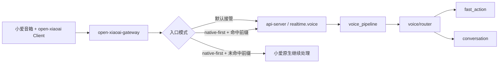

# 设计文档 - 小爱原生优先与前缀接管

状态：Draft

## 1. 概述

### 1.1 目标

- 把当前“认领后默认进入 FamilyClaw 主链”的模式扩成两种可选入口模式
- 增加 native-first 模式，复刻 `mi-gpt` 已验证的“默认原生、命中前缀才接管”
- 保持 `voice_pipeline / router / fast_action / conversation` 这些正式主链不变
- 只在 gateway 增加最小接管判定，不把网关变成业务垃圾桶

### 1.2 覆盖需求

- `requirements.md` 需求 1
- `requirements.md` 需求 2
- `requirements.md` 需求 3
- `requirements.md` 需求 4
- `requirements.md` 需求 5
- `requirements.md` 需求 6

### 1.3 设计约束

- 不接入 `mi-gpt` 代码
- 不让 gateway 承担快路径、慢路径、权限、身份或上下文决策
- 不破坏当前默认接管模式
- 尽量复用现有 `audio.commit(debug_transcript=...) -> voice_pipeline` 主链

### 1.4 方案结论

#### 1.4.1 接管闸门放哪

结论写死：

- **放在 gateway**
- **不放在 `api-server/voice/router`**

原因：

如果等 `router` 才判断，就已经进入 FamilyClaw 正式主链了。那不是“默认原生、命中再接管”，那只是“先接进来再说不处理”。

#### 1.4.2 gateway 这次新增的职责是什么

gateway 只新增一件事：

- **判断这句最终文本要不要被 FamilyClaw 接管**

gateway 明确不新增这些职责：

- 不判断快路径还是慢路径
- 不判断权限和风险
- 不判断家庭上下文
- 不直接执行设备动作
- 不直接调用 `conversation`

#### 1.4.3 最小可用版本用什么触发 takeover

第一版不搞复杂流式抢占，直接用：

- 终端最终文本 `instruction final`

命中前缀后：

1. gateway 本地执行一次 takeover 打断
2. 发 `session.start`
3. 发 `audio.commit(debug_transcript=...)`
4. 后面继续走现有正式主链

这个落法最笨，但最清楚，也最像 `mi-gpt` 的文本接管模式。

## 2. 架构

### 2.1 模式结构



一句话：

> gateway 决定“进不进主链”，`api-server` 决定“进来以后怎么处理”。

### 2.2 运行模式

#### 2.2.1 模式 A：默认接管

这是当前已有模式：

- 终端认领后
- gateway 正常连接 realtime voice
- `kws / instruction / record` 正常翻译进 FamilyClaw

#### 2.2.2 模式 B：native-first

这是本次新增模式：

- 终端认领后仍连接 gateway
- 但 gateway 不在 `kws` 阶段立刻把会话送进 FamilyClaw
- gateway 等待最终文本
- 只有命中前缀，才正式接管

## 3. 组件与接口

### 3.1 gateway 组件改动

覆盖需求：1、2、4、5、6

新增或改造这些组件：

- `GatewayInvocationMode`
  - 表示入口模式：`always_familyclaw`、`native_first`
- `GatewayInvocationPolicy`
  - 做前缀命中判断
- `TerminalBridgeContext`
  - 增加模式信息、前缀命中状态、最近一次未接管原因
- `translate_text_message`
  - 改造为支持“native-first 下默认静默”

### 3.2 配置结构

覆盖需求：5、6

建议新增配置项：

| 配置项 | 类型 | 默认值 | 说明 |
| --- | --- | --- | --- |
| `invocation_mode` | string | `always_familyclaw` | 入口模式 |
| `takeover_prefixes` | string[] | 空 | 接管前缀列表 |
| `strip_takeover_prefix` | bool | `true` | 接管后是否剥离前缀 |
| `pause_on_takeover` | bool | `true` | 命中前缀后是否先打断原生播放 |

对应环境变量建议：

- `FAMILYCLAW_OPEN_XIAOAI_GATEWAY_INVOCATION_MODE`
- `FAMILYCLAW_OPEN_XIAOAI_GATEWAY_TAKEOVER_PREFIXES`
- `FAMILYCLAW_OPEN_XIAOAI_GATEWAY_STRIP_TAKEOVER_PREFIX`
- `FAMILYCLAW_OPEN_XIAOAI_GATEWAY_PAUSE_ON_TAKEOVER`

说明：

- `TAKEOVER_PREFIXES` 建议用逗号分隔
- `native_first` 模式下，空前缀列表应视为配置错误或等价禁用

### 3.3 事件流

#### 3.3.1 当前默认接管模式

1. `kws`
2. gateway 发 `session.start`
3. `record` 转 `audio.append`
4. `instruction final` 转 `audio.commit`
5. `api-server` 路由处理

#### 3.3.2 native-first 未命中前缀

1. 终端产出 `instruction final`
2. gateway 读取最终文本
3. 前缀未命中
4. gateway 记录 `native_passthrough`
5. gateway 不发 `session.start`
6. gateway 不发 `audio.commit`
7. gateway 不发播放控制

#### 3.3.3 native-first 命中前缀

1. 终端产出 `instruction final`
2. gateway 判断前缀命中
3. 如配置允许，先执行本地 `pause`
4. gateway 创建 `session_id`
5. gateway 发 `session.start`
6. gateway 发 `audio.commit(debug_transcript=清洗后的文本)`
7. `api-server` 正常进入 `voice_pipeline`

### 3.4 `api-server` 侧接口影响

覆盖需求：3、4、6

`api-server` 不需要新增新协议，只需要接受 gateway 发来的最小 takeover 事件：

- `session.start`
- `audio.commit(debug_transcript=...)`

这意味着现有主链可继续复用：

- `voice_pipeline`
- `voice_router`
- `voice_fast_action_service`
- `voice_conversation_bridge`

`api-server` 侧明确不承担：

- 第一道前缀接管判断
- 未命中前缀时的 native_passthrough 逻辑

## 4. 数据与状态模型

### 4.1 gateway 本地状态

建议给 `TerminalBridgeContext` 增加这些字段：

| 字段 | 类型 | 说明 |
| --- | --- | --- |
| `invocation_mode` | string | 当前入口模式 |
| `takeover_prefixes` | string[] | 当前前缀列表 |
| `last_invocation_decision` | string | 最近一次判定结果 |
| `last_passthrough_reason` | string \| null | 最近一次未接管原因 |

### 4.2 判定结果模型

建议新增：

```text
InvocationDecision
- decision_type: familyclaw_takeover | native_passthrough | invalid_config
- matched_prefix: string | null
- stripped_text: string | null
- reason: string
```

### 4.3 会话状态

#### 4.3.1 未命中前缀

- 不创建正式 `voice_session`
- gateway 本地仅记录一次判定结果

#### 4.3.2 命中前缀

- 正式创建 `voice_session`
- 后续状态流转沿用现有主链

### 4.4 正确性属性

#### 4.4.1 属性 1：未命中前缀时必须保持静默

*对于任何* native-first 模式下未命中前缀的语音请求，系统都应该满足：FamilyClaw 不创建正式会话、不下发播放命令、不进入业务主链。

#### 4.4.2 属性 2：命中前缀后必须复用现有主链

*对于任何* native-first 模式下命中前缀的语音请求，系统都应该满足：接管后仍然复用现有 `voice_pipeline / router / fast_action / conversation`。

#### 4.4.3 属性 3：gateway 不承载业务决策

*对于任何* native-first 模式下的 gateway 实现，系统都应该满足：gateway 只做接管判定，不做快慢路径、权限、高风险和上下文判断。

## 5. 错误处理

### 5.1 错误类型

- `native_first_prefixes_empty`
  - 开启 native-first 但未配置前缀
- `takeover_pause_failed`
  - 命中前缀，但打断原生播放失败
- `takeover_commit_failed`
  - 命中前缀，但无法把文本送入正式主链
- `native_passthrough`
  - 不是错误，而是明确状态

### 5.2 处理策略

1. `always_familyclaw` 模式下，忽略前缀配置，继续按当前主链运行。
2. `native_first` 模式下，前缀为空时：
   - 记录明确错误
   - 不假装已正确启用
3. 命中前缀但本地 `pause` 失败时：
   - 记录错误
   - 是否继续接管由配置决定，初版建议继续接管但记录失败
4. 命中前缀但 `session.start / audio.commit` 失败时：
   - 返回明确错误日志
   - 不再尝试额外播报，避免双重打架

## 6. 测试策略

### 6.1 gateway 单元测试

- native-first 未命中前缀时不产出正式事件
- native-first 命中前缀时产出 `session.start + audio.commit`
- 前缀剥离逻辑正确
- 前缀为空配置时给出明确错误或阻断
- 默认接管模式不受影响

### 6.2 `api-server` 集成测试

- takeover 文本仍能走现有 `voice_pipeline`
- 快路径和慢路径继续可用
- 未命中前缀时，`api-server` 不会收到正式事件

### 6.3 回归测试

- 默认接管模式仍能走现在的 `kws / record / instruction` 链
- native-first 模式不破坏待认领设备流程
- playback 和 interruption 回执不受接管闸门影响

### 6.4 验证映射

| 需求 | 设计章节 | 验证方式 |
| --- | --- | --- |
| `requirements.md` 需求 1 | `design.md` §2.2、§3.3 | gateway 行为测试 |
| `requirements.md` 需求 2 | `design.md` §1.4.1、§3.1、§3.3 | gateway 单元测试 + 走查 |
| `requirements.md` 需求 3 | `design.md` §3.4、§4.4.2 | `api-server` 集成测试 |
| `requirements.md` 需求 4 | `design.md` §3.3.2、§4.4.1 | native passthrough 测试 |
| `requirements.md` 需求 5 | `design.md` §3.2 | 配置解析测试 |
| `requirements.md` 需求 6 | `design.md` §2.2、§5.2 | 双模式回归测试 |

## 7. 风险与待确认项

### 7.1 风险

- 小爱原生在不同机型上的最终播报时机不完全一致，`pause_on_takeover` 可能需要实机校正。
- 如果未来又想在 gateway 塞更多规则，入口策略很容易膨胀成业务逻辑。
- `debug_transcript` takeover 第一版更稳，但会失去部分流式录音链路收益。

### 7.2 待确认项

- 初版接管前缀是否固定为全局配置，还是要给单终端覆盖位。当前建议先做全局配置。
- `pause_on_takeover` 失败时是否继续接管。当前建议继续接管，但必须记录日志。
- 前缀剥离后若文本为空，是否直接视为无效请求。当前建议直接放弃接管并记录原因。
