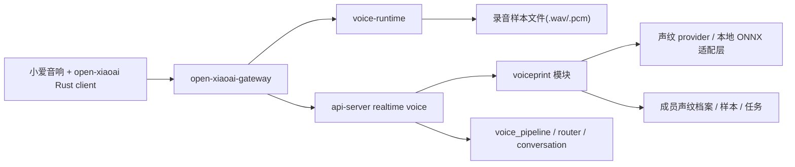

# 设计文档 - 小爱声纹采集与身份识别

状态：Draft

## 1. 概述

### 1.1 目标

- 先把开发前测试闸门写实，不再假设声纹能力天然可做
- 把“小爱音响录音样本如何进入系统并保存”这件事做成正式链路
- 把“成员声纹档案如何生成、更新、停用”这件事做成正式对象和流程
- 把“对话前先做声纹识别，再决定成员身份”这件事接到现有语音主链前面
- 保持 `gateway -> voice-runtime -> api-server voice_pipeline` 这条正式主链继续可用

### 1.2 覆盖需求

- `requirements.md` 闸门 A
- `requirements.md` 闸门 B
- `requirements.md` 闸门 C
- `requirements.md` 需求 1
- `requirements.md` 需求 2
- `requirements.md` 需求 3
- `requirements.md` 需求 4
- `requirements.md` 需求 5
- `requirements.md` 需求 6
- `requirements.md` 需求 7

### 1.3 技术约束

- backend 指 `api-server + voice-runtime`
- gateway 只负责录音采集、会话打标和转发，不做声纹算法
- 数据库结构变更必须通过 Alembic migration 完成
- 声纹 provider 必须经过统一适配层，不能把第三方 SDK 逻辑直接塞进语音主链
- 识别失败必须降级，不能让现有用户对话直接报废

### 1.4 2026-03-15 已验证结论

- `open-xiaoai` Rust client 会发送 `record` 原始音频流分片
- gateway 当前已经能把这些分片转成 `audio.append`
- 分片可无损恢复成 `.wav / .pcm`
- 第一版本地声纹基线已实测可跑通：
  - `sherpa-onnx 1.12.29`
  - `wespeaker_en_voxceleb_resnet34.onnx`
- 本地 CPU 基线下，查询窗口 `1s ~ 2s` 有机会把声纹识别压进 `100ms`
- 查询窗口 `3s` 及以上时，当前基线开始超出 `100ms`
- 已使用公开样本对比 `CAM++` 与 `ResNet34`
- 本次对比中，`ResNet34` 准确率和稳定性明显更好
- 结论：`005.3` 第一版正式选用 `weSpeaker/ResNet34`

## 2. 架构

### 2.1 系统结构

一句话：

> gateway 把音频送进来，voice-runtime 负责把音频变成可用样本，api-server 负责建档、识别和身份回填。

### 2.2 先测后做的两阶段结构

第一阶段先做测试闸门，不碰正式业务实现边界：

1. 证明小爱音频分片能恢复成标准源文件
2. 证明多轮样本能做成可搜索的声纹档案
3. 给出真实时延数据，决定第一版窗口和方案

第二阶段才做正式实现：

1. 补 `voice-runtime` 的正式落盘
2. 补 `voiceprint` 模块
3. 把识别前置到 LLM 之前

没有第一阶段的结论，第二阶段不许开工。

### 2.3 模块职责

| 模块 | 职责 | 输入 | 输出 |
| --- | --- | --- | --- |
| `open-xiaoai-gateway` | 采集录音、识别当前会话用途、转发音频与提交事件 | 终端录音流、终端文本、后端绑定信息 | `session.start / audio.append / audio.commit` |
| `voice-runtime` | 缓存音频块、落地样本文件、返回音频产物元数据 | 音频分片流 | `.wav/.pcm` 样本文件、音频元数据 |
| `voiceprint` 模块 | 管理建档任务、样本、声纹档案和识别调用 | 样本文件、成员、终端、provider 配置 | 建档结果、识别结果 |
| `voice.identity_service` | 合并声纹结果与现有上下文身份推断 | 声纹结果、上下文快照、文本 | 最终身份结果 |
| `voice_pipeline / router / conversation` | 使用最终身份继续快慢路径处理 | 转写文本、身份结果 | 设备控制或 LLM 对话 |

### 2.4 关键流程

#### 2.4.1 声纹建档流程

1. 管理员在后端创建一个“成员声纹建档任务”，指定家庭成员、终端和建档批次。
2. 后端把该任务暴露给对应终端绑定信息，gateway 知道当前终端存在待采样任务。
3. 目标成员通过该小爱音响完成多轮采样，第一版默认按 `3` 轮处理。
4. gateway 把这次语音会话标记为 `voiceprint_enrollment`，继续上传音频分片。
5. `voice-runtime` 在 commit 时把本次音频落成可解析源文件，并返回样本元数据。
6. `api-server` 校验文本、时长、格式、任务状态。
7. `voiceprint` 模块调用本地适配器或 provider 生成 embedding，并聚合多轮样本。
8. 系统保存样本记录、档案版本和任务状态。

#### 2.4.2 普通对话识别流程

1. 用户通过小爱音响发起普通会话。
2. gateway 按 `005 / 005.2` 现有规则决定这次是否进入 FamilyClaw 主链。
3. 进入主链后，音频分片照常进入 `voice-runtime`，commit 后拿到转写文本和音频产物元数据。
4. `api-server` 在 `voice_pipeline` 进入后续路由前先执行声纹识别。
5. 若声纹匹配成功，则把成员身份写入最终身份结果。
6. 若声纹匹配失败，则回退到现有 `identity_service` 的上下文推断。
7. 后续 `fast_action / conversation` 共用这份身份结果。

#### 2.4.3 失败回退流程

1. provider 超时、不可用或返回异常。
2. 系统记录失败原因和识别状态。
3. 当前会话不终止，回退到现有身份推断或匿名身份。
4. 后续快路径和慢路径继续跑。

## 3. 第一版方案选择

### 3.1 首版声纹方案

这轮 Spec 不再把“provider 待定”当正文糊弄过去。第一版基线正式定成：

- 录入与解析：本地 ONNX
- 工具链：`sherpa-onnx`
- 模型：`wespeaker_en_voxceleb_resnet34.onnx`
- 建档方式：多轮样本 embedding 聚合
- 识别方式：当前家庭范围内 search / verify

原因：

- 已经在本地跑通
- 公开样本对比里，`ResNet34` 明显比本次拿到的 `CAM++` ONNX 更稳
- 不依赖云端往返，时延更可控
- 便于先把主链立住，再决定后续是否要扩 provider

### 3.2 多轮建档策略

第一版建议：

- 默认 `3` 轮样本
- 每轮有效语音目标 `2s ~ 5s`
- 每轮都保存原始 `.wav`
- 建档时至少保存：
  - 样本文件路径
  - 样本元数据
  - 单轮 embedding
  - 聚合后的最终档案

原则：

- 不拿单条录音当正式档案
- 不在 gateway 侧做聚合
- 聚合逻辑收口在后端 `voiceprint` 模块

### 3.3 `100ms` 目标怎么落

基于当前测试，第一版的现实做法是：

- 识别查询窗口控制在 `1s ~ 2s`
- 本地 CPU 直接做 embedding 提取
- search / verify 继续放在内存态或快速索引里

如果后续产品坚持：

- 查询窗口要 `3s+`
- 仍然要求严格 `100ms`

那就必须单开优化项，不许直接把这个承诺写进第一版上线口径。优化方向只有这几种：

- 流式预计算
- 更轻模型
- 更强硬件

## 4. 组件和接口

### 4.1 gateway 改动

覆盖需求：1、2、5、6

- `TerminalBridgeContext` 增加当前会话用途：
  - `conversation`
  - `voiceprint_enrollment`
- gateway 需要从后端绑定信息里拿到待处理的建档任务摘要，例如：
  - `enrollment_id`
  - `target_member_id`
  - `expected_phrase`
  - `expires_at`
- `session.start` 需要带出会话用途和可选建档任务 id
- `audio.commit` 继续带 `debug_transcript`，并在建档模式下带出 `enrollment_id`

gateway 明确不做：

- 不直接调用声纹 provider
- 不在网关里保存正式声纹档案
- 不在网关里做最终身份决策

### 4.2 voice-runtime 改动

覆盖需求：2、4、5、6、7

当前 `voice-runtime` 只是在内存里攒 `audio_chunks`。这次要补成正式音频产物链路：

- 会话 append 继续缓存音频块
- commit 时把音频块落为可解析样本文件，默认输出标准 `.wav`
- 保留必要元数据：
  - `artifact_id`
  - `file_path`
  - `sample_rate`
  - `channels`
  - `sample_width`
  - `duration_ms`
  - `sha256`
- commit 返回中增加音频产物信息，供 `api-server` 后续建档或识别使用

设计取舍：

- 第一版优先落 `.wav`
- 如有需要可同时保留原始 `.pcm`
- 不在 `voice-runtime` 内直接决定成员身份

### 4.3 api-server 新增 `voiceprint` 模块

覆盖需求：1、2、3、4、5、6、7

建议新增模块：

- `app/modules/voiceprint/models.py`
- `app/modules/voiceprint/schemas.py`
- `app/modules/voiceprint/service.py`
- `app/modules/voiceprint/provider.py`

这个模块负责：

- 创建和管理建档任务
- 保存录音样本记录
- 保存成员声纹档案
- 调用 provider 或本地适配器建档和识别
- 对外提供管理接口

### 4.4 身份判定链路改动

覆盖需求：5、6

现有流程是：

1. `voice_router` 调 `voice_identity_service.resolve(...)`
2. 再按身份结果继续路由

这次改为：

1. `voice_pipeline` 在 commit 后拿到转写文本和音频产物
2. `voiceprint` 模块先尝试识别
3. `voice_identity_service` 合并：
  - 声纹识别结果
  - 当前房间
  - 活跃成员
  - 文本命名线索
4. 输出统一的 `VoiceIdentityResolution`

原则：

- 声纹成功时优先用声纹
- 声纹失败时回退到现有上下文推断
- 不允许两套身份结果在不同链路上各跑各的

### 4.5 接口契约

覆盖需求：1、2、4、5、7

#### 4.5.1 创建建档任务

- 类型：HTTP
- 路径：`POST /api/v1/voiceprints/enrollments`
- 输入：
  - `household_id`
  - `member_id`
  - `terminal_id`
  - `expected_phrase`
  - `sample_goal`
- 输出：
  - `enrollment_id`
  - `status`
  - `expected_phrase`
  - `expires_at`
- 错误：
  - 成员不存在
  - 终端不属于家庭
  - 已有冲突中的任务

#### 4.5.2 查询终端待建档信息

- 类型：HTTP
- 路径：复用或扩展现有终端绑定查询接口
- 输入：
  - `fingerprint`
- 输出：
  - 绑定信息
  - 可选 `pending_voiceprint_enrollment`

#### 4.5.3 音频提交返回产物元数据

- 类型：HTTP
- 路径：`POST /v1/voice/sessions/commit`
- 输入：
  - 现有 commit 参数
- 输出新增：
  - `audio_artifact_id`
  - `audio_file_path`
  - `sample_rate`
  - `channels`
  - `duration_ms`

#### 4.5.4 成员声纹管理

- 类型：HTTP
- 路径：
  - `GET /api/v1/voiceprints/members/{member_id}`
  - `DELETE /api/v1/voiceprints/members/{member_id}`
- 输出：
  - 当前生效档案
  - 样本列表
  - 最近识别状态摘要

## 5. 数据模型

### 5.1 数据关系

- 一个家庭有多个成员
- 一个成员可以有一个当前生效的声纹档案
- 一个声纹档案可以关联多条录音样本
- 一个建档任务指向一个成员和一个终端，并生成一批样本

### 5.2 建议新增数据表

#### 5.2.1 `voiceprint_enrollments`

| 字段 | 类型 | 必填 | 说明 | 约束 |
| --- | --- | --- | --- | --- |
| `id` | string | 是 | 建档任务 id | 主键 |
| `household_id` | string | 是 | 所属家庭 | 外键 |
| `member_id` | string | 是 | 目标成员 | 外键 |
| `terminal_id` | string | 是 | 目标终端 | 非空 |
| `status` | enum | 是 | `pending / recording / processing / completed / failed / cancelled` | 非空 |
| `expected_phrase` | string | 否 | 采样口令 | 可空 |
| `sample_goal` | int | 是 | 目标样本数 | 大于 0 |
| `sample_count` | int | 是 | 已采到样本数 | 默认 0 |
| `error_code` | string | 否 | 失败原因 | 可空 |
| `created_at` | datetime | 是 | 创建时间 | 非空 |
| `updated_at` | datetime | 是 | 更新时间 | 非空 |

#### 5.2.2 `member_voiceprint_profiles`

| 字段 | 类型 | 必填 | 说明 | 约束 |
| --- | --- | --- | --- | --- |
| `id` | string | 是 | 档案 id | 主键 |
| `household_id` | string | 是 | 所属家庭 | 外键 |
| `member_id` | string | 是 | 所属成员 | 外键 |
| `provider` | string | 是 | 声纹提供方 | 非空 |
| `provider_profile_ref` | string | 否 | provider 侧档案引用 | 可空 |
| `status` | enum | 是 | `active / superseded / disabled / failed` | 非空 |
| `sample_count` | int | 是 | 样本数量 | 默认 0 |
| `version` | int | 是 | 档案版本 | 大于 0 |
| `created_at` | datetime | 是 | 创建时间 | 非空 |
| `updated_at` | datetime | 是 | 更新时间 | 非空 |

#### 5.2.3 `member_voiceprint_samples`

| 字段 | 类型 | 必填 | 说明 | 约束 |
| --- | --- | --- | --- | --- |
| `id` | string | 是 | 样本 id | 主键 |
| `profile_id` | string | 否 | 关联档案 | 可空 |
| `enrollment_id` | string | 否 | 来源建档任务 | 可空 |
| `household_id` | string | 是 | 所属家庭 | 外键 |
| `member_id` | string | 是 | 所属成员 | 外键 |
| `terminal_id` | string | 是 | 来源终端 | 非空 |
| `artifact_path` | string | 是 | 音频文件路径 | 非空 |
| `artifact_sha256` | string | 是 | 文件摘要 | 非空 |
| `sample_rate` | int | 是 | 采样率 | 非空 |
| `channels` | int | 是 | 声道数 | 非空 |
| `duration_ms` | int | 是 | 时长 | 大于 0 |
| `transcript_text` | string | 否 | 采样时文本 | 可空 |
| `status` | enum | 是 | `accepted / rejected / deleted` | 非空 |
| `created_at` | datetime | 是 | 创建时间 | 非空 |

### 5.3 语音会话扩展字段

现有 `VoiceSessionState` 或等价记录建议增加：

| 字段 | 类型 | 说明 |
| --- | --- | --- |
| `audio_artifact_id` | string \| null | 本次 commit 后的音频产物 id |
| `audio_file_path` | string \| null | 本次样本文件路径 |
| `voiceprint_match_status` | string \| null | `matched / conflict / low_confidence / unavailable / skipped` |
| `voiceprint_member_id` | string \| null | 声纹识别出的成员 |
| `voiceprint_score` | float \| null | 匹配分数 |

## 6. 错误处理

### 6.1 错误类型

- `voiceprint_enrollment_conflict`
  - 同一终端已有进行中的建档任务
- `voiceprint_sample_invalid`
  - 录音样本为空、太短或格式不合格
- `voiceprint_provider_unavailable`
  - provider 不可用或超时
- `voiceprint_match_conflict`
  - 多个成员匹配分数接近，无法安全认人
- `voiceprint_artifact_missing`
  - commit 后找不到样本文件

### 6.2 处理策略

1. 建档任务冲突时：
   - 拒绝新任务
   - 保留现有任务状态
2. 样本不合格时：
   - 记录拒绝原因
   - 不更新声纹档案
3. provider 调用失败时：
   - 建档任务标记失败或待重试
   - 普通对话路径降级继续
4. 对话识别冲突时：
   - 标记为 `conflict`
   - 回退到现有上下文推断

## 7. 正确性属性

### 7.1 属性 1：家庭隔离

对于任何一次声纹建档或识别，系统都必须只在当前家庭的数据范围内工作，不能把 A 家庭的成员档案拿去识别 B 家庭的音频。

**验证需求：** `requirements.md` 需求 7

### 7.2 属性 2：识别失败不破坏主链

对于任何一次普通语音对话，即使声纹识别不可用、超时或冲突，系统也必须允许现有语音主链继续走完。

**验证需求：** `requirements.md` 需求 6

### 7.3 属性 3：同一会话只产出一份最终身份结果

对于任何一次已进入 FamilyClaw 主链的语音会话，快路径和慢路径都必须共享同一份最终身份结果，不能一个说是成员 A，另一个又按成员 B 处理。

**验证需求：** `requirements.md` 需求 5、需求 6

## 8. 测试策略

### 8.1 已完成的前置测试

- 小爱音频分片 -> `.wav` 恢复测试
- 本地 ONNX 声纹闭环测试
- `1s / 2s / 3s / 4s` 查询窗口时延测试
- 现有 gateway / voice / runtime 相关单元测试回归

### 8.2 实现阶段单元测试

- gateway 会话用途识别和建档任务打标
- voice-runtime 音频落地为 `.wav`
- 声纹 provider 适配层成功、失败、超时
- 身份服务合并声纹结果与上下文结果

### 8.3 集成测试

- 建档任务创建到样本入库的完整后端链路
- 小爱音响普通对话 commit 后先做声纹识别，再继续路由
- provider 不可用时对话平稳降级

### 8.4 端到端测试

- 管理员创建成员建档任务，成员通过小爱音响完成采样
- 样本文件成功落地，声纹档案成功生效
- 该成员再次通过小爱音响对话时，被识别为正确身份并进入 LLM

### 8.5 验证映射

| 需求 | 设计章节 | 验证方式 |
| --- | --- | --- |
| `requirements.md` 闸门 A | `design.md` 1.4、2.2 | 音频恢复测试 |
| `requirements.md` 闸门 B | `design.md` 3.1、3.2 | 本地 ONNX 声纹闭环测试 |
| `requirements.md` 闸门 C | `design.md` 3.3 | 时延基准测试 |
| `requirements.md` 需求 1 | `design.md` 2.4.1、4.3、4.5.1、5.2.1 | API 集成测试 |
| `requirements.md` 需求 2 | `design.md` 4.1、4.2、4.5.3 | gateway + runtime 集成测试 |
| `requirements.md` 需求 3 | `design.md` 3.1、3.2 | 方案和建档策略走查 |
| `requirements.md` 需求 4 | `design.md` 4.3、5.2.2、5.2.3 | 适配层测试 |
| `requirements.md` 需求 5 | `design.md` 2.4.2、4.4、5.3 | voice_pipeline 集成测试 |
| `requirements.md` 需求 6 | `design.md` 2.4.3、6.2、7.2 | 降级回归测试 |
| `requirements.md` 需求 7 | `design.md` 5.2、7.1 | 数据隔离和清理测试 |

## 9. 风险与待确认项

### 9.1 风险

- 声纹 provider 的延迟如果太高，会直接拖慢首句体验
- 不同小爱机型的录音质量和麦克风环境差异，会影响建档质量
- 如果样本太短或家庭现场噪音太大，建档成功率会很差
- 当前 `100ms` 结论只在基线机器和当前模型上成立，不能拿去外推所有部署环境

### 9.2 待确认项

- 第一版是直接把本地 ONNX `ResNet34` 方案入库，还是先包一层本地 adapter 再入库
- 样本保留多久，是否默认保留原始 `.pcm`
- 建档时是否要求固定口令，还是允许自由说话但只做时长校验
- 真实家庭成员验收时，阈值最终定在多少
