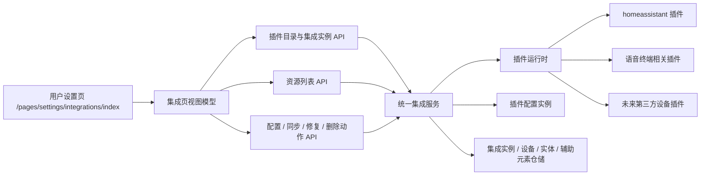

# 设计文档 - 设备与集成全插件化重构

状态：Draft

## 1. 概述

### 1.1 目标

- 把 `user-app` 的 `/pages/settings/integrations/index` 从 HA/音箱特例页重构为统一插件管理页。
- 把“集成、设备、实体、辅助元素”统一纳入同一套后端模型、接口和前端信息架构。
- 彻底移除 HA 专用配置表、专用接口、专用前端类型和页面硬编码。
- 让音箱终端、语音终端发现、声纹入口回到统一资源能力模型，而不是继续作为页面私货。

### 1.2 覆盖需求

- `requirements.md` 需求 1
- `requirements.md` 需求 2
- `requirements.md` 需求 3
- `requirements.md` 需求 4
- `requirements.md` 需求 5
- `requirements.md` 需求 6
- `requirements.md` 需求 7
- `requirements.md` 需求 8

### 1.3 技术约束

- 后端：FastAPI + SQLAlchemy + Alembic，必须通过 Alembic 迁移表结构。
- 前端：只改 `apps/user-app`，不改 `user-web`。
- 插件体系：优先复用现有 `plugin`、`plugin_config_instances`、`plugin_jobs`、`plugin_mounts`、manifest 和运行时。
- 页面风格：参考 Home Assistant 的“选择品牌或集成”与“集成 / 设备 / 实体 / 辅助元素”信息架构，但文案与行为必须贴合当前产品。
- 删除原则：旧 HA 页面逻辑、旧 HA API、旧 HA schema、旧 HA 表、旧音箱专用主页面区块都要进入删除清单，不保留长期兼容层。

## 2. 架构

### 2.1 系统结构



一句话说明：

> 页面不再直接知道 HA，也不再直接知道音箱；页面只知道“有哪些集成插件”“这些插件产出了哪些资源”“我对某个实例执行了什么标准动作”。

### 2.2 模块职责

| 模块 | 职责 | 输入 | 输出 |
| --- | --- | --- | --- |
| `integration_catalog_service` | 提供当前家庭可添加的插件目录 | 家庭 id、筛选条件 | 插件目录列表 |
| `integration_instance_service` | 创建、查询、更新、删除集成实例 | 家庭 id、插件 id、配置 | 集成实例视图 |
| `integration_resource_service` | 统一管理设备、实体、辅助元素列表和详情 | 家庭 id、资源类型、筛选条件 | 资源列表 / 资源详情 |
| `integration_action_service` | 统一触发配置保存、同步、修复、禁用、删除 | 集成实例 id、动作 payload | 动作结果 / 任务结果 |
| `plugin runtime` | 运行 connector、action、memory-ingestor 等入口 | 标准插件请求 | 标准插件结果 |
| `user-app integrations page` | 呈现四个视图和添加集成流程 | API 响应 | 用户界面 |

### 2.3 关键流程

#### 2.3.1 添加集成流程

1. 用户进入“设备与集成”页，默认看到“集成”视图。
2. 页面请求集成目录，展示插件卡片和搜索入口。
3. 用户点击“添加集成”后，弹出“选择品牌或集成”弹层。
4. 用户选择一个插件后，页面读取该插件的配置 schema。
5. 用户提交配置后，后端创建集成实例并触发初始化或首轮同步。
6. 页面刷新集成实例列表和资源统计。

#### 2.3.2 查看资源流程

1. 用户切换到“设备”“实体”或“辅助元素”视图。
2. 页面按统一资源接口拉取列表，并携带资源类型、集成实例、房间、状态等筛选条件。
3. 后端从统一资源模型返回结果，不再拼装 HA 特殊响应。
4. 页面用同一套卡片或列表组件展示资源，不再依赖平台特例组件。

#### 2.3.3 同步与修复流程

1. 用户在集成实例卡片上点击“同步”或“修复”。
2. 后端创建统一插件动作任务，交由插件运行时执行。
3. 插件返回资源变化结果，后端按统一规则更新实例状态和资源表。
4. 页面刷新实例状态、资源计数和最近任务结果。

#### 2.3.4 音箱终端并入流程

1. 音箱终端发现、认领、详情能力不再在页面主布局中独立占位。
2. 相关插件将音箱暴露为集成资源或待处理发现项。
3. 页面在统一资源模型下显示音箱设备详情，并按能力渲染声纹、接管前缀等扩展面板。
4. 声纹相关能力保留，但只作为资源详情能力，而不是页面顶层结构。

## 3. 组件和接口

### 3.1 核心组件

覆盖需求：1、2、3、4、5、6、7、8

- `IntegrationCatalogItem`
  - 描述可添加的插件目录项。
- `IntegrationInstance`
  - 描述某个家庭下已添加的集成实例。
- `IntegrationResource`
  - 描述任意资源，统一分为 `device`、`entity`、`helper`。
- `IntegrationActionRequest`
  - 描述对集成实例发起的同步、修复、禁用、删除等动作。
- `IntegrationPageViewModel`
  - `user-app` 页面使用的聚合视图模型，承接目录、实例、资源和动作状态。

### 3.2 数据结构

覆盖需求：2、3、4、5、7

#### 3.2.1 `IntegrationCatalogItem`

| 字段 | 类型 | 必填 | 说明 | 约束 |
| --- | --- | --- | --- | --- |
| `plugin_id` | string | 是 | 插件 id | 非空 |
| `name` | string | 是 | 显示名称 | 非空 |
| `icon_url` | string \| null | 否 | 图标 | 可空 |
| `source_type` | string | 是 | 内置 / 官方 / 第三方 | 枚举 |
| `risk_level` | string | 是 | 风险等级 | 枚举 |
| `supports_device_resources` | bool | 是 | 是否产生设备资源 | 枚举布尔 |
| `supports_entity_resources` | bool | 是 | 是否产生实体资源 | 枚举布尔 |
| `supports_helper_resources` | bool | 是 | 是否产生辅助元素 | 枚举布尔 |
| `config_schema_available` | bool | 是 | 是否可直接配置 | 布尔 |
| `already_added` | bool | 是 | 当前家庭是否已添加 | 布尔 |

#### 3.2.2 `IntegrationInstance`

| 字段 | 类型 | 必填 | 说明 | 约束 |
| --- | --- | --- | --- | --- |
| `id` | string | 是 | 实例 id | 非空 |
| `household_id` | string | 是 | 家庭 id | 非空 |
| `plugin_id` | string | 是 | 来源插件 | 非空 |
| `display_name` | string | 是 | 实例名称 | 非空 |
| `status` | string | 是 | 未配置 / 运行中 / 异常 / 已停用 | 枚举 |
| `error_summary` | string \| null | 否 | 最近错误摘要 | 可空 |
| `resource_counts` | object | 是 | 设备 / 实体 / 辅助元素统计 | 非空 |
| `last_synced_at` | string \| null | 否 | 最近同步时间 | 可空 |
| `created_at` | string | 是 | 创建时间 | ISO 时间 |
| `updated_at` | string | 是 | 更新时间 | ISO 时间 |

#### 3.2.3 `IntegrationResource`

| 字段 | 类型 | 必填 | 说明 | 约束 |
| --- | --- | --- | --- | --- |
| `id` | string | 是 | 资源 id | 非空 |
| `resource_type` | string | 是 | `device` / `entity` / `helper` | 枚举 |
| `integration_instance_id` | string | 是 | 所属集成实例 | 非空 |
| `plugin_id` | string | 是 | 所属插件 | 非空 |
| `name` | string | 是 | 显示名称 | 非空 |
| `status` | string | 是 | 统一状态 | 枚举 |
| `room_id` | string \| null | 否 | 所属房间 | 可空 |
| `device_id` | string \| null | 否 | 所属设备，仅实体可指向设备 | 可空 |
| `capabilities` | object | 是 | 资源能力快照 | 非空 |
| `metadata` | object | 是 | 扩展元数据 | 非空 |
| `updated_at` | string | 是 | 更新时间 | ISO 时间 |

#### 3.2.4 `IntegrationConfigMigration`

| 字段 | 类型 | 必填 | 说明 | 约束 |
| --- | --- | --- | --- | --- |
| `legacy_source` | string | 是 | 旧数据来源 | 固定值如 `household_ha_configs` |
| `target_plugin_id` | string | 是 | 迁移目标插件 | 非空 |
| `target_scope_type` | string | 是 | 插件配置 scope | 枚举 |
| `mapped_fields` | object | 是 | 字段映射关系 | 非空 |
| `verified` | bool | 是 | 是否已验证 | 布尔 |

### 3.3 接口契约

覆盖需求：1、2、3、4、5、6、7、8

#### 3.3.1 集成目录接口

- 类型：HTTP
- 路径：`GET /api/v1/integrations/catalog`
- 输入：`household_id`、搜索关键字、资源能力筛选
- 输出：`IntegrationCatalogItem[]`
- 校验：必须校验家庭访问权限
- 错误：统一返回标准错误结构

#### 3.3.2 集成实例列表接口

- 类型：HTTP
- 路径：`GET /api/v1/integrations/instances`
- 输入：`household_id`
- 输出：`IntegrationInstance[]`
- 校验：只返回当前家庭可见实例
- 错误：统一返回标准错误结构

#### 3.3.3 创建集成实例接口

- 类型：HTTP
- 路径：`POST /api/v1/integrations/instances`
- 输入：`household_id`、`plugin_id`、配置 payload
- 输出：新建 `IntegrationInstance`
- 校验：插件必须在目录中可见且允许当前家庭添加
- 错误：配置校验失败、插件不可用、初始化失败

#### 3.3.4 资源列表接口

- 类型：HTTP
- 路径：`GET /api/v1/integrations/resources`
- 输入：`household_id`、`resource_type`、`integration_instance_id`、`room_id`、`status`
- 输出：`IntegrationResource[]`
- 校验：`resource_type` 必须为设备、实体、辅助元素之一
- 错误：统一返回标准错误结构

#### 3.3.5 集成动作接口

- 类型：HTTP
- 路径：`POST /api/v1/integrations/instances/{instance_id}/actions`
- 输入：动作类型，例如 `sync`、`repair`、`disable`、`enable`、`delete`
- 输出：动作执行结果或任务结果
- 校验：动作必须在插件声明能力范围内
- 错误：统一动作错误码、统一审计日志

#### 3.3.6 旧接口替换与删除策略

- 旧接口：
  - `/devices/ha-config/{household_id}`
  - `/devices/ha-candidates/{household_id}`
  - `/devices/sync/ha`
  - `/devices/rooms/ha-candidates/{household_id}`
  - `/devices/rooms/sync/ha`
- 处理方式：
  - 在新页面完成切换后删除，不保留长期兼容。
  - 对应前端 `settingsApi` 中的 `HomeAssistant*` 调用和类型同步删除。

## 4. 数据与状态模型

### 4.1 数据关系

- 一个插件目录项可以在一个家庭下生成零个或多个集成实例。
- 一个集成实例可以产出零个或多个设备、实体、辅助元素。
- 一个设备可以拥有多个实体。
- 音箱终端不再是页面的独立顶层结构，而是某个集成实例下的设备资源，或某个集成实例的发现候选。
- 原 `HouseholdHaConfig` 配置迁移到 `plugin_config_instances` 中以插件 scope 保存。

### 4.2 状态流转

| 状态 | 含义 | 进入条件 | 退出条件 |
| --- | --- | --- | --- |
| `draft` | 实例已创建但未完成配置 | 新建实例但未保存完整配置 | 配置成功或删除 |
| `active` | 实例可正常工作 | 配置完成且最近检查通过 | 同步失败、停用或删除 |
| `degraded` | 实例可见但存在错误 | 同步或修复失败 | 修复成功、停用或删除 |
| `disabled` | 实例被管理员停用 | 执行停用动作 | 启用或删除 |
| `deleted` | 实例已删除 | 执行删除动作 | 不可恢复 |

## 5. 错误处理

### 5.1 错误类型

- `integration_plugin_not_found`：插件目录项不存在或对当前家庭不可见。
- `integration_config_invalid`：插件配置表单校验失败。
- `integration_action_not_supported`：插件不支持请求动作。
- `integration_sync_failed`：插件同步失败。
- `integration_resource_inconsistent`：资源落库失败或数据不一致。
- `legacy_migration_incomplete`：旧数据尚未完成迁移，禁止删除旧结构。

### 5.2 错误响应格式

```json
{
  "detail": "集成配置校验失败",
  "error_code": "integration_config_invalid",
  "field": "base_url",
  "timestamp": "2026-03-16T12:00:00Z"
}
```

### 5.3 处理策略

1. 输入校验错误：直接返回字段级错误，不创建实例。
2. 插件执行错误：写统一任务和审计日志，实例状态变为 `degraded`。
3. 数据迁移未完成：禁止删除旧表和旧接口。
4. 页面加载部分失败：允许局部展示，并明确提示是哪一块失败。

## 6. 正确性属性

### 6.1 插件优先属性

对于任何设备来源，系统都应该先经过插件目录、实例和资源模型，而不是继续走平台专用页面逻辑。

**验证需求：** 需求 1、需求 2、需求 5、需求 6

### 6.2 资源统一属性

对于任何接入来源，设备、实体、辅助元素都必须落入统一资源结构，页面不能再按来源定制顶层结构。

**验证需求：** 需求 3、需求 4、需求 5

### 6.3 旧链路清理属性

当新页面和新后端主链完成后，旧 HA 专用接口、旧 HA 表和旧前端类型必须被删除，不允许长期并存。

**验证需求：** 需求 6、需求 7、需求 8

## 7. 测试策略

### 7.1 单元测试

- 插件目录聚合逻辑
- 集成实例状态机
- 统一资源映射逻辑
- 旧 HA 配置迁移映射逻辑

### 7.2 集成测试

- 通过统一目录添加 `homeassistant` 集成实例
- 统一同步动作生成设备、实体、辅助元素
- 旧 HA 配置迁移后资源继续可见
- 删除旧接口后，新页面只走新接口

### 7.3 端到端测试

- `user-app` 设备与集成页的“添加集成”流程
- 四个视图切换与筛选
- 集成实例同步、禁用、删除
- 音箱资源详情和扩展能力入口

### 7.4 验证映射

| 需求 | 设计章节 | 验证方式 |
| --- | --- | --- |
| `requirements.md` 需求 1 | `design.md` 2.3.1、3.3.1、3.3.3 | 页面 E2E + 后端集成测试 |
| `requirements.md` 需求 2 | `design.md` 3.2.2、3.3.2、3.3.5 | 集成测试 |
| `requirements.md` 需求 3 | `design.md` 2.3.2、3.2.3、3.3.4 | 页面 E2E + 列表接口测试 |
| `requirements.md` 需求 4 | `design.md` 2.3.4、4.1 | 页面 E2E + 资源详情测试 |
| `requirements.md` 需求 5 | `design.md` 2.2、3.3.5 | 插件动作测试 |
| `requirements.md` 需求 6 | `design.md` 3.3.6、6.3 | grep 清理检查 + 回归测试 |
| `requirements.md` 需求 7 | `design.md` 3.2.4、4.1 | Alembic 迁移测试 |
| `requirements.md` 需求 8 | `design.md` 7 全文 | 验收清单 |

## 8. 风险与待确认项

### 8.1 风险

- 音箱与声纹能力目前和资源模型耦合不够统一，拆分不当会导致页面功能回退。
- `homeassistant` 插件当前还直接读旧表，迁移顺序不对会导致插件不可用。
- 用户端页面已有大量 `HomeAssistant*` 类型和文案，前端清理面广。

### 8.2 待确认项

- 语音终端发现是否直接并入某个插件实例的“待处理发现项”，还是独立成统一发现资源类型。
- 统一资源模型是否需要在数据库层新增独立 `integration_instances`、`integration_resources` 表，还是先在现有 `devices`、`device_bindings`、插件表上扩展。
- 集成实例卡片上的“修复”动作是否统一落到插件动作协议，还是保留部分系统级动作。
