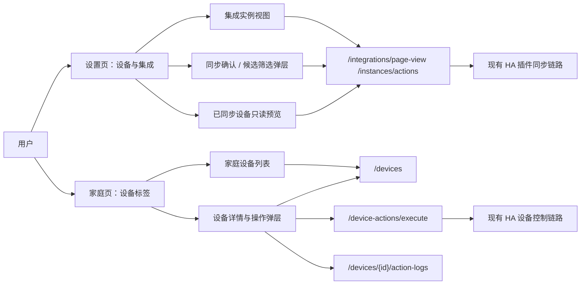

# 设计文档 - 设备管理前端迁移与同步收口

状态：Draft

## 1. 概述

### 1.1 目标

- 把 `设置-设备与集成` 页面收口成“插件同步中心”，不再承担设备操作。
- 把设备操作入口迁到 `家庭页`，让设备回到“家庭结构”里，而不是继续待在设置页。
- 在不改后端设备同步执行逻辑和设备操作执行逻辑的前提下，补齐全量同步确认和部分同步筛选体验。

### 1.2 覆盖需求

- `requirements.md` 需求 1
- `requirements.md` 需求 2
- `requirements.md` 需求 3
- `requirements.md` 需求 4
- `requirements.md` 需求 5
- `requirements.md` 需求 6

### 1.3 技术约束

- 前端：只改 `apps/user-app` 和 `packages/user-core`，不碰 `user-web`。
- 后端：不改设备同步执行语义，不改设备控制执行语义，不改 HA 服务映射语义。
- 现有设备操作链路必须复用：
  - `GET /devices`
  - `GET /devices/{id}/entities`
  - `PUT /devices/{id}/entities/{entity_id}/favorite`
  - `POST /device-actions/execute`
  - `POST /devices/{id}/disable`
  - `DELETE /devices/{id}`
  - `GET /devices/{id}/action-logs`
- 现有插件同步链路必须复用：
  - `GET /integrations/page-view`
  - `POST /integrations/instances/{id}/actions`
- HA 当前已接入接口必须优先复用：
  - REST `GET /api/states`
  - WebSocket `/api/websocket`
  - registry 命令 `config/device_registry/list`
  - registry 命令 `config/entity_registry/list`
  - registry 命令 `config/area_registry/list`

## 2. 现状与核心判断

### 2.1 当前真实结构

当前设备相关前端入口已经出现职责混乱：

- `设置-设备与集成` 页面既做插件实例管理，又做设备详情、实体控制、停用、删除、日志。
- `家庭页` 已经拉取了 `devices` 数据，但只在房间卡片里拿设备数量做摘要，没有设备标签页和设备详情入口。
- 家庭页当前标签顺序是：
  - `overview`
  - `rooms`
  - `members`
  - `relationships`

一句话说穿：后端已经把设备操作链路打通了，前端却把入口放错了位置。

### 2.2 核心判断

这件事值得做，而且应该现在做。

原因很简单：

1. 这不是臆想需求，当前页面职责确实混了。
2. 有更简单的方法，不需要重写后端，只要把入口搬对地方、把同步交互补完整。
3. 最大风险不是代码实现，而是继续让“设置页”和“家庭页”都碰设备，形成双入口和双心智模型。

## 3. 架构

### 3.1 系统结构



### 3.2 模块职责

| 模块 | 职责 | 输入 | 输出 |
| --- | --- | --- | --- |
| `SettingsIntegrationsPage` | 只负责集成实例管理、同步入口、已同步设备只读预览 | 集成实例、候选设备、设备资源统计 | 设置页 UI |
| `IntegrationSyncDialogs` | 承担全量同步确认与部分同步筛选 | 集成实例、候选设备列表 | 确认结果、筛选结果 |
| `FamilyDevicesTab` | 展示家庭设备列表与筛选器 | 家庭设备列表、房间列表 | 设备卡片列表 |
| `HouseholdDeviceDetailDialog` | 承担设备详情、实体控制、停用、删除、日志 | 设备 id、实体列表、日志 | 设备操作 UI |
| `settingsApi` / `coreApiClient` 包装层 | 继续调用现有后端接口 | 查询参数、动作 payload | 标准读写响应 |
| 现有 HA 插件同步链路 | 拉取 HA 设备候选或执行同步 | `sync_scope`、`selected_external_ids` | 设备候选或同步结果 |
| 现有 HA 设备控制链路 | 执行实体级设备动作 | 设备动作 payload | 动作结果 |

### 3.3 关键流程

#### 3.3.1 设置页只读查看已同步设备

1. 用户进入 `设置-设备与集成`。
2. 页面调用 `GET /integrations/page-view`，得到集成实例和 `resources.device`。
3. 用户点击某个插件实例卡片上的“查看已同步设备”。
4. 页面打开只读弹层，展示该实例下已同步设备列表。
5. 用户只能查看设备名称、房间、状态、类型、最近同步信息，不能执行设备操作。

#### 3.3.2 设置页全量同步多次确认

1. 用户点击“全量同步设备”。
2. 页面先调用 `sync_scope=device_candidates` 读取候选设备总量和已同步数量。
3. 页面弹出第一次确认，说明这是针对当前实例的全量同步。
4. 用户继续后，页面弹出第二次确认，展示影响摘要。
5. 如需第三层保险，可要求用户输入确认词，例如“同步全部”。
6. 全部确认完成后，页面才调用 `sync_scope=device_sync` 且 `selected_external_ids=[]`。

#### 3.3.3 设置页部分同步筛选

1. 用户点击“部分同步设备”。
2. 页面调用 `sync_scope=device_candidates` 拉取候选设备。
3. 页面本地建立筛选条件：
   - 名称搜索
   - 房间
   - 集成分类
4. 用户筛选后勾选设备，页面保留跨筛选条件的已选状态。
5. 用户点击“同步选中设备”，页面调用 `sync_scope=device_sync` 且提交 `selected_external_ids`。

#### 3.3.4 家庭页设备管理

1. 用户进入 `家庭页`。
2. 页面标签顺序变为：
   - `概览`
   - `房间`
   - `设备`
   - `人员`
   - `关系`
3. 用户切换到 `设备` 标签后，页面拉取家庭设备列表，并支持房间、设备类型、状态筛选。
4. 用户点击设备后，打开设备详情弹层。
5. 详情弹层继续复用现有实体收藏、实体控制、设备停用、设备删除、操作记录能力。

## 4. 前端信息架构

### 4.1 设置页改造

设置页必须做减法，不是再加一层设备详情。

#### 改造后保留

- 集成实例列表
- 集成实例状态
- 最近同步时间
- 全量同步入口
- 部分同步入口
- 查看已同步设备只读入口

#### 改造后删除

- 设备详情弹层里的实体控制入口
- 设备停用按钮
- 设备删除按钮
- 设备操作日志入口
- 收藏实体入口

#### 改造后新增

- 全量同步多次确认弹层
- 部分同步筛选条
- 已同步设备只读预览弹层

### 4.2 家庭页新增设备标签

设备标签插在“房间”和“人员”之间，不是随便插，是为了保持家庭结构阅读顺序：

1. 先看空间：房间
2. 再看空间里的对象：设备
3. 再看人：人员

设备标签页布局分成两层：

- 顶部：筛选器
  - 房间
  - 设备类型
  - 设备状态
- 主体：设备列表
  - 设备名称
  - 房间
  - 设备类型
  - 当前状态
  - 可控/只读标记

设备详情继续采用弹层，不把家庭页做成第二个“超级工作台”。

### 4.3 共享组件拆分

当前 `IntegrationDevicePanel` 已经同时干了三件事：

1. 渲染设备列表
2. 渲染设备详情
3. 执行设备操作

这不利于迁移。

建议拆成下面几块：

- `DeviceListCardGrid`
  - 只负责设备列表卡片
- `HouseholdDeviceDetailDialog`
  - 负责设备详情、实体标签、控制、停用、删除、日志
- `DeviceLogDialog`
  - 负责设备日志展示
- `IntegrationSyncedDevicePreviewDialog`
  - 负责设置页的只读预览

这样设置页和家庭页都能复用列表和详情壳子，但设置页只挂只读版本。

## 5. 数据结构

### 5.1 `HouseholdDeviceFilterState`

覆盖需求：2、3

| 字段 | 类型 | 必填 | 说明 | 约束 |
| --- | --- | --- | --- | --- |
| `room_id` | string \| null | 否 | 房间筛选 | 可空 |
| `device_type` | string \| null | 否 | 设备类型筛选 | 可空 |
| `status` | string \| null | 否 | 设备状态筛选 | 可空 |
| `keyword` | string | 否 | 客户端名称搜索，后续可选 | 默认空字符串 |

### 5.2 `IntegrationCandidateFilterState`

覆盖需求：4、5、6

| 字段 | 类型 | 必填 | 说明 | 约束 |
| --- | --- | --- | --- | --- |
| `keyword` | string | 否 | 按名称搜索 | 默认空字符串 |
| `ha_room` | string \| null | 否 | 按 房间筛选 | 可空 |
| `integration_category` | string \| null | 否 | 按集成分类筛选 | 可空 |
| `show_already_synced` | boolean | 否 | 是否显示已同步候选 | 默认 true |

### 5.3 `IntegrationDeviceCandidateView`

覆盖需求：5、6

这是前端消费的候选设备展示模型。同步执行仍然只认 `external_device_id`，其余字段全是读模型。

| 字段 | 类型 | 必填 | 说明 | 约束 |
| --- | --- | --- | --- | --- |
| `external_device_id` | string | 是 | HA 设备 id | 非空 |
| `primary_entity_id` | string | 是 | 主实体 id，例如 `light.bedroom_main` | 非空 |
| `name` | string | 是 | 设备显示名 | 非空 |
| `room_name` | string \| null | 否 | 房间名 | 可空 |
| `device_type` | string | 是 | 本地映射后的设备类型 | 非空 |
| `entity_count` | number | 是 | 关联实体数量 | >= 1 |
| `already_synced` | boolean | 是 | 是否已同步过 | 布尔 |
| `integration_category` | string \| null | 否 | HA 集成分类 | 可空 |
| `integration_category_source` | `platform` \| `config_entry` \| `domain_fallback` \| `unknown` | 是 | 分类来源 | 枚举 |

说明：

- `integration_category` 优先来自 HA entity registry / device registry 的平台或 config entry 元数据。
- 如果当前后端只返回 `primary_entity_id`，则前端可以退化为实体 domain 分类，例如 `light`、`climate`，但必须明确标记 `domain_fallback`，不能假装这就是 HA 集成。

### 5.4 `SyncedDevicePreviewItem`

覆盖需求：1

| 字段 | 类型 | 必填 | 说明 | 约束 |
| --- | --- | --- | --- | --- |
| `device_id` | string | 是 | 本地设备 id | 非空 |
| `name` | string | 是 | 设备名称 | 非空 |
| `room_name` | string \| null | 否 | 房间名 | 可空 |
| `status` | string | 是 | 当前设备状态 | 枚举 |
| `device_type` | string | 是 | 设备类型 | 非空 |
| `updated_at` | string | 是 | 最近更新时间 | ISO 时间 |

## 6. 接口契约

### 6.1 继续复用的现有接口

覆盖需求：1、2、3、4、5

#### 6.1.1 集成页聚合接口

- 类型：HTTP
- 路径：`GET /api/v1/integrations/page-view`
- 作用：读取集成实例和已同步设备资源
- 本次变化：前端继续使用，不改后端执行语义

#### 6.1.2 集成实例动作接口

- 类型：HTTP
- 路径：`POST /api/v1/integrations/instances/{instance_id}/actions`
- 当前动作：
  - `sync_scope=device_candidates`
  - `sync_scope=device_sync`
- 本次变化：
  - 全量同步前先调用 `device_candidates` 做影响预估
  - 部分同步继续提交 `selected_external_ids`
  - 不改同步执行语义

#### 6.1.3 家庭设备列表接口

- 类型：HTTP
- 路径：`GET /api/v1/devices`
- 当前已支持查询参数：
  - `household_id`
  - `room_id`
  - `device_type`
  - `status`
- 本次变化：
  - 前端把 `packages/user-core` 的 `listDevices` 包装扩成可传筛选参数
  - 后端业务逻辑不用改

#### 6.1.4 设备详情与操作接口

- 类型：HTTP
- 路径：
  - `GET /api/v1/devices/{device_id}/entities?view=favorites|all`
  - `PUT /api/v1/devices/{device_id}/entities/{entity_id}/favorite`
  - `POST /api/v1/device-actions/execute`
  - `POST /api/v1/devices/{device_id}/disable`
  - `DELETE /api/v1/devices/{device_id}`
  - `GET /api/v1/devices/{device_id}/action-logs`
- 作用：完全复用当前设备操作链路
- 本次变化：只改调用位置，从设置页迁到家庭页

### 6.2 允许的最小读模型补充

覆盖需求：5、6

严格遵守“不改后端设备同步逻辑”的边界后，真正可能需要补的只有候选设备读模型。

#### 6.2.1 候选设备字段补充

- 类型：HTTP 响应扩展
- 路径：`POST /api/v1/integrations/instances/{instance_id}/actions`
- 触发：`action=sync` + `sync_scope=device_candidates`
- 建议新增字段：
  - `integration_category`
  - `integration_category_source`
- 约束：
  - 只允许补展示字段
  - 不改变 `selected_external_ids` 的输入方式
  - 不改变 `device_sync` 的落库和同步策略

如果团队坚持“连候选 DTO 都不想动”，那就启用前端降级方案：

- 用 `primary_entity_id` 的 domain 作为伪分类
- UI 明确写成“实体域”
- 不要把它叫成“HA 集成分类”

### 6.3 HA 接口到筛选字段的映射

覆盖需求：5、6

| 筛选项 | HA 数据来源 | 当前项目是否已读取 | 前端承接方式 |
| --- | --- | --- | --- |
| 名称搜索 | device registry 名称、entity friendly_name、state 属性 | 已读取 | 直接按 `candidate.name` 搜索 |
| 房间 | area registry `name`、entity/device 的 `area_id`、state 属性中的 `area_name/room_name` | 已读取 | 直接按 `room_name` 分组筛选 |
| 集成分类 | entity registry 平台字段或 config entry 关联 | 部分已读取路径存在，但当前候选 DTO 未稳定暴露 | 优先读显式字段，拿不到时退化为 `primary_entity_id` domain |

## 7. HA 接口分析

### 7.1 当前项目已经在用什么

当前 Home Assistant 客户端已经明确走了这几条路：

- `GET /api/states`
  - 用来拿实时状态和属性
- WebSocket `/api/websocket`
  - 认证后发 registry 命令
- `config/device_registry/list`
  - 读取设备注册表
- `config/entity_registry/list`
  - 读取实体注册表
- `config/area_registry/list`
  - 读取区域注册表
- `POST /api/services/{domain}/{service}`
  - 执行设备动作

这意味着本次筛选设计不是凭空造接口，而是站在已经存在的 HA 接入之上做前端收口。

### 7.2 字段映射策略

#### 7.2.1 名称

优先级：

1. `device.name_by_user`
2. `device.name`
3. `entity.name`
4. `entity.original_name`
5. `state.attributes.friendly_name`

#### 7.2.2 房间

优先级：

1. `entity.area_id -> area_registry.name`
2. `device.area_id -> area_registry.name`
3. `state.attributes.area_name`
4. `state.attributes.room_name`
5. `state.attributes.room`

#### 7.2.3 集成分类

优先级：

1. entity registry 的平台字段
2. device/entity 关联的 config entry 标题
3. `primary_entity_id` 的 domain 作为降级分类

### 7.3 为什么这套做法安全

因为这次不碰两条危险链路：

1. 不碰真正的设备同步落库逻辑
2. 不碰真正的设备控制执行逻辑

我们只做三类事情：

- 搬前端入口
- 补前端确认流程
- 补前端筛选能力

如果确实要补候选字段，也只补只读展示字段，不动同步执行本体。

## 8. 状态模型

### 8.1 页面状态流转

| 状态 | 含义 | 进入条件 | 退出条件 |
| --- | --- | --- | --- |
| `sync_idle` | 设置页空闲 | 页面初始或同步完成 | 打开确认弹层或候选弹层 |
| `sync_confirming` | 全量同步确认中 | 点击全量同步 | 取消或进入执行 |
| `candidate_browsing` | 部分同步候选浏览中 | 打开部分同步弹层 | 取消或提交同步 |
| `device_browsing` | 家庭页设备列表浏览中 | 进入设备标签 | 打开设备详情 |
| `device_detail_open` | 设备详情弹层打开 | 点击设备卡片 | 关闭弹层或删除成功 |

### 8.2 操作边界

- 设置页：
  - 允许：同步、查看只读预览
  - 禁止：设备控制、停用、删除、日志
- 家庭页：
  - 允许：筛选、控制、停用、删除、日志、实体收藏
  - 禁止：插件配置、插件创建

## 9. 错误处理

### 9.1 错误类型

- `integration_action_payload_invalid`：同步请求参数不合法
- `integration_instance_not_found`：集成实例不存在
- `platform_unreachable`：HA 不可达
- `device_disabled`：设备已停用，禁止控制
- `candidate_filter_field_missing`：请求按集成分类筛选，但当前候选数据不具备显式字段

### 9.2 错误响应格式

```json
{
  "detail": "sync.payload.sync_scope 不合法。",
  "error_code": "integration_action_payload_invalid",
  "field": "payload.sync_scope",
  "timestamp": "2026-03-17T10:00:00Z"
}
```

### 9.3 处理策略

1. 设置页全量同步确认未完成：直接中止，不发请求。
2. 候选列表加载失败：保留当前实例卡片，不打开候选弹层，提示读取失败。
3. 集成分类字段缺失：
   - 有降级方案时，用降级分类并标明来源。
   - 没降级方案时，禁用该筛选器并给出说明。
4. 家庭页设备详情动作失败：保持详情弹层不关闭，直接展示错误反馈。

## 10. 正确性属性

### 10.1 属性 1：页面职责单一

*对于任何* 设备级操作，系统都应该满足：设置页不再提供执行入口，家庭页是唯一主入口。

**验证需求：** 需求 1、需求 2、需求 3

### 10.2 属性 2：同步执行语义不变

*对于任何* 全量同步或部分同步请求，系统都应该满足：真正发给后端的同步动作语义与现在一致，只允许前置确认和候选筛选变化。

**验证需求：** 需求 3、需求 4、需求 5

### 10.3 属性 3：HA 筛选字段有来源

*对于任何* 候选筛选字段，系统都应该满足：能明确指出来自 HA 哪个接口或哪个本地字段，不允许页面里凭空造判断。

**验证需求：** 需求 5、需求 6

## 11. 测试策略

### 11.1 单元测试

- 家庭页设备筛选状态计算
- 部分同步候选筛选函数
- 全量同步多次确认状态机
- 集成分类降级策略

### 11.2 集成测试

- 设置页触发 `device_candidates` 后能展示候选并筛选
- 设置页触发全量同步前必须经过全部确认
- 家庭页设备详情继续通过现有设备接口完成控制、停用、删除、日志查询

### 11.3 端到端测试

- `设置-设备与集成` 页面只保留同步与只读预览
- `家庭页` 新增设备标签，且位于房间与人员之间
- 家庭页设备筛选与详情操作完整可用
- 部分同步筛选后同步选中设备可用

### 11.4 验证映射

| 需求 | 设计章节 | 验证方式 |
| --- | --- | --- |
| `requirements.md` 需求 1 | `design.md` §3.3.1、§4.1、§8.2 | 页面走查 + 前端测试 |
| `requirements.md` 需求 2 | `design.md` §3.3.4、§4.2、§6.1.3 | 页面走查 + 设备列表接口回归 |
| `requirements.md` 需求 3 | `design.md` §3.2、§6.1.4、§10.2 | 接口复用检查 + 回归测试 |
| `requirements.md` 需求 4 | `design.md` §3.3.2、§9.3 | 交互测试 |
| `requirements.md` 需求 5 | `design.md` §3.3.3、§5.2、§6.2、§6.3 | 候选筛选测试 |
| `requirements.md` 需求 6 | `design.md` §6.3、§7 全文、`docs/20260317-Home Assistant接口与筛选字段分析.md` | 人工审查 + 文档核对 |

## 12. 风险与待确认项

### 12.1 风险

- 如果继续把设备详情逻辑硬塞在 `IntegrationDevicePanel` 里，迁移到家庭页时会把设置页和家庭页继续绑死。
- 如果集成分类字段当前链路拿不到，而产品又坚持必须是“HA 集成”不是“实体域”，就需要最小只读字段补充。
- `packages/user-core` 现在的 `listDevices` 只支持 `household_id`，前端包装层不扩参数就没法干净承接筛选器。

### 12.2 待确认项

- 全量同步的“多次确认”到底采用两层弹窗，还是“两层弹窗 + 输入确认词”。建议默认三步确认。
- 设置页的已同步设备预览是“点击插件卡片直接打开”，还是“卡片上单独放查看按钮”。建议用单独按钮，避免把“选中实例”和“查看设备”混成一个动作。
- 集成分类是否必须展示 HA 原生集成名。如果必须，且当前候选数据没有显式字段，就需要允许补候选 DTO 的只读元数据。
