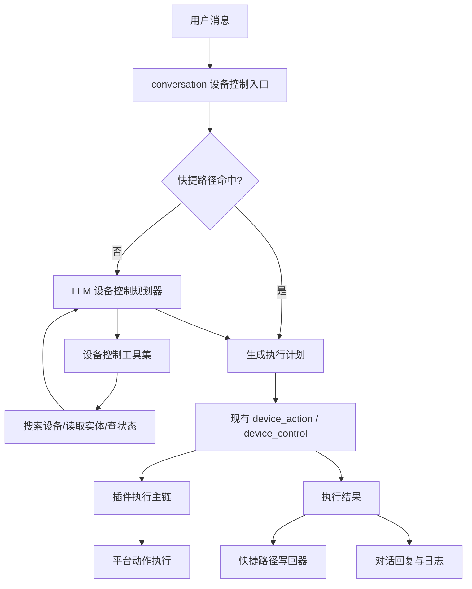

# 设计文档 - 对话设备控制MCP化与快捷路径收口

状态：Draft

## 1. 概述

### 1.1 目标

- 把对话设备控制从“规则猜测”改成“快捷路径 + 工具决策”
- 保留现有统一设备执行链，不重写平台控制器
- 为后续语音接入和正式 MCP 暴露留出干净边界

### 1.2 覆盖需求

- `requirements.md` 需求 1：快捷路径优先命中
- `requirements.md` 需求 2：模型通过工具查询设备和实体
- `requirements.md` 需求 3：统一执行链继续负责真实控制
- `requirements.md` 需求 4：成功后沉淀快捷路径
- `requirements.md` 需求 5：处理歧义、高风险和低置信
- `requirements.md` 需求 6：补齐可观测性

### 1.3 技术约束

- 后端：FastAPI + SQLAlchemy + 现有 conversation / device_action / device_control 模块
- 前端：本 Spec 不要求新增页面，只允许消费已有对话结果
- 数据存储：PostgreSQL；新增持久化结构必须通过 Alembic migration 落地
- 认证授权：继续复用现有对话 actor、家庭归属校验和高风险确认规则
- 外部依赖：现有 LLM 调用能力、Home Assistant 插件、插件执行主链

## 2. 架构

### 2.1 系统结构

第一阶段不引入独立 MCP 进程，而是在 `api-server` 内提供一层 **MCP 风格工具目录**。  
模型看到的是一组白名单工具；系统内部看到的是一层干净的工具门面。这样先把链路跑通，后面如果要外置成正式 MCP server，再拆暴露层就行。



核心原则只有一句话：

- 决策层负责“找谁、做什么”
- 执行层负责“能不能做、怎么真正执行”

### 2.2 模块职责

| 模块 | 职责 | 输入 | 输出 |
| --- | --- | --- | --- |
| `conversation_device_control_entry` | 判断是否进入设备控制闭环，协调快捷路径和工具规划 | 用户文本、会话、actor | 执行计划或澄清结果 |
| `device_shortcut_service` | 查询、写入、失效快捷路径 | 家庭、成员、原始说法、执行结果 | 快捷路径命中结果、快捷路径记录 |
| `device_control_toolkit` | 向模型暴露白名单工具 | 家庭上下文、查询词、设备/实体标识 | 候选设备、候选实体、状态、执行回执 |
| `device_control_planner` | 驱动模型做 tool use，产出明确执行计划 | 用户文本、上下文、工具结果 | `device_id / entity_id / action / params` |
| `device_action/device_control` | 继续做统一控制执行 | 执行计划 | 标准执行结果或标准错误 |

### 2.3 关键流程

#### 2.3.1 快捷路径命中流程

1. 对话入口识别这是设备控制请求。
2. `device_shortcut_service` 按家庭、成员、归一化说法查询可用快捷路径。
3. 若命中，系统检查目标设备、目标实体和动作当前是否仍然有效。
4. 有效则直接生成执行计划，进入现有统一执行链。
5. 执行成功后更新命中次数和最近使用时间；执行失败则视情况降级回工具决策。

#### 2.3.2 工具决策流程

1. 对话入口未命中快捷路径，进入 `device_control_planner`。
2. 规划器拿到白名单工具描述，只允许查设备、查实体、查状态、发起正式执行。
3. 模型先调用搜索工具拿候选设备，再调用实体工具拿候选实体和控制能力。
4. 若目标仍不唯一，系统返回澄清问题；若目标明确，则生成执行计划。
5. 执行计划进入现有统一执行链。
6. 成功后写入或更新快捷路径。

#### 2.3.3 快捷路径写回流程

1. 统一执行链返回成功结果。
2. 写回器提取原始说法、归一化说法、成员、设备、实体、动作、参数、来源。
3. 若已有相同语义快捷路径，则累加命中数据并更新目标；否则新增记录。
4. 若本轮来源是工具决策，还要记录工具决策置信和来源类型，方便后续清理。

## 3. 组件和接口

### 3.1 核心组件

覆盖需求：1、2、3、4、5、6

- `ConversationDeviceShortcutMatcher`：查询和校验快捷路径，不负责执行真实动作
- `ConversationDeviceToolRegistry`：定义模型能用哪些设备控制工具
- `ConversationDevicePlanner`：运行模型 tool use，直到得到唯一计划或明确澄清
- `ConversationDeviceExecutionAdapter`：把计划落到现有 `execute_device_action / aexecute_device_action`
- `ConversationDeviceShortcutWriter`：成功后沉淀快捷路径

### 3.2 数据结构

覆盖需求：1、4、6

#### 3.2.1 `device_control_shortcuts`

| 字段 | 类型 | 必填 | 说明 | 约束 |
| --- | --- | --- | --- | --- |
| `id` | UUID | 是 | 主键 | Alembic 创建 |
| `household_id` | UUID/字符串 | 是 | 家庭范围 | 必须存在 |
| `member_id` | UUID/字符串 | 否 | 成员级快捷路径；为空表示家庭共享 | 可空 |
| `source_text` | TEXT | 是 | 用户原始说法 | 保留原文 |
| `normalized_text` | TEXT | 是 | 用于匹配的归一化说法 | 建索引 |
| `device_id` | UUID/字符串 | 是 | 目标设备 | 必须存在 |
| `entity_id` | TEXT | 是 | 目标实体 | 必须能定位到当前设备 |
| `action` | TEXT | 是 | 标准动作名 | 走统一动作协议 |
| `params_json` | JSON | 是 | 动作参数 | 默认 `{}` |
| `resolution_source` | TEXT | 是 | `shortcut` / `tool_planner` / `manual_seed` | 受限枚举 |
| `confidence` | FLOAT | 否 | 当时的决策置信 | 0~1 |
| `hit_count` | INT | 是 | 成功命中次数 | 默认 0 |
| `last_used_at` | TIMESTAMP | 否 | 最近使用时间 | 可空 |
| `status` | TEXT | 是 | `active / stale / disabled` | 默认 `active` |
| `created_at` | TIMESTAMP | 是 | 创建时间 | 统一时间格式 |
| `updated_at` | TIMESTAMP | 是 | 更新时间 | 统一时间格式 |

#### 3.2.2 `ConversationDeviceExecutionPlan`

| 字段 | 类型 | 必填 | 说明 | 约束 |
| --- | --- | --- | --- | --- |
| `device_id` | str | 是 | 最终执行设备 | 必须属于当前家庭 |
| `entity_id` | str | 是 | 最终执行实体 | 必须属于设备 |
| `action` | str | 是 | 标准动作 | 通过统一协议校验 |
| `params` | dict | 是 | 标准参数 | 默认 `{}` |
| `reason` | str | 是 | 执行来源 | 如 `conversation.shortcut` / `conversation.tool_planner` |
| `resolution_trace` | dict | 是 | 命中或工具决策摘要 | 只做日志和追踪 |

#### 3.2.3 `DeviceControlToolResult`

| 字段 | 类型 | 必填 | 说明 | 约束 |
| --- | --- | --- | --- | --- |
| `tool_name` | str | 是 | 工具名 | 白名单 |
| `items` | list | 是 | 返回结果 | 结构化、可序列化 |
| `truncated` | bool | 是 | 是否裁剪 | 默认 `false` |
| `summary` | str | 否 | 人可读摘要 | 用于调试 |

### 3.3 接口契约

覆盖需求：1、2、3、4、5、6

#### 3.3.1 `match_device_shortcut(...)`

- 类型：Function
- 路径或标识：`app.modules.conversation.device_shortcut_service.match_device_shortcut`
- 输入：`household_id`、`member_id`、原始说法、归一化说法
- 输出：命中的快捷路径或 `None`
- 校验：只返回 `status=active` 且目标设备、实体仍可用的记录
- 错误：不抛给用户；异常时按未命中处理并记录日志

#### 3.3.2 `search_controllable_entities(...)`

- 类型：Function / Tool
- 路径或标识：`conversation.device_control.search_controllable_entities`
- 输入：家庭、查询文本、可选房间/设备类型范围
- 输出：候选设备与候选实体列表，包含状态、房间、控制能力摘要
- 校验：只返回当前家庭可见且可控的对象
- 错误：统一工具错误结构，不泄漏底层平台异常

#### 3.3.3 `get_device_entity_profile(...)`

- 类型：Function / Tool
- 路径或标识：`conversation.device_control.get_device_entity_profile`
- 输入：`device_id`
- 输出：设备下可控实体、每个实体的动作能力、当前状态、可读名称
- 校验：设备必须属于当前家庭
- 错误：设备不存在、无权限、设备不可控

#### 3.3.4 `execute_planned_device_action(...)`

- 类型：Function / Tool Adapter
- 路径或标识：`conversation.device_control.execute_planned_device_action`
- 输入：`ConversationDeviceExecutionPlan`
- 输出：统一设备执行结果
- 校验：必须落到现有 `DeviceActionExecuteRequest`
- 错误：沿用现有统一设备错误结构

#### 3.3.5 `upsert_device_shortcut(...)`

- 类型：Function
- 路径或标识：`app.modules.conversation.device_shortcut_service.upsert_device_shortcut`
- 输入：原始说法、归一化说法、成员、设备、实体、动作、参数、来源、置信
- 输出：新增或更新后的快捷路径记录
- 校验：相同家庭、相同成员范围、相同说法、相同目标优先合并
- 错误：写入失败不影响主回复，但要写结构化日志

## 4. 数据与状态模型

### 4.1 数据关系

- 一个家庭可以有多条快捷路径
- 快捷路径可以是“成员专属”或“家庭共享”
- 快捷路径必须指向一个设备和一个实体
- 快捷路径不负责替代设备绑定，只是引用既有设备与实体
- 执行计划是瞬时对象，不直接长期存储，但其摘要会进入对话日志和设备控制日志

### 4.2 状态流转

| 状态 | 含义 | 进入条件 | 退出条件 |
| --- | --- | --- | --- |
| `active` | 可直接参与匹配 | 新建成功或校验通过 | 目标失效、命中失败、人工停用 |
| `stale` | 记录还在，但需要重新验证 | 目标设备不存在、实体不再可控、连续命中失败 | 重新验证成功回到 `active`；人工停用变 `disabled` |
| `disabled` | 不再参与匹配 | 人工停用或明确废弃 | 人工重新启用 |

## 5. 错误处理

### 5.1 错误类型

- `shortcut_target_invalid`：快捷路径指向的设备或实体失效
- `device_resolution_ambiguous`：模型或工具结果无法唯一确定目标
- `device_resolution_not_found`：未找到匹配设备或实体
- `device_resolution_invalid`：模型产出的计划与当前设备能力不一致
- `tool_execution_failed`：工具层内部调用失败
- `platform_unreachable`：统一执行链进入平台后失败

### 5.2 错误响应格式

```json
{
  "detail": "<用户友好的错误消息>",
  "error_code": "<错误码>",
  "field": "<字段名，可选>",
  "timestamp": "2026-03-17T00:00:00Z"
}
```

### 5.3 处理策略

1. 快捷路径失效：标记为 `stale`，本轮回退到工具决策。
2. 工具结果歧义：返回追问，不直接执行。
3. 模型计划不合法：拒绝执行并记录日志，不做自动纠正。
4. 平台执行失败：沿用现有统一设备错误结构和用户提示收口。
5. 快捷路径写回失败：不影响本轮主回复，但记录结构化错误。

## 6. 正确性属性

### 6.1 属性 1：执行唯一性

*对于任何* 一次对话设备控制请求，系统都应该满足：最终真实平台动作只能通过现有统一执行链触发一次，不能因为快捷路径和工具决策并存而发生双执行。

**验证需求：** 需求 1、需求 3、需求 5

### 6.2 属性 2：目标可解释性

*对于任何* 一次成功或失败的对话设备控制请求，系统都应该满足：维护者能看出它是命中了哪条快捷路径，还是走了哪些工具调用后才定位到目标实体。

**验证需求：** 需求 2、需求 4、需求 6

## 7. 测试策略

### 7.1 单元测试

- 快捷路径匹配、失效和回退
- 工具结果转执行计划
- 模型输出非法计划时的拒绝逻辑
- 快捷路径写回合并规则

### 7.2 集成测试

- 对话设备控制经由工具层定位多实体设备后成功执行
- 快捷路径命中后直接执行统一设备链
- 高风险动作在工具决策模式下仍然要求确认
- 快捷路径失效后自动回退到工具决策

### 7.3 端到端测试

- “打开书房灯”首次走工具检索成功，第二次命中快捷路径
- “打开灯”在多房间歧义时返回追问
- “确认解锁入户门锁”继续走高风险保护

### 7.4 验证映射

| 需求 | 设计章节 | 验证方式 |
| --- | --- | --- |
| `requirements.md` 需求 1 | `design.md` §2.3.1、§3.3.1、§4.2 | 快捷路径匹配与失效回退测试 |
| `requirements.md` 需求 2 | `design.md` §2.3.2、§3.3.2、§3.3.3 | 工具调用与澄清流程测试 |
| `requirements.md` 需求 3 | `design.md` §2.1、§3.3.4、§6.1 | 统一执行链集成测试 |
| `requirements.md` 需求 4 | `design.md` §2.3.3、§3.3.5、§4.1 | 快捷路径写回与复用测试 |
| `requirements.md` 需求 5 | `design.md` §5.1、§5.3、§6.1 | 歧义、高风险、非法计划测试 |
| `requirements.md` 需求 6 | `design.md` §3.2、§5.3、§6.2 | 结构化日志与排查链路检查 |

## 8. 风险与待确认项

### 8.1 风险

- 当前对话主链的 LLM tool use 能力边界如果不够稳定，第一阶段可能需要限制工具轮数和输出格式。
- 快捷路径如果匹配规则写得太宽，容易把历史成功说法误用到相近但不同的设备。
- 如果设备实体列表过大，工具返回内容必须裁剪，否则会把上下文塞爆。

### 8.2 待确认项

- 第一阶段是否只在 `conversation fast_action` 中启用，还是同步替换 `voice_fast_action_service` 的决策层。
- 快捷路径是否需要提供后台管理入口，还是先只做自动写入与自动失效。
- 内部工具层第一阶段是否直接对接现有 LLM provider tool calling，还是先做一层更窄的 planner 包装。
